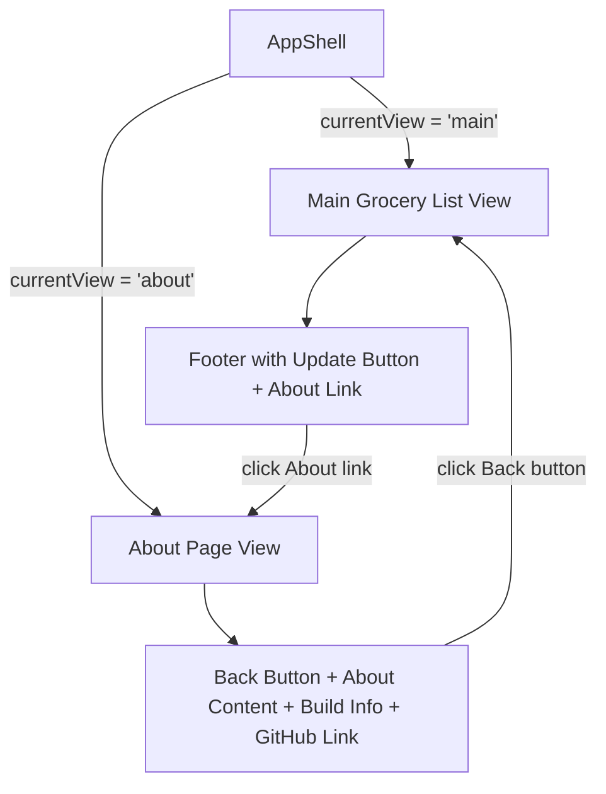

# Design Document: About Page

## Overview

This design adds a dedicated About page to the Grocery List PWA. The About page is an in-app view managed by the `AppShell` class — no page reload occurs when navigating to or from it. The page consolidates informational content (build timestamp, GitHub link) currently rendered in the main footer, adds descriptive content about the app's features, and provides back navigation to the main grocery list view. The footer is updated to remove the build timestamp and GitHub link, replacing them with an "About" link below the existing "Check for updates" button.

## Architecture

The About page is implemented as a simple view toggle within the existing `AppShell` class. No router or additional framework is introduced.



### View Switching

- `AppShell` gains a `currentView` property: `'main' | 'about'`.
- When `currentView === 'main'`, the existing grocery list UI renders as today.
- When `currentView === 'about'`, the sections container is replaced with the About page content.
- Switching views is a DOM swap — no page reload, no URL change, no history API usage.

### Footer Changes

- The `<span class="build-timestamp">` and `<a class="github-link">` elements are removed from the footer in `createAppStructure()`.
- A new `<a class="about-link">` element is added below the update button.
- The About link triggers `currentView = 'about'` and re-renders.

## Components and Interfaces

### Modified: `AppShell` (src/index.ts)

New private members:

```typescript
private currentView: 'main' | 'about' = 'main';
```

New methods:

```typescript
/** Switch to the About page view */
private showAboutPage(): void;

/** Switch back to the main grocery list view */
private showMainView(): void;

/** Render the About page content into the sections container */
private renderAboutPage(): void;
```

Changes to existing methods:

- `createAppStructure()`: Remove build timestamp `<span>` and GitHub `<a>` from the footer. Add an About link `<a>` after the update button.
- `render()`: Guard with `if (this.currentView === 'about') { this.renderAboutPage(); return; }` at the top.

### About Page DOM Structure

The About page is rendered as semantic HTML directly by `renderAboutPage()`:

```html
<div class="about-page">
  <button class="about-back-btn" aria-label="Back to grocery list">← Back</button>
  <h1>About Grocery List</h1>
  <p>A shopping list app that works offline and keeps your groceries organized.</p>
  <h2>Features</h2>
  <ul>
    <li><strong>Movable Sections</strong> — Reorder your grocery sections to match your store layout.</li>
    <li><strong>Sharing</strong> — Share your list with others via a link.</li>
    <li><strong>Offline Support</strong> — Works without an internet connection as a PWA.</li>
    <li><strong>Multiple Lists</strong> — Manage more than one grocery list.</li>
  </ul>
  <footer class="about-footer">
    <span class="build-timestamp">{__BUILD_TIMESTAMP__}</span>
    <a href="https://github.com/wphillips/Shopping-List" target="_blank"
       rel="noopener noreferrer" aria-label="View source code on GitHub"
       class="github-link">GitHub</a>
  </footer>
</div>
```

### Updated Footer Structure

```html
<footer id="app-footer" class="app-footer">
  <!-- update button rendered by createUpdateButton() -->
  <a href="#" class="about-link" aria-label="About this app">About</a>
</footer>
```

## Data Models

No new data models are required. The About page is purely presentational — it reads only the compile-time `__BUILD_TIMESTAMP__` constant and a hardcoded GitHub URL. No state changes, no persistence, no new types.

The only new state is the `currentView` property on `AppShell`, which is a simple string literal union (`'main' | 'about'`) held as a private instance field. It is not persisted and resets to `'main'` on page load.


## Correctness Properties

*A property is a characteristic or behavior that should hold true across all valid executions of a system — essentially, a formal statement about what the system should do. Properties serve as the bridge between human-readable specifications and machine-verifiable correctness guarantees.*

Most acceptance criteria for this feature are static content checks (specific DOM elements, attributes, text content) best validated by example-based unit tests. One criterion yields a true property:

### Property 1: View switching round trip

*For any* application state (any combination of lists, sections, items, filter mode), navigating from the main view to the About page and then activating the Back navigation control should restore the main grocery list view with all original content intact, without triggering a page reload.

**Validates: Requirements 4.3**

## Error Handling

This feature is purely presentational with no external data fetching, user input processing, or state mutations. Error scenarios are minimal:

- **Missing `#app` container**: Already handled by the existing `init()` function — logs an error and returns.
- **Missing `__BUILD_TIMESTAMP__`**: The build system always injects this constant. If somehow undefined, the template literal renders `"undefined"` — acceptable degradation, no crash.
- **About link click when already on About page**: `showAboutPage()` is idempotent — re-rendering the same view is harmless.
- **Back button click when already on main view**: `showMainView()` is idempotent — re-rendering the main view is harmless.

No new error handling code is required.

## Testing Strategy

### Property-Based Tests

Use `fast-check` (already in devDependencies) with minimum 100 iterations per property.

**Property test file**: `tests/about-page.properties.test.ts`

- **Feature: about-page, Property 1: View switching round trip** — Generate random `MultiListState` values (varying numbers of lists, sections, items, filter modes). For each, instantiate `AppShell`, navigate to About, click Back, and assert the main view is restored with the sections container populated and no page reload.

Each property test must be tagged with a comment referencing the design property:
```
// Feature: about-page, Property 1: View switching round trip
```

### Unit Tests

**Unit test file**: `tests/about-page.unit.test.ts`

Unit tests cover all example-based acceptance criteria:

1. **About page content** (Requirements 1.1–1.6): Render the About page and verify it contains the heading, shopping list description, and all four feature descriptions (movable sections, sharing, offline support, multiple lists).
2. **Build info on About page** (Requirements 2.1–2.4): Verify the About page displays the build timestamp, contains a GitHub link with the correct URL, `target="_blank"`, and `rel="noopener noreferrer"`.
3. **Footer cleanup** (Requirements 2.5–2.6): Verify the main footer no longer contains a `.build-timestamp` span or `.github-link` anchor.
4. **Footer About link** (Requirements 3.1–3.3): Verify the footer contains an `.about-link` element positioned after the update button, with matching styling.
5. **Back navigation** (Requirements 4.1–4.2): Verify the About page has a back button as the first interactive element with an appropriate `aria-label`.
6. **Accessibility** (Requirements 6.1–6.4): Verify semantic headings (`h1`, `h2`), accessible names on the About link, Back button, and GitHub link.

### CSS

About page styles are added to `src/styles/main.css` using existing CSS custom properties. No separate stylesheet. The `.about-page`, `.about-back-btn`, `.about-link`, and `.about-footer` classes follow the established patterns. Visual consistency (Requirement 5) is verified by manual review, not automated tests.
