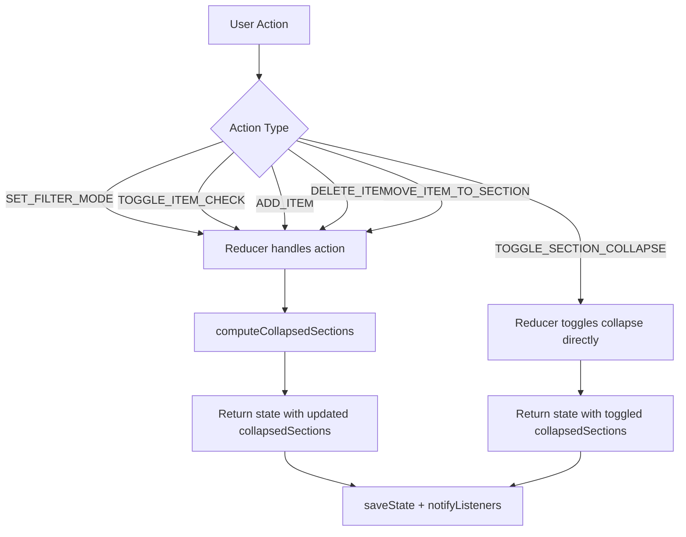
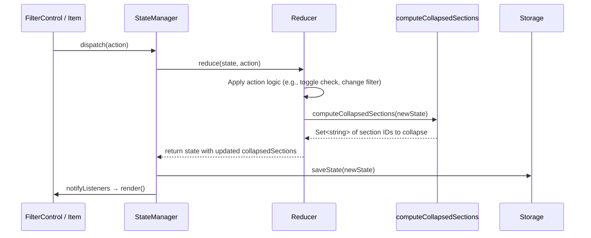

# Design Document: Auto-Collapse Empty Sections

## Overview

When a user interacts with the grocery list — changing filter modes, checking/unchecking items, adding/deleting/moving items — sections that have zero visible items under the current filter should automatically collapse, and sections with visible items should automatically expand. This keeps the UI tidy by hiding irrelevant sections and surfacing relevant ones without manual intervention.

The core change introduces an **Auto-Collapse Engine**: a pure function `computeCollapsedSections` that takes the full `AppState` (sections, items, filterMode) and returns the correct `collapsedSections` set. This function is called inside the `StateManager.reduce` method after every action that could change item visibility (filter change, item check toggle, item add/delete/move). The reducer applies the computed set to the returned state before it reaches listeners, ensuring the UI always renders with the correct collapse state.

Manual toggle (`TOGGLE_SECTION_COLLAPSE`) continues to work as before — it directly flips the collapse bit. The auto-collapse engine only runs on actions that mutate item visibility, so a manual toggle is never overridden until the next visibility-changing action.

## Architecture





### Design Decisions

1. **Pure function, not a class** — `computeCollapsedSections` is a stateless pure function. It takes `sections`, `items`, and `filterMode` and returns a `Set<string>`. No side effects, easy to test.

2. **Integrated into the reducer** — The auto-collapse logic runs inside `reduce()` after the primary action logic. This guarantees `collapsedSections` is always consistent with item visibility before the state reaches listeners or storage. No race conditions, no extra render cycles.

3. **Triggered only by visibility-changing actions** — The engine runs after `SET_FILTER_MODE`, `TOGGLE_ITEM_CHECK`, `ADD_ITEM`, `DELETE_ITEM`, and `MOVE_ITEM_TO_SECTION`. It does NOT run after `TOGGLE_SECTION_COLLAPSE` (manual override), `ADD_SECTION`, `DELETE_SECTION`, `RENAME_SECTION`, or section reorder actions.

4. **"All" filter keeps everything expanded** — When `filterMode` is `'all'`, every item is visible, so every section with at least one item is expanded. Only truly empty sections (no items at all) collapse.

5. **Manual toggle is respected until next visibility change** — `TOGGLE_SECTION_COLLAPSE` works exactly as before. The auto-collapse engine re-evaluates on the next filter/item mutation, which may override the manual state. This matches Requirement 4.

6. **Initial render handled by `createStateManager`** — On app startup, after loading persisted state, the engine runs once to ensure `collapsedSections` is consistent with the persisted `filterMode`. This is done by calling `computeCollapsedSections` on the loaded state inside the `StateManager` constructor.

## Components and Interfaces

### New: `computeCollapsedSections` (src/state.ts)

```typescript
/**
 * Compute which sections should be collapsed based on visible items.
 * A section is collapsed if it has zero items matching the current filterMode.
 */
export function computeCollapsedSections(
  sections: Section[],
  items: Item[],
  filterMode: FilterMode
): Set<string> {
  const collapsed = new Set<string>();
  for (const section of sections) {
    const sectionItems = items.filter(item => item.sectionId === section.id);
    const hasVisible = filterMode === 'all'
      ? sectionItems.length > 0
      : sectionItems.some(item =>
          filterMode === 'checked' ? item.isChecked : !item.isChecked
        );
    if (!hasVisible) {
      collapsed.add(section.id);
    }
  }
  return collapsed;
}
```

### Modified: `StateManager.reduce` (src/state.ts)

The reducer is modified so that after handling `SET_FILTER_MODE`, `TOGGLE_ITEM_CHECK`, `ADD_ITEM`, `DELETE_ITEM`, and `MOVE_ITEM_TO_SECTION`, it calls `computeCollapsedSections` on the resulting state and overwrites `collapsedSections`.

```typescript
// Inside reduce(), after the switch statement returns newState:
const autoCollapseActions = [
  'SET_FILTER_MODE',
  'TOGGLE_ITEM_CHECK',
  'ADD_ITEM',
  'DELETE_ITEM',
  'MOVE_ITEM_TO_SECTION',
];
if (autoCollapseActions.includes(action.type)) {
  newState = {
    ...newState,
    collapsedSections: computeCollapsedSections(
      newState.sections,
      newState.items,
      newState.filterMode
    ),
  };
}
return newState;
```

### Modified: `StateManager` constructor (src/state.ts)

After loading state, run the engine once to ensure initial consistency:

```typescript
constructor(initialState?: AppState) {
  this.state = initialState || createDefaultState();
  // Auto-collapse on initial load
  this.state = {
    ...this.state,
    collapsedSections: computeCollapsedSections(
      this.state.sections,
      this.state.items,
      this.state.filterMode
    ),
  };
}
```

### Unchanged Components

- **Section component** (`src/components/Section.ts`) — No changes. It already receives `isCollapsed` from AppShell and renders accordingly.
- **Item component** (`src/components/Item.ts`) — No changes.
- **FilterControl component** (`src/components/FilterControl.ts`) — No changes. It dispatches `SET_FILTER_MODE` as before.
- **AppShell** (`src/index.ts`) — No changes. It already reads `collapsedSections` from state and passes `isCollapsed` to each Section component. The render method already skips rendering items for collapsed sections.
- **Storage** (`src/storage.ts`) — No changes. `collapsedSections` is already serialized as an array and deserialized as a Set.
- **Types** (`src/types.ts`) — No changes to data models.

## Data Models

No changes to data models. The existing `AppState` interface already contains `collapsedSections: Set<string>` which is exactly what the auto-collapse engine writes to. The feature only changes how and when `collapsedSections` is computed.

```typescript
// Unchanged — included for reference
interface AppState {
  sections: Section[];
  items: Item[];
  filterMode: FilterMode;
  collapsedSections: Set<string>;  // Auto-collapse engine writes to this
  selectedSectionId: string | null;
  version: number;
}
```


## Correctness Properties

*A property is a characteristic or behavior that should hold true across all valid executions of a system — essentially, a formal statement about what the system should do. Properties serve as the bridge between human-readable specifications and machine-verifiable correctness guarantees.*

### Property 1: Filter change collapse invariant

*For any* `AppState` with any number of sections and items, when the `filterMode` is changed via `SET_FILTER_MODE`, the resulting `collapsedSections` set should contain exactly the section IDs that have zero items matching the new filter mode, and should not contain any section ID that has one or more matching items.

**Validates: Requirements 1.1, 1.2**

### Property 2: Item check toggle collapse invariant

*For any* `AppState` and any item within it, when that item's checked state is toggled via `TOGGLE_ITEM_CHECK`, the resulting `collapsedSections` set should contain exactly the section IDs that have zero visible items under the current `filterMode`. In particular, when `filterMode` is `'all'`, no section that contains at least one item should be collapsed, because all items are visible regardless of checked state.

**Validates: Requirements 2.1, 2.2, 2.3**

### Property 3: Item add/delete/move collapse invariant

*For any* `AppState`, when an item is added (`ADD_ITEM`), deleted (`DELETE_ITEM`), or moved to a different section (`MOVE_ITEM_TO_SECTION`), the resulting `collapsedSections` set should contain exactly the section IDs that have zero visible items under the current `filterMode`.

**Validates: Requirements 3.1, 3.2, 3.3, 3.4**

### Property 4: Manual toggle independence

*For any* `AppState` and any section within it, when the user dispatches `TOGGLE_SECTION_COLLAPSE`, the resulting `collapsedSections` should differ from the previous state only in the toggled section's membership — no other section's collapse state should change, and the auto-collapse engine should not run.

**Validates: Requirements 4.1**

### Property 5: Initial load collapse invariant

*For any* valid persisted `AppState` (with any combination of sections, items, and filterMode), when a `StateManager` is constructed with that state, the resulting `collapsedSections` should contain exactly the section IDs that have zero visible items under the persisted `filterMode`.

**Validates: Requirements 5.1, 5.2**

## Error Handling

This feature introduces no new error paths. The `computeCollapsedSections` function is a pure function operating on arrays and a filter mode string — it cannot throw. All existing error handling remains unchanged:

- **Empty sections array**: The function returns an empty set (no sections to collapse). Valid behavior.
- **Empty items array**: All sections have zero visible items, so all are collapsed. Valid behavior.
- **Invalid filterMode**: Not possible — TypeScript's `FilterMode` type restricts values to `'all' | 'checked' | 'unchecked'`. The existing `SET_FILTER_MODE` handler already only accepts valid modes.
- **Storage failure**: `saveState` is already wrapped in a try/catch in `dispatch`. The auto-collapse state is part of the normal `AppState` and serializes via the existing `collapsedSections` → array conversion.
- **Section with no items**: Correctly collapsed (zero visible items). When items are later added, the engine expands it.

## Testing Strategy

### Dual Testing Approach

Both unit tests and property-based tests are required.

### Unit Tests

Unit tests cover specific examples and edge cases:

- **Example: Filter to "checked" collapses section with only unchecked items** — Create state with two sections: section A has 2 unchecked items, section B has 1 checked item. Set filter to "checked". Verify section A is collapsed, section B is expanded.
- **Example: Filter to "all" expands all sections with items** — Create state with sections collapsed under "checked" filter. Switch to "all". Verify all sections with items are expanded.
- **Example: Checking last unchecked item collapses section under "unchecked" filter** — Create state with filterMode "unchecked", one section with one unchecked item. Toggle the item to checked. Verify the section is collapsed.
- **Example: Adding item to collapsed section expands it** — Create state with a collapsed empty section under "all" filter. Add an item to it. Verify the section is expanded.
- **Example: Deleting last visible item collapses section** — Create state with filterMode "checked", one section with one checked item. Delete the item. Verify the section is collapsed.
- **Example: Moving item collapses source, expands target** — Create state with filterMode "all", section A with one item, section B empty (collapsed). Move the item from A to B. Verify A is collapsed and B is expanded.
- **Example: Manual toggle is not overridden** — Create state, manually collapse a section with visible items. Verify it stays collapsed. Then change filter mode. Verify auto-collapse re-evaluates.
- **Edge case: Toggle item under "all" filter never collapses** — Create state with filterMode "all". Toggle any item. Verify no section with items is collapsed.
- **Edge case: Section with zero items is always collapsed** — Create state with an empty section (no items). Verify it's collapsed regardless of filter mode.
- **Example: Initial load computes correct collapse state** — Create a StateManager with a state where collapsedSections is empty but some sections have no visible items. Verify the constructor corrects collapsedSections.

### Property-Based Tests

Property-based tests use `fast-check` to generate random `AppState` instances and verify universal properties.

- **Library**: `fast-check`
- **Minimum iterations**: 100 per property test
- **Tag format**: `Feature: auto-collapse-empty-sections, Property {N}: {title}`

Each correctness property maps to exactly one property-based test:

1. `Feature: auto-collapse-empty-sections, Property 1: Filter change collapse invariant`
2. `Feature: auto-collapse-empty-sections, Property 2: Item check toggle collapse invariant`
3. `Feature: auto-collapse-empty-sections, Property 3: Item add/delete/move collapse invariant`
4. `Feature: auto-collapse-empty-sections, Property 4: Manual toggle independence`
5. `Feature: auto-collapse-empty-sections, Property 5: Initial load collapse invariant`
