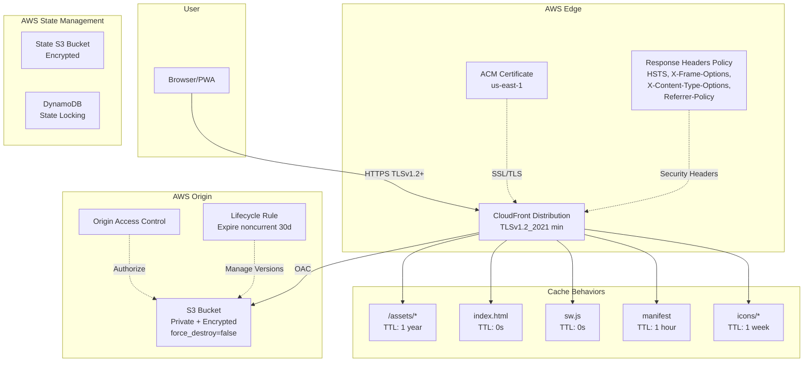

# Design Document: AWS Terraform Infrastructure for Grocery List PWA

## Overview

This design document describes the Terraform infrastructure to host the Grocery List PWA on AWS. The infrastructure provisions an S3 bucket for static file storage, a CloudFront CDN distribution for global content delivery with HTTPS, and an optional ACM certificate for custom domain support.

The PWA is a Vite-built application that produces static assets in the `dist/` directory:
- `index.html` - Main entry point
- `assets/` - Hashed JavaScript and CSS bundles (immutable)
- `sw.js` - Service worker for offline functionality
- `manifest.webmanifest` - PWA manifest
- `icons/` - App icons (192x192 and 512x512)

The Terraform configuration will be organized in the `infra/` directory at the project root.

## Architecture



### Request Flow

1. User requests the PWA via HTTPS
2. CloudFront terminates SSL using ACM certificate (or default CloudFront cert) with minimum TLSv1.2
3. CloudFront checks cache based on path-specific cache policies
4. On cache miss, CloudFront fetches from S3 using Origin Access Control
5. S3 bucket policy validates the OAC principal before serving content
6. Response is cached at edge and returned to user with compression and security response headers (HSTS, X-Frame-Options, X-Content-Type-Options, Referrer-Policy)

### Error Handling Flow

For SPA routing support, 403/404 errors are handled by returning `index.html` with a 200 status, allowing client-side routing to handle the path.

## Components and Interfaces

### File Structure

```
infra/
├── main.tf              # Main resource definitions
├── variables.tf         # Input variable declarations
├── outputs.tf           # Output value definitions
├── providers.tf         # Provider configuration
├── backend.tf           # S3 remote backend with DynamoDB locking
├── s3.tf                # S3 bucket and policy resources
├── cloudfront.tf        # CloudFront distribution and OAC
├── acm.tf               # ACM certificate (conditional)
└── terraform.tfvars.example  # Example variable values (placeholder values only)
```

### Component: S3 Bucket (s3.tf)

Resources:
- `aws_s3_bucket` - Main storage bucket (force_destroy = false)
- `aws_s3_bucket_versioning` - Enable versioning
- `aws_s3_bucket_server_side_encryption_configuration` - AES-256 encryption
- `aws_s3_bucket_public_access_block` - Block all public access
- `aws_s3_bucket_policy` - Allow CloudFront OAC access only
- `aws_s3_bucket_lifecycle_configuration` - Expire noncurrent object versions after 30 days

Configuration:
- `force_destroy = false` to prevent accidental bucket deletion
- Lifecycle rule: `noncurrent_version_expiration` with `noncurrent_days = 30` (cleans up old versions since versioning is enabled)

Inputs:
- `bucket_prefix` (string) - Prefix for bucket name generation

Outputs:
- `bucket_name` - The created bucket name
- `bucket_arn` - The bucket ARN

### Component: CloudFront Distribution (cloudfront.tf)

Resources:
- `aws_cloudfront_origin_access_control` - OAC for S3 access
- `aws_cloudfront_distribution` - CDN distribution
- `aws_cloudfront_cache_policy` - Custom cache policies per asset type
- `aws_cloudfront_response_headers_policy` - Security response headers

Configuration:
- Origin: S3 bucket with OAC
- Default root object: `index.html`
- Viewer protocol policy: redirect-to-https
- Compression: enabled (gzip, brotli)
- Custom error responses: 403/404 → /index.html (200)
- Minimum TLS version: TLSv1.2 via `minimum_protocol_version = "TLSv1.2_2021"` in `viewer_certificate` block

Security Response Headers Policy:
- `Strict-Transport-Security`: `max-age=31536000; includeSubDomains`
- `X-Content-Type-Options`: `nosniff`
- `X-Frame-Options`: `DENY`
- `Referrer-Policy`: `strict-origin-when-cross-origin`
- The response headers policy is attached to all cache behaviors (default and ordered)

Cache Behaviors:
| Path Pattern | TTL | Rationale |
|--------------|-----|-----------|
| `/assets/*` | 31536000s (1 year) | Immutable hashed files |
| `index.html` | 0s | Always fresh for updates |
| `sw.js` | 0s | Service worker must update immediately |
| `manifest.webmanifest` | 3600s (1 hour) | Infrequent changes |
| `/icons/*` | 604800s (1 week) | Rarely change |
| Default | 86400s (1 day) | Reasonable default |

Outputs:
- `distribution_domain_name` - CloudFront domain
- `distribution_id` - Distribution ID for cache invalidation

### Component: ACM Certificate (acm.tf)

Resources (conditional on `custom_domain` variable):
- `aws_acm_certificate` - SSL certificate in us-east-1
- `aws_acm_certificate_validation` - DNS validation waiter (optional)

Configuration:
- Region: us-east-1 (required for CloudFront)
- Validation method: DNS
- Subject alternative names: configurable

Outputs:
- `certificate_arn` - Certificate ARN
- `certificate_validation_records` - DNS records for validation

### Component: Variables (variables.tf)

| Variable | Type | Required | Default | Description |
|----------|------|----------|---------|-------------|
| `bucket_prefix` | string | yes | - | Prefix for S3 bucket name |
| `custom_domain` | string | no | null | Custom domain for CloudFront |
| `environment` | string | no | "production" | Environment tag |
| `aws_region` | string | no | "us-east-1" | AWS region for S3 |

### Component: Outputs (outputs.tf)

| Output | Description |
|--------|-------------|
| `s3_bucket_name` | Name of the created S3 bucket |
| `s3_bucket_arn` | ARN of the S3 bucket |
| `cloudfront_distribution_id` | CloudFront distribution ID |
| `cloudfront_domain_name` | CloudFront distribution domain |
| `website_url` | Full HTTPS URL for the website |
| `acm_certificate_arn` | ACM certificate ARN (if custom domain) |
| `acm_validation_records` | DNS validation records (if custom domain) |

### Component: Remote Backend (backend.tf)

Configuration:
- S3 backend for Terraform state storage with encryption enabled
- DynamoDB table for state locking to prevent concurrent modifications
- Backend bucket and DynamoDB table are referenced by name (must be pre-created or managed separately)

```hcl
terraform {
  backend "s3" {
    bucket         = "<state-bucket-name>"
    key            = "grocery-pwa/terraform.tfstate"
    region         = "us-east-1"
    encrypt        = true
    dynamodb_table = "<lock-table-name>"
  }
}
```

Note: The backend S3 bucket and DynamoDB table must exist before `terraform init`. These are typically created once manually or via a separate bootstrap Terraform configuration.

### Component: Providers (providers.tf)

```hcl
terraform {
  required_version = ">= 1.0"
  
  required_providers {
    aws = {
      source  = "hashicorp/aws"
      version = ">= 5.0"
    }
  }
}

provider "aws" {
  region = var.aws_region
}

# ACM certificates for CloudFront must be in us-east-1
provider "aws" {
  alias  = "us_east_1"
  region = "us-east-1"
}
```

## Data Models

### Terraform State Structure

The Terraform state will track the following resource types:

```
aws_s3_bucket.website
aws_s3_bucket_versioning.website
aws_s3_bucket_server_side_encryption_configuration.website
aws_s3_bucket_public_access_block.website
aws_s3_bucket_policy.website
aws_s3_bucket_lifecycle_configuration.website
aws_cloudfront_origin_access_control.website
aws_cloudfront_distribution.website
aws_cloudfront_cache_policy.assets_cache
aws_cloudfront_response_headers_policy.security_headers
aws_acm_certificate.website (conditional)
```

### Variable Schema

```hcl
# variables.tf type definitions

variable "bucket_prefix" {
  type        = string
  description = "Prefix for the S3 bucket name. Will be combined with a random suffix."
  
  validation {
    condition     = can(regex("^[a-z0-9][a-z0-9-]*[a-z0-9]$", var.bucket_prefix))
    error_message = "Bucket prefix must be lowercase alphanumeric with hyphens, not starting or ending with hyphen."
  }
}

variable "custom_domain" {
  type        = string
  default     = null
  description = "Custom domain name for CloudFront. If null, uses default CloudFront domain."
  
  validation {
    condition     = var.custom_domain == null || can(regex("^[a-z0-9][a-z0-9.-]*[a-z0-9]$", var.custom_domain))
    error_message = "Custom domain must be a valid domain name."
  }
}

variable "environment" {
  type        = string
  default     = "production"
  description = "Environment name for resource tagging."
}

variable "aws_region" {
  type        = string
  default     = "us-east-1"
  description = "AWS region for S3 bucket. CloudFront is global."
}
```

### Output Schema

```hcl
# outputs.tf structure

output "s3_bucket_name" {
  value       = aws_s3_bucket.website.id
  description = "Name of the S3 bucket storing website files"
}

output "s3_bucket_arn" {
  value       = aws_s3_bucket.website.arn
  description = "ARN of the S3 bucket"
}

output "cloudfront_distribution_id" {
  value       = aws_cloudfront_distribution.website.id
  description = "CloudFront distribution ID for cache invalidation"
}

output "cloudfront_domain_name" {
  value       = aws_cloudfront_distribution.website.domain_name
  description = "CloudFront distribution domain name"
}

output "website_url" {
  value       = "https://${coalesce(var.custom_domain, aws_cloudfront_distribution.website.domain_name)}"
  description = "Full URL to access the website"
}

output "acm_certificate_arn" {
  value       = var.custom_domain != null ? aws_acm_certificate.website[0].arn : null
  description = "ACM certificate ARN (null if no custom domain)"
}

output "acm_validation_records" {
  value       = var.custom_domain != null ? aws_acm_certificate.website[0].domain_validation_options : []
  description = "DNS records required for ACM certificate validation"
}
```


## Correctness Properties

*A property is a characteristic or behavior that should hold true across all valid executions of a system — essentially, a formal statement about what the system should do. Properties serve as the bridge between human-readable specifications and machine-verifiable correctness guarantees.*

Most of the acceptance criteria for this infrastructure spec are static configuration checks (e.g., "encryption is AES-256", "versioning is enabled"). These are best validated as example-based tests that verify specific Terraform plan output values. However, two properties emerge from criteria that must hold across a range of inputs.

### Property 1: Bucket name derives from prefix

*For any* valid bucket prefix string (lowercase alphanumeric with hyphens), the generated S3 bucket name must contain that prefix as a substring.

**Validates: Requirements 1.1**

### Property 2: Custom domain conditional resource creation

*For any* Terraform configuration, if a custom domain is provided then the plan must include an ACM certificate resource in us-east-1, the CloudFront distribution aliases must contain that domain, and the certificate must be associated with the distribution. If no custom domain is provided (null), then no ACM certificate resource must exist in the plan and the CloudFront distribution must use its default domain with no aliases.

**Validates: Requirements 3.1, 3.4, 3.6**

## Error Handling

### Terraform Validation Errors

| Scenario | Handling |
|----------|----------|
| Invalid `bucket_prefix` (uppercase, special chars) | Variable validation block rejects with descriptive error message |
| Invalid `custom_domain` format | Variable validation block rejects with descriptive error message |
| Missing required `bucket_prefix` variable | Terraform prompts for value or fails with missing variable error |

### AWS Resource Errors

| Scenario | Handling |
|----------|----------|
| S3 bucket name already exists globally | Terraform fails at apply with bucket name conflict; user should change prefix |
| ACM certificate DNS validation timeout | Terraform apply waits for validation; user must create DNS records |
| CloudFront distribution creation failure | Terraform reports AWS API error; typically quota or permission issue |
| IAM permission insufficient | Terraform reports access denied; user must ensure IAM policy allows required actions |

### Operational Considerations

- CloudFront distributions take 10-15 minutes to deploy/update
- ACM certificate validation requires manual DNS record creation (unless Route53 is used)
- S3 bucket deletion requires emptying the bucket first (Terraform handles this with `force_destroy` if configured)
- Terraform state should be stored remotely using the S3 backend configured in backend.tf with DynamoDB locking

## Testing Strategy

### Approach

This infrastructure module uses a dual testing approach:

1. **Unit tests** using `terraform plan` output validation to verify specific configuration values
2. **Property-based tests** using fast-check to verify properties that must hold across a range of inputs

Since this is Terraform HCL (not application code), testing focuses on:
- Validating the generated Terraform plan JSON output
- Verifying variable validation rules
- Checking resource relationships and conditional logic

### Testing Tools

- **Vitest** - Test runner (consistent with existing project)
- **fast-check** - Property-based testing library (already in project devDependencies)
- **terraform plan -out=plan.json** - Generate plan output for validation
- Tests will parse Terraform plan JSON to validate resource configurations

### Unit Tests

Unit tests verify specific configuration examples:

- S3 bucket has public access blocked (all four block settings true) — validates 1.2
- S3 bucket has versioning enabled — validates 1.3
- S3 bucket has AES-256 encryption — validates 1.4
- S3 bucket outputs include name and ARN — validates 1.5
- CloudFront origin points to S3 bucket — validates 2.1
- CloudFront uses OAC — validates 2.2
- CloudFront redirects HTTP to HTTPS — validates 2.3
- CloudFront default root object is index.html — validates 2.4
- CloudFront custom error responses for 403/404 return /index.html with 200 — validates 2.5
- CloudFront has compression enabled — validates 2.7
- CloudFront outputs include domain name and ID — validates 2.8
- ACM certificate uses DNS validation — validates 3.2
- ACM certificate is associated with CloudFront — validates 3.3
- ACM outputs include ARN and validation records — validates 3.5
- S3 bucket policy allows only CloudFront OAC principal — validates 4.1, 4.2, 4.3
- variables.tf contains all variable declarations — validates 5.1
- outputs.tf contains all output declarations — validates 5.2
- Provider versions have minimum constraints — validates 5.3, 5.4, 5.5
- terraform.tfvars.example file exists with documented variables — validates 5.6
- Cache behavior for /assets/* has TTL of 31536000s — validates 6.1
- Cache behavior for index.html has TTL of 0s — validates 6.2
- Cache behavior for sw.js has TTL of 0s — validates 6.3
- Cache behavior for manifest.webmanifest has TTL of 3600s — validates 6.4
- Cache behavior for /icons/* has TTL of 604800s — validates 6.5
- CloudFront response headers policy includes HSTS with max-age=31536000 and includeSubDomains — validates 7.1
- CloudFront response headers policy includes X-Content-Type-Options: nosniff — validates 7.2
- CloudFront response headers policy includes X-Frame-Options: DENY — validates 7.3
- CloudFront response headers policy includes Referrer-Policy: strict-origin-when-cross-origin — validates 7.4
- Response headers policy is attached to all cache behaviors — validates 7.5
- CloudFront viewer certificate minimum_protocol_version is TLSv1.2_2021 — validates 8.1, 8.2
- S3 bucket lifecycle rule expires noncurrent versions after 30 days — validates 9.1
- S3 bucket force_destroy is set to false — validates 9.2
- backend.tf configures S3 remote backend with encryption enabled — validates 10.1, 10.2
- backend.tf configures DynamoDB for state locking — validates 10.3
- terraform.tfvars is listed in .gitignore — validates 10.4
- terraform.tfvars.example contains placeholder values only — validates 10.5

### Property-Based Tests

Each correctness property is implemented as a single property-based test with minimum 100 iterations.

- **Feature: aws-terraform-iac, Property 1: Bucket name derives from prefix** — Generate random valid bucket prefixes (lowercase alphanumeric with hyphens, 3-20 chars), verify the Terraform variable validation accepts them and the resulting bucket name contains the prefix. Validates 1.1.

- **Feature: aws-terraform-iac, Property 2: Custom domain conditional resource creation** — Generate random configurations with and without custom domains, verify that when custom_domain is non-null the plan includes ACM resources and CloudFront aliases, and when null it does not. Validates 3.1, 3.4, 3.6.

### Test File Organization

```
tests/
├── aws-terraform-iac.unit.test.ts        # Unit tests for Terraform config validation
└── aws-terraform-iac.properties.test.ts  # Property-based tests
```

### Test Configuration

```typescript
// Property test configuration
fc.assert(
  fc.property(/* arbitraries */, (input) => {
    // Feature: aws-terraform-iac, Property 1: Bucket name derives from prefix
    // ... test implementation
  }),
  { numRuns: 100 }
);
```
