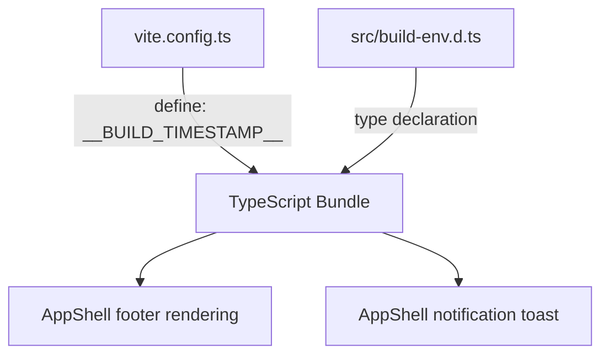

# Design Document: Build Timestamp Display

## Overview

This feature injects a human-readable build timestamp into the application bundle at build time using Vite's `define` configuration, then surfaces it in two places: the app footer (full format) and the "up to date" notification toast (short format). The approach mirrors the existing `vite-plugin-sw-cache-version.ts` pattern of build-time value injection, but uses Vite's native `define` option instead of a custom plugin since the value is a simple string constant rather than a file transformation.

The timestamp is formatted at build time (not runtime), so the displayed value always reflects when the bundle was produced, regardless of when the user loads the page.

## Architecture

The feature touches four layers of the codebase:



1. **Build-time injection** — `vite.config.ts` adds a `define` entry that replaces `__BUILD_TIMESTAMP__` with the formatted timestamp string during production builds, or `"Built dev"` during development.
2. **Type declaration** — A new ambient declaration file (`src/build-env.d.ts`) declares the global constant so TypeScript resolves it without errors.
3. **Footer display** — `AppShell.createAppStructure()` adds a `<span>` element in the footer alongside the existing update button.
4. **Notification enhancement** — `AppShell.handleForceUpdate()` modifies the `'up-to-date'` case to include the short-form timestamp.

### Design Decisions

- **`define` over a custom plugin**: The existing `swCacheVersionPlugin` replaces placeholders in file content (the service worker template). For a simple global constant, Vite's built-in `define` is the idiomatic, lower-complexity approach.
- **Build-time formatting**: The timestamp is formatted once at build time using `Date.toLocaleString('en-US', ...)`. This avoids runtime date parsing and ensures the value is a static string baked into the bundle.
- **Single global constant**: One constant `__BUILD_TIMESTAMP__` holds the full-format string ("Built MMM DD, YYYY h:mm AM/PM"). The short format (no year) is derived at runtime by a pure helper function, avoiding a second global constant.

## Components and Interfaces

### 1. Vite Config (`vite.config.ts`)

Add a `define` block to the existing config:

```typescript
define: {
  __BUILD_TIMESTAMP__: JSON.stringify(
    command === 'build'
      ? `Built ${new Date().toLocaleString('en-US', { month: 'short', day: 'numeric', year: 'numeric', hour: 'numeric', minute: '2-digit', hour12: true })}`
      : 'Built dev'
  )
}
```

The config callback switches from `defineConfig({...})` to `defineConfig(({ command }) => ({...}))` to access the `command` parameter (`'build'` vs `'serve'`).

### 2. Type Declaration (`src/build-env.d.ts`)

```typescript
declare const __BUILD_TIMESTAMP__: string;
```

This file is automatically included via the existing `tsconfig.json` `"include": ["src/**/*"]` glob.

### 3. Short Timestamp Helper

A pure function to strip the year from the full timestamp for notification use:

```typescript
export function toShortTimestamp(full: string): string
```

Input: `"Built Mar 16, 2026 9:45 PM"` → Output: `"built Mar 16, 9:45 PM"`

Behavior:
- Removes the 4-digit year and surrounding punctuation (`, YYYY`)
- Lowercases "Built" to "built" for inline use in the notification sentence

This function lives in a small utility module (e.g., `src/build-timestamp.ts`) to keep it testable independently of the DOM.

### 4. AppShell Footer Changes (`src/index.ts`)

In `createAppStructure()`, the footer HTML gains a `<span>` for the timestamp:

```html
<footer id="app-footer" class="app-footer">
  <span class="build-timestamp">__BUILD_TIMESTAMP__</span>
</footer>
```

The update button is appended after this span as it is today. The span uses class `build-timestamp` styled with the same muted appearance as the update button (font-size `0.75rem`, color `var(--text-disabled)`).

### 5. AppShell Notification Change (`src/index.ts`)

In `handleForceUpdate()`, the `'up-to-date'` case changes from:

```typescript
this.showNotification('App is already up to date.', 'info');
```

to:

```typescript
this.showNotification(`App is up to date (${toShortTimestamp(__BUILD_TIMESTAMP__)})`, 'info');
```

### 6. CSS Addition (`src/styles/main.css`)

```css
.build-timestamp {
  display: block;
  font-size: 0.75rem;
  color: var(--text-disabled);
  margin-bottom: 0.25rem;
}
```

## Data Models

No new persistent data models are introduced. The build timestamp is a compile-time string constant, not stored in localStorage or any runtime state.

**Constants:**

| Name | Type | Source | Example Value |
|------|------|--------|---------------|
| `__BUILD_TIMESTAMP__` | `string` | Vite `define` (build-time) | `"Built Mar 16, 2026 9:45 PM"` |

**Derived values:**

| Value | Derivation | Example |
|-------|-----------|---------|
| Short timestamp | `toShortTimestamp(__BUILD_TIMESTAMP__)` | `"built Mar 16, 9:45 PM"` |


## Correctness Properties

*A property is a characteristic or behavior that should hold true across all valid executions of a system — essentially, a formal statement about what the system should do. Properties serve as the bridge between human-readable specifications and machine-verifiable correctness guarantees.*

### Property 1: Build timestamp format validity

*For any* valid JavaScript `Date` object, formatting it with the build timestamp logic should produce a string matching the pattern `Built <Mon> <DD>, <YYYY> <h>:<mm> <AM|PM>` — specifically, starting with "Built ", followed by a 3-letter month abbreviation, a 1-2 digit day, a 4-digit year, and a time in 12-hour format with AM/PM.

**Validates: Requirements 1.1, 1.3**

### Property 2: Short timestamp derivation preserves components

*For any* valid full-format build timestamp string (matching "Built MMM DD, YYYY h:mm AM/PM"), applying `toShortTimestamp` should produce a string that: (a) starts with lowercase "built", (b) contains the same month and day, (c) contains the same time and AM/PM, and (d) does not contain the 4-digit year.

**Validates: Requirements 3.1**

## Error Handling

This feature has a minimal error surface since the timestamp is a static string injected at build time:

- **Missing `__BUILD_TIMESTAMP__`**: If the Vite define config is misconfigured and the constant is not replaced, TypeScript compilation will fail due to the ambient declaration expecting a string. This is a build-time failure, not a runtime one.
- **Malformed timestamp in `toShortTimestamp`**: If the input string doesn't match the expected format (e.g., during development when the value is `"Built dev"`), the function should return the input unchanged rather than crashing. This graceful fallback means the notification will show "built dev" in dev mode, which is acceptable.
- **No runtime errors**: Since the value is a compile-time constant string, there are no network calls, async operations, or user input parsing that could fail at runtime.

## Testing Strategy

### Property-Based Tests

Use `fast-check` (already in devDependencies) with minimum 100 iterations per property.

**Property 1 — Build timestamp format validity**:
- Generate random `Date` objects using `fc.date()`
- Apply the formatting logic
- Assert the output matches the regex `/^Built [A-Z][a-z]{2} \d{1,2}, \d{4} \d{1,2}:\d{2} [AP]M$/`
- Tag: `Feature: build-timestamp-display, Property 1: Build timestamp format validity`

**Property 2 — Short timestamp derivation preserves components**:
- Generate random full-format timestamp strings by generating random dates, formatting them, then applying `toShortTimestamp`
- Assert the output starts with "built " (lowercase)
- Assert the output contains the same month, day, time, and AM/PM as the input
- Assert the output does not contain the 4-digit year
- Tag: `Feature: build-timestamp-display, Property 2: Short timestamp derivation preserves components`

### Unit Tests

- **Dev mode value**: Verify that when command is `'serve'`, the define value is `"Built dev"`.
- **Footer DOM structure**: Verify the footer contains a `.build-timestamp` span adjacent to the `.update-btn` button.
- **Non-interactive element**: Verify the timestamp span has no click event listeners and is not a button or anchor.
- **Up-to-date notification includes short timestamp**: Mock `__BUILD_TIMESTAMP__` and verify the notification message format.
- **Non-up-to-date statuses exclude timestamp**: Verify that `'reloading'`, `'unsupported'`, and `'error'` status notifications don't include the build timestamp.
- **`toShortTimestamp` with "Built dev"**: Verify it returns `"built dev"` (graceful fallback).
- **CSS class presence**: Verify `.build-timestamp` element has the correct class for muted styling.

### Test Configuration

- Property-based tests: `fast-check` with `{ numRuns: 100 }` minimum
- Each property test must reference its design document property in a comment
- Test files: `tests/build-timestamp-display.properties.test.ts` and `tests/build-timestamp-display.unit.test.ts`
- Test runner: `vitest` (already configured)
