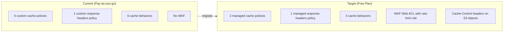
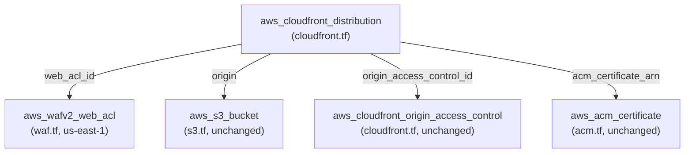

# Design Document: CloudFront Free Tier Migration

## Overview

This design describes the Terraform infrastructure changes required to migrate the grocery list PWA's CloudFront distribution from pay-as-you-go pricing to the AWS CloudFront Free flat-rate pricing plan. The migration touches four Terraform files (`cloudfront.tf`, `providers.tf`, `outputs.tf`, and a new `waf.tf`) and produces a deploy script reference for setting Cache-Control headers on S3 objects.

The free plan imposes these constraints:
- Only AWS managed cache policies (no custom `aws_cloudfront_cache_policy` resources)
- Only AWS managed response headers policies (no custom `aws_cloudfront_response_headers_policy` resources)
- Maximum 5 cache behaviors (1 default + 4 ordered)
- A WAF Web ACL must be attached (max 5 rules, included free)
- The WAF Web ACL cannot be shared with other distributions

The current infrastructure has 6 custom cache policies, 1 custom response headers policy, and 6 cache behaviors (1 default + 5 ordered). No WAF exists today.

### Key Design Decisions

1. **Caching intent preserved via S3 object Cache-Control headers** — The managed `CachingOptimized` policy respects origin `Cache-Control` headers, so per-file-type TTLs move from Terraform cache policies to the deploy script.
2. **Behavior consolidation** — `manifest.webmanifest` and `/icons/*` behaviors are absorbed into the default behavior. Their caching intent is preserved by Cache-Control headers set during deployment.
3. **WAF in a separate file** — The `aws_wafv2_web_acl` resource goes in a new `waf.tf` file for separation of concerns, using the existing `aws.us_east_1` provider alias.
4. **IAM is manual** — The `AWSWAFFullAccess` managed policy must be attached to the Terraform apply user outside of Terraform. This is documented, not automated.

## Architecture

### Before / After Comparison



### Resource Dependency Flow



## Components and Interfaces

### 1. `cloudfront.tf` — Modified

**Removals:**
- All 6 `aws_cloudfront_cache_policy` resource blocks (`assets_cache`, `index_cache`, `sw_cache`, `manifest_cache`, `icons_cache`, `default_cache`)
- The `aws_cloudfront_response_headers_policy.security_headers` resource block
- The `manifest.webmanifest` ordered cache behavior
- The `/icons/*` ordered cache behavior

**Modifications to remaining cache behaviors:**

| Behavior | Path Pattern | Managed Cache Policy | Managed Response Headers Policy |
|---|---|---|---|
| Default | `*` (catch-all) | `CachingOptimized` (`658327ea-f89d-4fab-a63d-7e88639e58f6`) | `SecurityHeadersPolicy` (`67f7725c-6f97-4210-82d7-5512b31e9d03`) |
| Ordered 1 | `/assets/*` | `CachingOptimized` | `SecurityHeadersPolicy` |
| Ordered 2 | `index.html` | `CachingDisabled` (`4135ea2d-6df8-44a3-9df3-4b5a84be39ad`) | `SecurityHeadersPolicy` |
| Ordered 3 | `sw.js` | `CachingDisabled` | `SecurityHeadersPolicy` |

**Addition:**
- `web_acl_id` attribute on the distribution referencing `aws_wafv2_web_acl.cloudfront.arn`

Note: `/assets/*` uses `CachingOptimized` rather than `CachingDisabled` because hashed assets are immutable and benefit from CloudFront edge caching. The 1-year TTL intent is enforced by the `Cache-Control: public, max-age=31536000, immutable` header set on S3 objects during deployment.

### 2. `waf.tf` — New File

Creates an `aws_wafv2_web_acl` resource with:
- `provider = aws.us_east_1` (required for CloudFront scope)
- `scope = "CLOUDFRONT"`
- `default_action = allow`
- One rule: AWS managed `AWSManagedRulesAmazonIpReputationList` is not needed for 3-4 users. Instead, a single rate-based rule blocking IPs exceeding 300 requests per 5-minute window.
- Total rules: 1 (well within the 5-rule limit)

```hcl
resource "aws_wafv2_web_acl" "cloudfront" {
  provider = aws.us_east_1
  name     = "${var.bucket_prefix}-cloudfront-waf"
  scope    = "CLOUDFRONT"

  default_action { allow {} }

  rule {
    name     = "rate-limit"
    priority = 1

    action { block {} }

    statement {
      rate_based_statement {
        limit              = 300
        aggregate_key_type = "IP"
      }
    }

    visibility_config {
      sampled_requests_enabled   = true
      cloudwatch_metrics_enabled = true
      metric_name                = "${var.bucket_prefix}-rate-limit"
    }
  }

  visibility_config {
    sampled_requests_enabled   = true
    cloudwatch_metrics_enabled = true
    metric_name                = "${var.bucket_prefix}-waf"
  }

  tags = {
    Name        = "${var.bucket_prefix}-cloudfront-waf"
    Environment = var.environment
  }
}
```

### 3. `outputs.tf` — Modified

Add a new output for the WAF Web ACL ARN:

```hcl
output "waf_web_acl_arn" {
  value       = aws_wafv2_web_acl.cloudfront.arn
  description = "ARN of the WAF Web ACL attached to CloudFront"
}
```

### 4. Deploy Script Reference

A reference deploy script section documenting `aws s3 sync` and `aws s3 cp` commands with `--cache-control` flags. This is documentation only — not a Terraform resource.

```bash
# Deploy hashed assets (1 year cache)
aws s3 sync dist/assets/ s3://$BUCKET_NAME/assets/ \
  --cache-control "public, max-age=31536000, immutable"

# Deploy index.html (no cache)
aws s3 cp dist/index.html s3://$BUCKET_NAME/index.html \
  --cache-control "no-cache, no-store, must-revalidate"

# Deploy service worker (no cache)
aws s3 cp dist/sw.js s3://$BUCKET_NAME/sw.js \
  --cache-control "no-cache, no-store, must-revalidate"

# Deploy manifest (1 hour cache)
aws s3 cp dist/manifest.webmanifest s3://$BUCKET_NAME/manifest.webmanifest \
  --cache-control "public, max-age=3600"

# Deploy icons (1 week cache)
aws s3 sync dist/icons/ s3://$BUCKET_NAME/icons/ \
  --cache-control "public, max-age=604800"

# Deploy remaining files (1 day cache)
aws s3 sync dist/ s3://$BUCKET_NAME/ \
  --cache-control "public, max-age=86400" \
  --exclude "assets/*" \
  --exclude "index.html" \
  --exclude "sw.js" \
  --exclude "manifest.webmanifest" \
  --exclude "icons/*"

# Invalidate CloudFront cache
aws cloudfront create-invalidation \
  --distribution-id $DISTRIBUTION_ID \
  --paths "/*"
```

### 5. Files Unchanged

- `s3.tf` — No changes needed. S3 bucket, versioning, encryption, public access block, lifecycle, and bucket policy remain as-is.
- `acm.tf` — No changes needed. ACM certificate conditional creation stays the same.
- `providers.tf` — No changes needed. The `aws.us_east_1` alias already exists and will be reused by `waf.tf`.
- `backend.tf` — No changes needed.
- `variables.tf` — No changes needed. Existing variables are sufficient.

## Data Models

### Managed Policy IDs (Constants)

| Policy | Type | ID |
|---|---|---|
| CachingOptimized | Cache Policy | `658327ea-f89d-4fab-a63d-7e88639e58f6` |
| CachingDisabled | Cache Policy | `4135ea2d-6df8-44a3-9df3-4b5a84be39ad` |
| SecurityHeadersPolicy | Response Headers Policy | `67f7725c-6f97-4210-82d7-5512b31e9d03` |

These are AWS-global constants — they do not vary by account or region.

### Cache-Control Header Values

| File Pattern | Cache-Control Value | Rationale |
|---|---|---|
| `/assets/*` | `public, max-age=31536000, immutable` | Vite-hashed filenames; content never changes for a given hash |
| `index.html` | `no-cache, no-store, must-revalidate` | Entry point must always be fresh to pick up new asset hashes |
| `sw.js` | `no-cache, no-store, must-revalidate` | Service worker spec requires freshness checks |
| `manifest.webmanifest` | `public, max-age=3600` | Rarely changes; 1-hour TTL is a reasonable refresh window |
| `/icons/*` | `public, max-age=604800` | Icons change very infrequently |
| Everything else | `public, max-age=86400` | Sensible default for any other static files |

### WAF Configuration

| Attribute | Value |
|---|---|
| Scope | `CLOUDFRONT` |
| Region | `us-east-1` |
| Default Action | `allow` |
| Rule Count | 1 |
| Rate Limit | 300 requests / 5 minutes per IP |
| Rate Limit Action | `block` |

### IAM Prerequisite (Manual)

| Action | Detail |
|---|---|
| Policy to attach | `AWSWAFFullAccess` (ARN: `arn:aws:iam::aws:policy/AWSWAFFullAccess`) |
| Attach to | Terraform apply user |
| When | Before running `terraform apply` with WAF changes |
| How | AWS Console → IAM → Users → Attach policy, or `aws iam attach-user-policy` CLI |


## Correctness Properties

*A property is a characteristic or behavior that should hold true across all valid executions of a system — essentially, a formal statement about what the system should do. Properties serve as the bridge between human-readable specifications and machine-verifiable correctness guarantees.*

### Property 1: All cache behaviors use only managed policies

*For any* cache behavior block (default or ordered) in the CloudFront distribution configuration, the `cache_policy_id` must be one of the two AWS managed cache policy IDs (`658327ea-f89d-4fab-a63d-7e88639e58f6` for CachingOptimized or `4135ea2d-6df8-44a3-9df3-4b5a84be39ad` for CachingDisabled), AND the `response_headers_policy_id` must be the AWS managed SecurityHeadersPolicy ID (`67f7725c-6f97-4210-82d7-5512b31e9d03`).

**Validates: Requirements 1.1, 3.1**

### Property 2: No custom policy resource blocks exist

*For any* `.tf` file in the `infra/` directory, the file shall contain zero `aws_cloudfront_cache_policy` resource blocks and zero `aws_cloudfront_response_headers_policy` resource blocks.

**Validates: Requirements 1.2, 3.2**

### Property 3: All cache behaviors enforce viewer HTTPS redirect

*For any* cache behavior block (default or ordered) in the CloudFront distribution configuration, the `viewer_protocol_policy` must be `redirect-to-https`.

**Validates: Requirements 7.4**

## Error Handling

### Terraform Apply Failures

| Scenario | Cause | Resolution |
|---|---|---|
| WAF creation fails with `AccessDeniedException` | `AWSWAFFullAccess` not attached to Terraform apply user | Attach the managed policy manually (see Requirement 6), then re-run `terraform apply` |
| WAF creation fails with `WAFInvalidParameterException` | Rate limit value out of range or invalid scope | Verify `scope = "CLOUDFRONT"` and `limit >= 100` |
| Distribution update fails referencing deleted cache policy | Terraform apply order issue | Terraform handles this via dependency graph; if it occurs, run `terraform apply` again |
| Distribution update fails with "too many cache behaviors" | More than 5 behaviors after migration | Verify only 4 ordered + 1 default behavior exist in `cloudfront.tf` |

### Deploy Script Errors

| Scenario | Cause | Resolution |
|---|---|---|
| `aws s3 sync` fails with `AccessDenied` | S3 bucket policy or IAM permissions | Verify the deploy user has `s3:PutObject` permission on the bucket |
| Cache-Control header not applied | Missing `--cache-control` flag in command | Verify each `aws s3 sync`/`cp` command includes the flag |
| CloudFront still serving stale content after deploy | Missing cache invalidation | Run `aws cloudfront create-invalidation --distribution-id $DISTRIBUTION_ID --paths "/*"` |

### Rollback Strategy

If the migration causes issues:
1. Revert `cloudfront.tf` and `waf.tf` to the previous state (restore custom policies and all 6 behaviors)
2. Run `terraform apply` to restore the original configuration
3. The WAF Web ACL will be destroyed automatically when removed from config
4. Switch the CloudFront pricing plan back to pay-as-you-go in the AWS Console

## Testing Strategy

### Unit Tests

Unit tests verify specific, concrete aspects of the migrated Terraform configuration:

- **No custom policy resources**: Verify that no `aws_cloudfront_cache_policy` or `aws_cloudfront_response_headers_policy` resource blocks exist in any `.tf` file (Requirements 1.2, 3.2)
- **Behavior count**: Verify exactly 4 `ordered_cache_behavior` blocks exist (Requirement 2.1)
- **Retained behaviors**: Verify `/assets/*`, `index.html`, and `sw.js` path patterns exist as ordered behaviors (Requirement 2.2)
- **Removed behaviors**: Verify no `manifest.webmanifest` or `/icons/*` ordered behaviors exist (Requirement 2.3)
- **Default behavior policy**: Verify default behavior uses CachingOptimized (Requirement 2.4)
- **WAF resource exists**: Verify `aws_wafv2_web_acl` resource exists with `provider = aws.us_east_1`, `scope = "CLOUDFRONT"`, `default_action { allow {} }` (Requirements 4.1, 4.2)
- **WAF rule count**: Verify at most 5 `rule` blocks in the WAF resource (Requirement 4.3)
- **Rate limit rule**: Verify `rate_based_statement` with `limit = 300` exists (Requirement 4.4)
- **WAF attached to distribution**: Verify `web_acl_id` references the WAF resource (Requirement 4.5)
- **Preserved config**: Verify OAC, custom_error_response blocks, geo_restriction "none", is_ipv6_enabled, compress, minimum_protocol_version remain (Requirements 7.1-7.6)
- **No IAM resources**: Verify no `aws_iam` resource blocks exist in any `.tf` file (Requirement 6.2)

### Property-Based Tests

Property-based tests use `fast-check` (already a project dependency) to verify universal properties across generated inputs. Each test runs a minimum of 100 iterations.

- **Feature: cloudfront-free-tier-migration, Property 1: All cache behaviors use only managed policies** — Parse all cache behavior blocks from `cloudfront.tf`, generate random selections from the extracted behaviors, and verify each one references only managed policy IDs.
- **Feature: cloudfront-free-tier-migration, Property 2: No custom policy resource blocks exist** — Generate random `.tf` filenames from the `infra/` directory, read each file, and verify it contains no custom policy resource declarations.
- **Feature: cloudfront-free-tier-migration, Property 3: All cache behaviors enforce viewer HTTPS redirect** — Parse all cache behavior blocks from `cloudfront.tf`, generate random selections, and verify each has `viewer_protocol_policy = "redirect-to-https"`.

### Pre-Apply Validation

Before running `terraform apply`, the maintainer should:
1. Verify `AWSWAFFullAccess` is attached to the Terraform apply user
2. Run `terraform plan` and confirm:
   - 6 cache policy resources destroyed
   - 1 response headers policy resource destroyed
   - 1 WAF Web ACL created
   - Distribution updated (behaviors reduced, policies changed, WAF attached)
3. Review the plan output for any unexpected changes

### Post-Apply Validation

After `terraform apply` succeeds:
1. Run the deploy script to set Cache-Control headers on S3 objects
2. Verify the site loads correctly at the CloudFront URL
3. Check response headers include security headers from the managed SecurityHeadersPolicy
4. Verify the CloudFront pricing plan can now be switched to Free in the AWS Console
