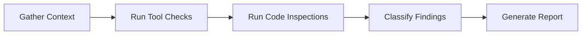

# Design Document: Codebase Audit

## Overview

This design describes a comprehensive audit of the Grocery List PWA codebase. The audit engine is a structured, manual-plus-tooling process that inspects every layer of the application — npm dependencies, TypeScript source code, PWA configuration, Vite build setup, and Terraform infrastructure — and produces a single, categorized report of findings with severity ratings and actionable recommendations.

The audit is not a runtime system; it is a one-shot analysis pass that reads the codebase, runs static analysis tools, and emits a Markdown report. The "Audit Engine" is the combination of CLI tool invocations (e.g., `npm audit`, `npm outdated`) and scripted/manual code inspection steps described below.

### Key Design Decisions

1. **Report-as-Markdown**: The audit report is a single Markdown file (`audit-report.md`) at the project root. Markdown is human-readable, version-controllable, and renderable in GitHub/IDE.
2. **Severity taxonomy**: Findings use four levels — Critical, High, Medium, Low — aligned with npm audit severity and industry convention.
3. **Tooling-assisted, not fully automated**: Some checks (e.g., `npm audit`, `npm outdated`) are tool-driven. Others (e.g., architecture review, component pattern consistency) require manual inspection guided by grep/AST queries. The design specifies which tool or technique applies to each check.
4. **No new runtime dependencies**: The audit does not introduce any new packages or build steps into the project.

## Architecture

The audit follows a linear pipeline:



### Stages

| Stage | Description | Inputs | Outputs |
|---|---|---|---|
| **Gather Context** | Read `package.json`, `tsconfig.json`, Terraform files, source tree | Filesystem | In-memory file map |
| **Run Tool Checks** | Execute `npm outdated --json`, `npm audit --json` | `package.json`, `node_modules` | Raw JSON results |
| **Run Code Inspections** | Grep/AST-based scans for duplicates, `innerHTML`, `any` types, missing return types, `Math.random()` UUID, etc. | `src/**/*.ts`, `infra/**/*.tf`, `public/*` | List of raw findings |
| **Classify Findings** | Assign severity, category, file paths, and recommendations | Raw findings | Classified findings |
| **Generate Report** | Render findings into structured Markdown grouped by category | Classified findings | `audit-report.md` |

## Components and Interfaces

### 1. Dependency Auditor

Inspects `package.json` for outdated and vulnerable dependencies.

**Tools:**
- `npm outdated --json` — lists current vs. latest versions for every dependency
- `npm audit --json` — reports known vulnerabilities from the npm advisory database

**Checks:**
- List every dependency with current pinned version and latest available version (Req 1.1)
- Flag major-upgrade candidates with breaking change notes (Req 1.2)
- Flag minor/patch upgrade candidates (Req 1.3)
- Identify deprecated packages via `npm outdated` deprecation field (Req 1.4)
- Produce prioritized upgrade plan: security-impacting first, then compatibility risk (Req 1.5)
- Report all `npm audit` vulnerabilities with severity and affected package (Req 3.1)

### 2. Duplicate Code Detector

Scans TypeScript source files for structural and near-duplicate code.

**Approach:**
- Use `jscpd` (JS/TS copy-paste detector) configured with `--min-lines 5` against `src/` to find identical and near-identical blocks (Req 2.1, 2.2)
- For each detected clone, report file paths, line ranges, and similarity percentage (Req 2.3)
- Provide consolidation recommendations (e.g., extract to shared utility) (Req 2.4)
- Specifically verify `generateId()` duplication across `src/state.ts`, `src/storage.ts`, `src/serializer.ts`, and `src/merge-engine.ts` — all four files contain identical `Math.random()`-based UUID implementations (Req 2.5)

### 3. Security Inspector

Checks for security vulnerabilities in dependencies and application code.

**Checks:**
- `npm audit` results (Req 3.1)
- Grep for `innerHTML` assignments in `src/**/*.ts` and classify injection risk (Req 3.2). Known occurrences: `src/index.ts` (multiple), `src/components/ListSelector.ts` (with `escapeHtml` mitigation)
- Verify service worker (`public/sw.js`) does not cache credentials or tokens — inspect cached asset list and fetch handler (Req 3.3)
- Verify CloudFront `viewer_protocol_policy = "redirect-to-https"` in `infra/cloudfront.tf` (Req 3.4)
- Verify S3 public access block in `infra/s3.tf` — all four block flags must be `true` (Req 3.5)
- Verify WAF rate-limiting rule exists on CloudFront distribution in `infra/waf.tf` (Req 3.6)
- Assign severity and remediation recommendation for each finding (Req 3.7)
- Verify `localStorage` usage in `src/storage.ts` does not store auth tokens or credentials (Req 3.8)

### 4. TypeScript Practices Reviewer

Reviews TypeScript configuration and source code quality.

**Checks:**
- Verify `tsconfig.json` has `"strict": true` (Req 4.1)
- Verify `noUnusedLocals` and `noUnusedParameters` are enabled (Req 4.2)
- Grep for `: any` type annotations in `src/**/*.ts` and recommend typed alternatives (Req 4.3). Known occurrences: `src/storage.ts` (validation functions, catch clauses), `src/serializer.ts` (validation, JSON parse)
- Check exported functions for explicit return type annotations via AST inspection (Req 4.4)
- Check error handling patterns: typed catch clauses, no swallowed errors (Req 4.5)
- Flag `Math.random()`-based UUID generation where cryptographic randomness may be needed (Req 4.6). All four `generateId()` implementations use `Math.random()`

### 5. PWA Configuration Reviewer

Validates the web manifest and service worker configuration.

**Checks:**
- Verify `public/manifest.webmanifest` contains required fields: `name`, `short_name`, `start_url`, `display`, `icons`, `theme_color`, `background_color` (Req 5.1)
- Verify service worker uses versioned cache name (`CACHE_NAME = 'grocery-list-__BUILD_HASH__'`) and cleans up old caches in the `activate` handler (Req 5.2)
- Verify service worker pre-caches critical assets via `__PRECACHE_ASSETS__` placeholder injected by `vite-plugin-sw-cache-version.ts` (Req 5.3)
- Verify service worker provides offline fallback for navigation requests (cache-first with `/index.html` fallback) (Req 5.4)
- Report any missing fields or behaviors with correction recommendations (Req 5.5)

### 6. Build Configuration Reviewer

Reviews Vite build setup and developer tooling.

**Checks:**
- Verify Vite produces hashed filenames — check `vite.config.ts` and `dist/assets/` output (Req 6.1). Vite defaults to content-hashed filenames for assets
- Verify tree-shaking is enabled — Vite uses Rollup which tree-shakes by default with ESM (Req 6.2)
- Check for ESLint configuration — no `.eslintrc.*` or `eslint.config.*` found in project root (Req 6.3)
- Check for Prettier configuration — no `.prettierrc` or `prettier.config.*` found (Req 6.4)
- Verify test configuration provides coverage reporting — `@vitest/coverage-v8` is present in devDependencies (Req 6.5)

### 7. Infrastructure Code Reviewer

Reviews Terraform files for best practices.

**Checks:**
- Verify Terraform state backend configuration — `infra/backend.tf` has remote backend commented out, currently using local state (Req 7.1)
- Verify `terraform.tfvars` is in `.gitignore` — confirmed via `*.tfvars` pattern (Req 7.2)
- Verify consistent resource tagging with `Name` and `Environment` tags (Req 7.3)
- Verify provider version constraints use pessimistic pinning — current config uses `>= 5.0` (open-ended) instead of `~>` (Req 7.4)
- Grep for hardcoded secrets/credentials in `infra/**/*.tf` (Req 7.5)
- Verify `terraform.tfstate` and `.tfstate.backup` are in `.gitignore` — confirmed via `*.tfstate` and `*.tfstate.*` patterns (Req 7.6)

### 8. Architecture Reviewer

Assesses code organization and structural quality.

**Checks:**
- Evaluate module structure under `src/` for separation of concerns (Req 8.1): types, state, storage, serialization, UI components, controllers
- Identify files exceeding 300 lines and assess whether they contain multiple responsibilities (Req 8.2). Known large files: `src/index.ts` (~1077 lines), `src/state.ts` (~600+ lines), `src/storage.ts` (~500+ lines)
- Verify component files under `src/components/` follow consistent patterns for element creation, event binding, and cleanup (Req 8.3)
- Verify state management is centralized in `src/state.ts` and not duplicated in components (Req 8.4)
- Check for circular dependency chains using import graph analysis (Req 8.5)

### 9. Report Generator

Produces the final structured audit report.

**Output format:**
- Findings grouped by category: Dependencies, Duplicate Code, Security, TypeScript, PWA, Build, Infrastructure, Architecture (Req 9.1)
- Each finding includes: Severity, affected file path(s), description, recommendation (Req 9.2)
- Summary section with total count per severity level (Req 9.3)
- Prioritized action plan ordered by severity: Critical → High → Medium → Low (Req 9.4)

## Data Models

### Finding

```typescript
interface Finding {
  id: string;                    // e.g., "SEC-001"
  category: AuditCategory;
  severity: 'Critical' | 'High' | 'Medium' | 'Low';
  title: string;                 // Short description
  description: string;           // Detailed explanation
  filePaths: string[];           // Affected files
  lineRanges?: string[];         // Optional line ranges (e.g., "42-58")
  recommendation: string;        // Actionable fix
  requirementRef: string;        // e.g., "Req 3.2"
}
```

### AuditCategory

```typescript
type AuditCategory =
  | 'Dependencies'
  | 'Duplicate Code'
  | 'Security'
  | 'TypeScript'
  | 'PWA'
  | 'Build'
  | 'Infrastructure'
  | 'Architecture';
```

### DependencyInfo

```typescript
interface DependencyInfo {
  name: string;
  currentVersion: string;
  latestVersion: string;
  upgradeType: 'major' | 'minor' | 'patch' | 'current';
  isDeprecated: boolean;
  hasVulnerability: boolean;
  vulnerabilitySeverity?: string;
}
```

### AuditReport

```typescript
interface AuditReport {
  generatedAt: string;           // ISO timestamp
  findings: Finding[];
  summary: Record<'Critical' | 'High' | 'Medium' | 'Low', number>;
  actionPlan: Finding[];         // Sorted by severity
}
```


## Correctness Properties

*A property is a characteristic or behavior that should hold true across all valid executions of a system — essentially, a formal statement about what the system should do. Properties serve as the bridge between human-readable specifications and machine-verifiable correctness guarantees.*

### Property 1: Dependency listing completeness

*For any* dependency entry in `package.json` (production or dev), the audit output must contain an entry with the dependency name, its current pinned version, the latest available version, and a deprecation flag.

**Validates: Requirements 1.1, 1.4**

### Property 2: Version upgrade classification correctness

*For any* dependency where the latest version differs from the current version, the audit must classify it as `major` (if the major version increased), `minor` (if major matches but minor increased), or `patch` (if only patch increased). If versions are equal, it must be classified as `current`.

**Validates: Requirements 1.2, 1.3**

### Property 3: Upgrade plan ordering

*For any* set of dependency upgrade findings, the prioritized upgrade plan must list security-impacting upgrades before non-security upgrades, and within each group, order by compatibility risk (major before minor before patch).

**Validates: Requirements 1.5**

### Property 4: Duplicate code finding completeness

*For any* duplicate code finding emitted by the audit, the finding must include file paths for all occurrences, line ranges for each occurrence, a similarity score, and a non-empty consolidation recommendation.

**Validates: Requirements 2.3, 2.4**

### Property 5: innerHTML detection

*For any* TypeScript source file under `src/` that contains an `innerHTML` assignment, the audit must produce a security finding referencing that file with the associated injection risk description.

**Validates: Requirements 3.2**

### Property 6: Finding structure completeness

*For any* finding in the audit report, the finding must include a non-empty severity (one of Critical, High, Medium, Low), at least one affected file path, a non-empty description, and a non-empty recommendation.

**Validates: Requirements 3.7, 9.2**

### Property 7: `any` type detection

*For any* TypeScript source file under `src/` that contains an explicit `: any` type annotation, the audit must produce a finding identifying the file and line, and must include a recommendation for a specific typed alternative.

**Validates: Requirements 4.3**

### Property 8: Exported function return type check

*For any* exported function in TypeScript source files under `src/`, if the function lacks an explicit return type annotation, the audit must produce a finding identifying the function and file.

**Validates: Requirements 4.4**

### Property 9: Terraform resource tagging consistency

*For any* Terraform resource block in `infra/*.tf` that supports tags, the resource must include at least `Name` and `Environment` tags. If a resource is missing either tag, the audit must produce a finding.

**Validates: Requirements 7.3**

### Property 10: Terraform provider version pinning

*For any* provider version constraint in `infra/providers.tf`, the constraint must use pessimistic pinning (`~>`) rather than open-ended ranges (`>=`). If an open-ended range is found, the audit must produce a finding.

**Validates: Requirements 7.4**

### Property 11: No hardcoded secrets in infrastructure code

*For any* Terraform file in `infra/`, the file must not contain patterns matching hardcoded secrets (e.g., AWS access keys, secret keys, passwords). If a match is found, the audit must produce a Critical severity finding.

**Validates: Requirements 7.5**

### Property 12: Large file detection

*For any* source file under `src/` with more than 300 lines, the audit must produce a finding recommending the file be evaluated for splitting.

**Validates: Requirements 8.2**

### Property 13: Circular dependency detection

*For any* import graph constructed from `src/**/*.ts` files, if a cycle exists (A imports B imports ... imports A), the audit must produce a finding listing the modules in the cycle.

**Validates: Requirements 8.5**

### Property 14: Report summary accuracy

*For any* audit report, the summary section's count per severity level must exactly equal the number of findings with that severity in the findings list.

**Validates: Requirements 9.3**

### Property 15: Action plan severity ordering

*For any* audit report, the prioritized action plan must list findings in descending severity order: all Critical findings before all High findings, all High before Medium, all Medium before Low.

**Validates: Requirements 9.4**

## Error Handling

| Scenario | Handling |
|---|---|
| `npm outdated` or `npm audit` fails (e.g., no network) | Log warning, skip dependency/vulnerability section, note in report as "unable to check" |
| `jscpd` not installed | Report a finding recommending installation; skip duplicate detection |
| Terraform files missing or malformed | Log warning, report as "unable to parse" for affected checks |
| Source file unreadable | Skip file, log warning, note in report |
| `package.json` missing | Fatal error — cannot proceed with audit |
| No findings in a category | Include category header with "No issues found" message |
| Extremely large codebase (>1000 files) | Not applicable — this project has ~20 source files |

## Testing Strategy

### Dual Testing Approach

The audit engine's logic is tested with both unit tests and property-based tests:

- **Unit tests**: Verify specific examples and edge cases (e.g., a known `package.json` with one outdated dep produces the correct finding; a manifest missing `theme_color` is flagged)
- **Property tests**: Verify universal invariants across randomly generated inputs (e.g., for any set of findings, the report summary counts match; for any version pair, classification is correct)

### Property-Based Testing Configuration

- **Library**: `fast-check` (already in devDependencies)
- **Minimum iterations**: 100 per property test
- **Tag format**: Each test is tagged with a comment referencing the design property:
  ```
  // Feature: codebase-audit, Property {N}: {property_text}
  ```
- Each correctness property is implemented by a single property-based test

### Unit Test Focus Areas

- Specific examples: known `package.json` fixtures, known Terraform files with/without tags
- Edge cases: empty `package.json`, manifest with all fields present, zero findings
- Integration points: tool output parsing (npm audit JSON → Finding objects)
- Error conditions: malformed JSON from tools, missing files

### Property Test Focus Areas

- Version classification correctness (Property 2)
- Finding structure completeness (Property 6)
- Report summary accuracy (Property 14)
- Action plan ordering (Property 15)
- Upgrade plan ordering (Property 3)
- innerHTML detection across generated source strings (Property 5)
- Large file threshold detection (Property 12)
