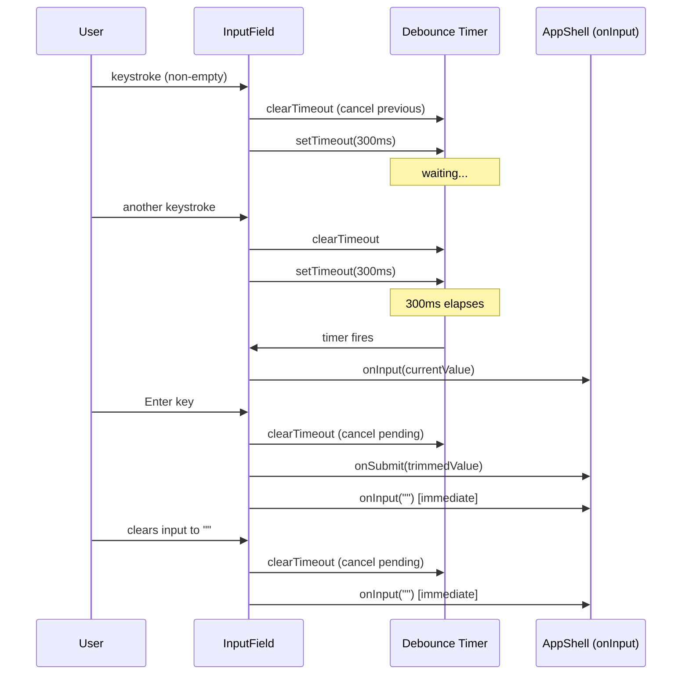

# Design Document: Debounce Filter Input

## Overview

The InputField component (`src/components/InputField.ts`) currently invokes the `onInput` filter callback synchronously on every keystroke. During rapid typing this causes the item list to re-render on each character, producing visual flashing. This design introduces a 300ms debounce on the filter callback so the list only updates after the user pauses typing, while keeping item submission (Enter) and input-clear paths immediate.

The change is entirely scoped to the `InputField` class. No other components, state management, or storage modules are affected.

## Architecture

The debounce logic lives inside `InputField` as private timer state. The component already owns the boundary between DOM events and application callbacks, so this is the natural place to gate when `onInput` fires.



### Key design decisions

1. **Debounce inside InputField, not in AppShell** — The component already mediates between DOM events and callbacks. Placing the timer here keeps the change self-contained and avoids touching AppShell or state logic.
2. **Native `setTimeout` / `clearTimeout`** — No external debounce library needed. The logic is a single timer ID, trivial to implement and test with `vi.useFakeTimers()`.
3. **Immediate path for empty string and submit** — Clearing the input or pressing Enter bypasses the debounce entirely, giving instant feedback for those interactions.

## Components and Interfaces

### Modified: `InputField` class

The public interface gains one new method; the constructor config is unchanged.

```typescript
export interface InputFieldConfig {
  placeholder: string;
  onInput: (text: string) => void;   // unchanged
  onSubmit: (text: string) => void;  // unchanged
}

export class InputField {
  // Existing public API (unchanged)
  getElement(): HTMLInputElement;
  getValue(): string;
  focus(): void;
  clear(): void;

  // New public method
  destroy(): void;  // cancels any pending debounce timer

  // New private members
  private debounceTimer: ReturnType<typeof setTimeout> | null;
  private readonly DEBOUNCE_DELAY: number; // 300
}
```

### Unchanged components

- `AppShell` — still passes `onInput` and `onSubmit` callbacks; no changes needed.
- `FilterControl`, `Section`, `Item` — unaffected.
- `StateManager` — unaffected.

## Data Models

No data model changes. The debounce is purely a UI-timing concern. `AppState`, `Item`, `Section`, `FilterMode`, and all storage serialization remain identical.

The only new state is a single `debounceTimer` field (a `setTimeout` handle) held privately inside the `InputField` instance. It is transient and never persisted.


## Correctness Properties

*A property is a characteristic or behavior that should hold true across all valid executions of a system — essentially, a formal statement about what the system should do. Properties serve as the bridge between human-readable specifications and machine-verifiable correctness guarantees.*

### Property 1: Debounce coalesces keystrokes into a single delayed callback

*For any* sequence of N keystrokes (N ≥ 1) typed into the InputField where each keystroke occurs less than 300ms after the previous one, the `onInput` filter callback should be invoked exactly once, with the final input value, exactly 300ms after the last keystroke. No intermediate values should be emitted.

**Validates: Requirements 1.1, 1.2, 1.3, 1.4**

### Property 2: Submit immediately fires and cancels pending debounce

*For any* non-empty, non-whitespace-only input string where a debounce timer is pending, pressing Enter should: (a) invoke `onSubmit` with the trimmed value immediately, (b) cancel the pending debounce timer so it never fires with the typed text, (c) clear the input field, and (d) invoke `onInput` with an empty string immediately (not debounced).

**Validates: Requirements 2.1, 2.2, 2.3**

### Property 3: Empty input bypasses debounce

*For any* input sequence where the user has typed characters (starting a debounce timer) and then clears the field to an empty string, the `onInput` callback should be invoked immediately with `""`, and the previously pending debounce timer should be cancelled so it never fires.

**Validates: Requirements 3.1, 3.2**

### Property 4: Destroy prevents stale callbacks

*For any* InputField instance with a pending debounce timer, calling `destroy()` should prevent the `onInput` callback from being invoked when the timer would have fired. After destruction, no further filter callbacks occur.

**Validates: Requirements 4.2, 4.3**

## Error Handling

| Scenario | Handling |
|---|---|
| `onInput` callback throws | The error propagates naturally from the `setTimeout` callback. No special handling needed — the timer is already consumed. |
| `onSubmit` callback throws | Same as current behavior — the error propagates from the `keydown` handler. The input is still cleared because `clear()` runs after `onSubmit`. |
| Multiple rapid `destroy()` calls | `clearTimeout(null)` is a no-op in browsers, so calling `destroy()` multiple times is safe. |
| `destroy()` called when no timer is pending | No-op — `clearTimeout` on a `null` or already-fired timer ID does nothing. |

No new error states are introduced. The debounce timer is a standard browser API with well-defined behavior.

## Testing Strategy

### Testing framework

- **Unit / property tests**: Vitest (already configured) with `vi.useFakeTimers()` for deterministic timer control
- **Property-based testing**: `fast-check` (already in `devDependencies`)
- **Environment**: jsdom (already configured in `vite.config.ts`)

### Unit tests

Unit tests cover specific examples, edge cases, and integration points:

- Typing a single character and advancing 300ms fires `onInput` once with that character
- Typing then pressing Enter before 300ms: `onSubmit` fires, debounced `onInput` does not
- Clearing input to empty fires `onInput("")` immediately
- Calling `destroy()` then advancing time: no callback fires
- The debounce delay is exactly 300ms (not 299ms, not 301ms)
- Existing InputField tests for submit validation, whitespace rejection, and `clear()` still pass

### Property-based tests

Each property test uses `fast-check` with a minimum of 100 iterations and references its design property.

| Test | Property | Generator |
|---|---|---|
| Debounce coalesces keystrokes | Property 1 | `fc.array(fc.char(), {minLength: 1, maxLength: 20})` — random keystroke sequences |
| Submit cancels debounce | Property 2 | `fc.string({minLength: 1, maxLength: 50}).filter(s => s.trim().length > 0)` — random non-empty strings |
| Empty clears immediately | Property 3 | `fc.string({minLength: 1, maxLength: 50})` — random strings typed before clearing |
| Destroy prevents callbacks | Property 4 | `fc.string({minLength: 1, maxLength: 50})` — random strings with pending debounce |

Each test must be tagged with a comment:
```
// Feature: debounce-filter-input, Property N: <property text>
```

### Test file location

- Property tests: `tests/InputField.debounce.properties.test.ts`
- Unit tests: extend existing `tests/InputField.test.ts` or add `tests/InputField.debounce.test.ts`
