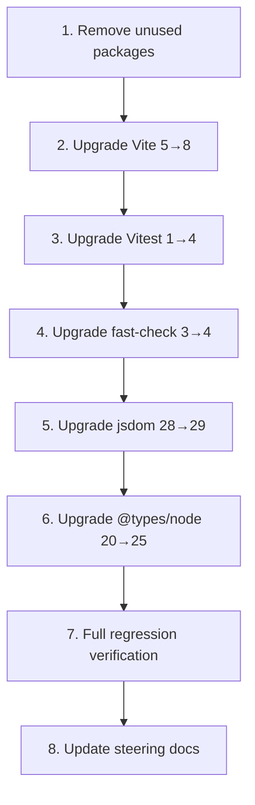

# Design Document: Dependency Upgrade

## Overview

This design covers upgrading the Grocery List PWA's outdated dependencies to their latest major versions, removing two unused packages, and verifying the entire application continues to build and pass all 262 tests. The upgrade touches the build tool (Vite 5→8), test runner (Vitest 1→4), property-based testing library (fast-check 3→4), DOM test environment (jsdom 28→29), and type definitions (@types/node 20→25). Two unused packages (vite-plugin-pwa, workbox-window) are removed entirely.

The key design decision is upgrade ordering: dependencies must be upgraded in a sequence that keeps the project in a buildable/testable state at each step, since Vitest 4 requires Vite ≥6 and several packages have peer dependency relationships.

## Architecture

The upgrade does not change the application's architecture. The project remains a static PWA built with Vite, using vanilla TypeScript components, a custom service worker, and localStorage persistence. The architecture stays identical:

```
src/ → TypeScript source (components, state, storage, types)
tests/ → Vitest test files (unit, integration, property-based)
public/ → Static assets (icons, manifest, sw.js)
vite.config.ts → Build + test configuration
package.json → Dependency declarations
```

### Upgrade Order Strategy

The upgrades must follow a specific dependency-aware order to avoid broken intermediate states:



**Rationale for this order:**
1. Remove unused packages first — they have no dependents, so removal is safe and simplifies the dependency tree for subsequent upgrades.
2. Vite before Vitest — Vitest 4 requires Vite ≥6, so Vite must be upgraded first.
3. Vitest next — once Vite 8 is in place, Vitest 4 can be installed with its peer dependency satisfied.
4. fast-check, jsdom, @types/node — these are independent of each other and of the Vite/Vitest pair, so they can be upgraded in any order after Vitest.
5. Full regression and doc updates last — ensures everything is stable before documenting.

## Components and Interfaces

### Affected Files

| File | Change Type | Reason |
|------|------------|--------|
| `package.json` | Modify | Update version ranges, remove unused deps |
| `package-lock.json` | Regenerate | Reflects new dependency tree |
| `vite.config.ts` | Potentially modify | `rollupOptions` may need renaming to `rolldownOptions` in Vite 8; test config format may change for Vitest 4 |
| `tests/*.test.ts` | Potentially modify | If Vitest 4 changes mock behavior or fast-check 4 changes APIs |
| `.kiro/steering/architecture.md` | Modify | Update version numbers |
| `.kiro/steering/development-workflow.md` | Modify | Update Node.js prerequisite to 20+ |

### vite.config.ts Changes

Current config:
```typescript
import { defineConfig } from 'vite';

export default defineConfig({
  plugins: [],
  test: {
    globals: true,
    environment: 'jsdom'
  },
  publicDir: 'public',
  build: {
    rollupOptions: {
      input: {
        main: './index.html'
      }
    }
  }
});
```

**Vite 8 considerations:**
- The `rollupOptions` key may need to become `rolldownOptions` since Vite 8 switches from Rollup to Rolldown. However, Vite 8 may still accept `rollupOptions` as an alias for backward compatibility. This must be verified during implementation.
- The `plugins: []` array is already empty (no custom Rollup plugins), so the Rolldown switch should be transparent.
- The `input` configuration for `index.html` is standard and should work unchanged.

**Vitest 4 considerations:**
- The `test` block inside `defineConfig` still works in Vitest 4.
- `globals: true` and `environment: 'jsdom'` are unchanged APIs.
- No `poolOptions` are used (confirmed by grep), so the poolOptions→top-level migration doesn't apply.

### Test File Impact Assessment

**Mock patterns in use (from codebase analysis):**
- `vi.mock()` — used in `state.test.ts` to mock the storage module
- `vi.fn()` — used extensively across test files for callback mocks
- `vi.spyOn()` — used in `state.test.ts` and `storage.test.ts`
- `vi.clearAllMocks()` — used in `beforeEach` blocks
- No usage of `vi.restoreAllMocks()` — so the Vitest 4 behavior change for restoreAllMocks is not a concern
- No usage of `vi.fn().getMockName()` — so the "vi.fn()" vs "spy" default name change is not a concern

**fast-check patterns in use:**
- `fc.assert()`, `fc.property()`, `fc.asyncProperty()` — core API, unchanged in fast-check 4
- `fc.string()`, `fc.integer()`, `fc.boolean()`, `fc.array()` — standard arbitraries, unchanged
- `fc.pre()` — precondition filtering, unchanged
- `{ numRuns: 100 }` — configuration option, unchanged

**Conclusion:** Based on the codebase analysis, no test file modifications should be required. The project uses only stable, core APIs from both Vitest and fast-check that remain backward compatible in their new major versions.

## Data Models

No data model changes. The `AppState`, `Section`, and `Item` interfaces in `src/types.ts` are unaffected by dependency upgrades. The localStorage persistence format remains identical.

## Correctness Properties

*A property is a characteristic or behavior that should hold true across all valid executions of a system — essentially, a formal statement about what the system should do. Properties serve as the bridge between human-readable specifications and machine-verifiable correctness guarantees.*

This spec is a dependency upgrade, not a new feature. It introduces no new behaviors, data models, or user-facing logic. Therefore, no new correctness properties are needed.

The correctness guarantee for this upgrade is that **all existing properties continue to hold**. The project already has comprehensive property-based tests covering state management, section operations, item operations, and force-update behavior across 8 property test files. These existing properties serve as the regression verification:

- `state.properties.test.ts` — Section creation, toggle idempotence, move up/down, deletion with cascading item removal
- `state.rename.properties.test.ts` — Section rename properties
- `forceUpdate.properties.test.ts` — Cache deletion completeness, button state during update
- `InputField.debounce.properties.test.ts` — Debounce behavior properties
- `Section.rename.properties.test.ts` — Section rename UI properties
- `no-sections-bug.preservation.test.ts` — Bug preservation properties

All acceptance criteria in this spec are concrete verification examples (build succeeds, tests pass, file contains correct version string) rather than universally quantified properties over generated inputs. This is expected for a dependency upgrade — the "for all" quantification is already captured by the existing test suite running across all 262 tests.

**Validates: Requirements 1.5, 3.2, 4.2, 5.2, 7.1**

## Error Handling

### Upgrade Failure Recovery

Each upgrade step should be performed as an isolated, reversible operation:

1. **Before starting**: Record the current `package.json` and `package-lock.json` state (git commit or stash).
2. **After each step**: Run `npm run build` and `npm test` to verify. If either fails:
   - Check error messages for known breaking changes documented in this design.
   - Apply the fix described in the relevant section below.
   - If the fix doesn't resolve it, revert to the pre-step state and investigate.

### Known Potential Issues and Mitigations

| Issue | Likelihood | Mitigation |
|-------|-----------|------------|
| `rollupOptions` not recognized in Vite 8 | Medium | Rename to `rolldownOptions` or remove entirely (the `input` config may be auto-detected from `index.html`) |
| Vitest 4 peer dependency conflict with Vite 8 | Low | Ensure Vite 8 is installed before Vitest 4; check Vitest 4 release notes for exact Vite version range |
| `npm install` fails due to peer dependency conflicts | Medium | Use `--legacy-peer-deps` temporarily, or upgrade conflicting packages together |
| TypeScript compilation errors after @types/node 25 | Low | The project uses ES2020 target with DOM libs; Node.js type changes are unlikely to affect browser-focused code |
| fast-check 4 shrinking behavior changes | Low | Tests may find different counterexamples but should still pass if the code is correct |

### Rollback Strategy

If the full upgrade cannot be completed:
- Each step is independently committable. Partial upgrades are acceptable as long as the build and tests pass at each checkpoint.
- The minimum viable upgrade is Vite 8 + Vitest 4 together (due to peer dependency), plus the unused package removal.

## Testing Strategy

### Verification Approach

This upgrade requires no new tests. The verification strategy is:

1. **Existing test suite as regression gate**: Run `npm test` (262 tests across 20 files) after each upgrade step. All tests must pass.
2. **Build verification**: Run `npm run build` after each upgrade step. The build must complete without errors or CJS deprecation warnings.
3. **Type checking**: The `tsc` step in the build pipeline verifies type compatibility with @types/node 25.

### Step-by-Step Verification Checkpoints

| Step | Verification Command | Expected Result |
|------|---------------------|-----------------|
| Remove unused packages | `npm run build && npm test` | Build succeeds, 262 tests pass |
| Upgrade Vite 5→8 | `npm run build` | Build succeeds, no CJS warnings |
| Upgrade Vitest 1→4 | `npm test` | 262 tests pass |
| Upgrade fast-check 3→4 | `npm test` | All property-based tests pass |
| Upgrade jsdom 28→29 | `npm test` | All DOM-dependent tests pass |
| Upgrade @types/node 20→25 | `npm run build` | tsc compiles without errors |
| Final regression | `npm run build && npm test` | Build succeeds, 262 tests pass |

### Property-Based Test Configuration

The existing property-based tests use fast-check with `{ numRuns: 100 }` configuration. This configuration is unchanged in fast-check 4.x. The core APIs used (`fc.assert`, `fc.property`, `fc.asyncProperty`, `fc.string`, `fc.integer`, `fc.boolean`, `fc.array`, `fc.pre`) are all backward compatible.

### What Does NOT Need Testing

- No new unit tests — no new code is being written
- No new property-based tests — no new behaviors are being added
- No new integration tests — component interactions are unchanged
- No manual testing of the PWA — the service worker (`public/sw.js`) is a static file unaffected by build tool changes

