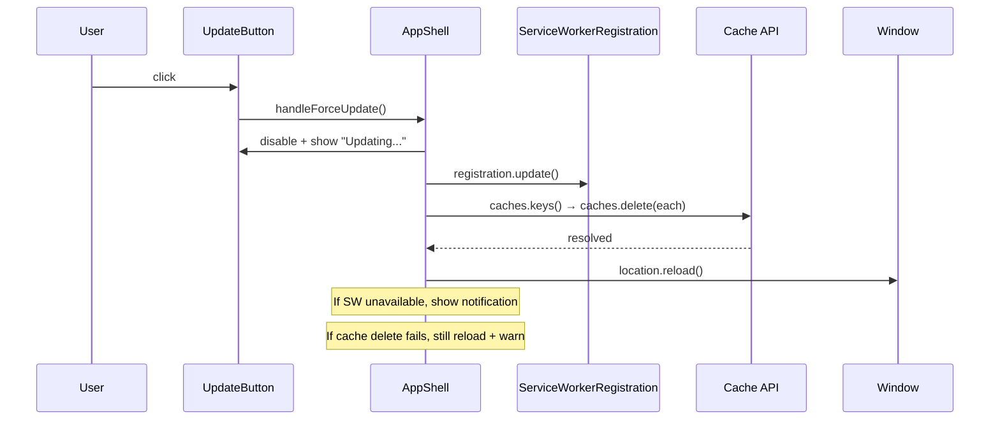

# Design Document: Force Update Control

## Overview

This feature adds a "Force Update" button to the Grocery List PWA header that gives users explicit control over the service worker update lifecycle. When activated, the button triggers a service worker update check, clears all caches managed by the Cache API, and performs a hard reload to ensure the browser fetches fresh assets from the server. Visual feedback (disabled state, loading text, notifications) keeps the user informed throughout the process.

The implementation touches three areas:
1. The `registerServiceWorker()` function in `src/index.ts`, which must return the `ServiceWorkerRegistration` object so the AppShell can use it.
2. The `AppShell` class, which gains a new button in the header and an async handler that orchestrates the update flow.
3. CSS additions for the button styling and a simple toast/notification element.

## Architecture

The feature follows the existing imperative DOM component pattern used throughout the app. No new frameworks or libraries are introduced.



## Components and Interfaces

### Modified: `registerServiceWorker()` (src/index.ts)

Currently returns `void`. Will be changed to return `Promise<ServiceWorkerRegistration | null>`.

```typescript
async function registerServiceWorker(): Promise<ServiceWorkerRegistration | null> {
  if (!('serviceWorker' in navigator)) {
    console.warn('Service Workers are not supported in this browser');
    return null;
  }
  try {
    const registration = await navigator.serviceWorker.register('/sw.js', { scope: '/' });
    // ... existing updatefound listener ...
    return registration;
  } catch (error) {
    console.error('Service Worker registration failed:', error);
    return null;
  }
}
```

### Modified: `AppShell` class (src/index.ts)

New private members:

| Member | Type | Purpose |
|---|---|---|
| `swRegistration` | `ServiceWorkerRegistration \| null` | Stored registration for update calls |
| `updateButton` | `HTMLButtonElement` | Reference to the force-update button |
| `notificationEl` | `HTMLElement` | Toast element for status messages |

New methods:

| Method | Signature | Purpose |
|---|---|---|
| `createUpdateButton` | `(): HTMLButtonElement` | Creates and returns the button element |
| `handleForceUpdate` | `(): Promise<void>` | Orchestrates update check → cache clear → reload |
| `showNotification` | `(message: string, type: 'info' \| 'warning' \| 'error'): void` | Shows a temporary toast message |
| `setSwRegistration` | `(reg: ServiceWorkerRegistration \| null): void` | Stores the registration after init |

### New: `forceUpdate` utility (src/forceUpdate.ts)

A pure-logic module extracted for testability:

```typescript
export interface ForceUpdateDeps {
  registration: ServiceWorkerRegistration | null;
  caches: CacheStorage;
  reload: () => void;
}

export interface ForceUpdateResult {
  status: 'reloading' | 'up-to-date' | 'unsupported' | 'error';
  message: string;
  cacheCleared: boolean;
}

export async function forceUpdate(deps: ForceUpdateDeps): Promise<ForceUpdateResult>;
```

This separation lets us test the update logic without touching the DOM or real service workers.

### New: Notification element

A lightweight `<div>` appended to `.app-shell` that auto-hides after a timeout. No separate component class needed — just a helper method on AppShell.

## Data Models

No new persistent data models are introduced. The feature operates entirely on browser APIs:

- `ServiceWorkerRegistration` — browser-provided, stored in memory on `AppShell`
- `CacheStorage` / `Cache` — browser-provided, accessed via `caches` global
- `ForceUpdateResult` — transient result object, not persisted

The `AppState` interface in `src/types.ts` is unchanged.


## Correctness Properties

*A property is a characteristic or behavior that should hold true across all valid executions of a system — essentially, a formal statement about what the system should do. Properties serve as the bridge between human-readable specifications and machine-verifiable correctness guarantees.*

### Property 1: All caches are deleted

*For any* set of cache names present in `CacheStorage`, calling `forceUpdate` should result in every cache being deleted — i.e., `caches.keys()` returns an empty list after the operation completes (before reload is triggered).

**Validates: Requirements 3.1**

### Property 2: Button is disabled and shows loading text during update

*For any* invocation of the force-update handler, while the underlying async operation is pending, the update button must be in a disabled state (`disabled === true`) and its text content must indicate a loading state (e.g., "Updating...").

**Validates: Requirements 4.1, 4.2**

## Error Handling

| Scenario | Behavior |
|---|---|
| Service worker not supported / registration is `null` | Show info notification: "Updates are not supported in this browser." Button re-enabled. |
| `registration.update()` throws | Show error notification with the error message. Still attempt cache clear + reload. |
| One or more `caches.delete()` calls reject | Log warning, show warning notification. Still proceed with reload. |
| All cache deletes succeed but no new SW version found | Show info notification: "App is already up to date." Button re-enabled, no reload. |
| `location.reload()` itself fails (extremely unlikely) | No special handling — browser-level concern. |

The `forceUpdate` function uses a try/catch around each phase (update check, cache clear, reload) so that a failure in one phase does not prevent subsequent phases from executing.

## Testing Strategy

### Unit Tests (vitest + jsdom)

Unit tests cover specific examples and edge cases:

- Button is rendered inside the header element (1.1)
- Button has correct label text (1.2) and aria-label (1.3)
- Clicking the button calls `registration.update()` (2.1)
- When registration is null, a notification is shown (2.2)
- When `update()` rejects, an error notification is shown (2.3)
- After cache clear, `location.reload()` is called (3.2)
- When cache deletion fails, reload still happens and warning is shown (3.3 — edge case)
- After a no-new-version update, button is re-enabled and "up to date" notification shown (4.3)
- `registerServiceWorker()` returns the registration object on success (5.1)
- AppShell stores the registration (5.2)
- When registration fails, null is stored and button treats it as unsupported (5.3 — edge case)

### Property-Based Tests (vitest + fast-check)

Each property test runs a minimum of 100 iterations.

- **Feature: force-update-control, Property 1: All caches are deleted** — Generate random arrays of cache name strings, populate a mock `CacheStorage`, call `forceUpdate`, assert all caches are gone.
- **Feature: force-update-control, Property 2: Button is disabled and shows loading text during update** — Generate random delay durations for the async operation, invoke the handler, assert button state while the promise is pending.

### Test File Organization

- `tests/forceUpdate.test.ts` — unit tests for the `forceUpdate` utility function
- `tests/forceUpdate.properties.test.ts` — property-based tests for the two correctness properties
- `tests/AppShell.force-update.test.ts` — integration tests for button rendering and AppShell wiring
