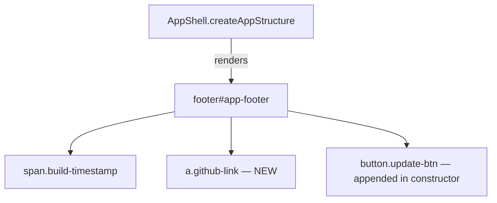

# Design Document: GitHub Repository Link

## Overview

This feature adds a GitHub repository link to the existing app footer of the Grocery List PWA. The link sits between the build timestamp and the update button, styled to match the dark theme. Implementation is minimal: a single anchor element created in the `AppShell.createAppStructure()` method, a small CSS addition for the link, and no new components or modules.

## Architecture

The change is entirely within the existing `AppShell` class and CSS. No new files, classes, or modules are introduced.

The footer rendering order (top to bottom in the footer):
1. Build timestamp (``)
2. GitHub link (`<a>`) — new
3. Update button (`<button>`) — appended dynamically in the constructor

## Components and Interfaces

No new components are created. The change touches:

### AppShell (modified)

- `createAppStructure()`: Add an `<a>` element inside the `<footer>` template literal, between the build timestamp `` and the closing `</footer>` tag.

The anchor element will have:
- `href` pointing to the GitHub repository URL
- `target="_blank"` to open in a new tab
- `rel="noopener noreferrer"` for security and to satisfy accessibility requirements
- `aria-label="View source code on GitHub"` for assistive technology
- `class="github-link"` for styling
- Visible text content: `"GitHub"`

### CSS (modified — `src/styles/main.css`)

Add a `.github-link` rule set that:
- Uses `font-size: 0.75rem` and `color: var(--text-disabled)` to match the build timestamp
- Displays as a block-level element centered in the footer
- Adds `text-decoration: none` by default
- On hover, transitions `color` to `var(--text-secondary)` and adds `text-decoration: underline`

## Data Models

No data model changes. The GitHub URL is a static string literal embedded in the template. No state, storage, or serialization changes are needed.

## Correctness Properties

*A property is a characteristic or behavior that should hold true across all valid executions of a system — essentially, a formal statement about what the system should do. Properties serve as the bridge between human-readable specifications and machine-verifiable correctness guarantees.*

All acceptance criteria for this feature describe fixed, static attributes of a single DOM element (a hardcoded GitHub link). The URL is a constant, the text is a constant, and the attributes (`target`, `rel`, `aria-label`) are constants. There is no variability across inputs, no user-driven data transformation, and no state changes involved.

Because every criterion checks a specific, fixed value rather than a rule that must hold across a range of inputs, none of the acceptance criteria are amenable to property-based testing. All are best validated as example-based unit tests.

No testable properties.

## Error Handling

This feature introduces a static anchor element in the HTML template. There are no runtime errors to handle:

- The link is rendered as part of the `innerHTML` template string — if the footer element exists, the link will exist.
- No network requests, async operations, or user input processing are involved.
- If the GitHub URL is unreachable, the browser handles navigation errors natively; no application-level error handling is needed.

## Testing Strategy

### Unit Tests

Since all acceptance criteria are example-based, a focused set of unit tests covers the feature completely:

1. **GitHub link exists in footer** — Verify the footer contains an `<a>` element with class `github-link`. (Validates 1.1)
2. **Link has correct href** — Verify the `href` attribute points to the expected GitHub repository URL. (Validates 1.1)
3. **Link opens in new tab** — Verify `target="_blank"` is set. (Validates 1.2)
4. **Link has visible text "GitHub"** — Verify `textContent` is `"GitHub"`. (Validates 1.3)
5. **Link has accessible name** — Verify `aria-label` is `"View source code on GitHub"`. (Validates 2.1)
6. **Link has security attributes** — Verify `rel` is `"noopener noreferrer"`. (Validates 2.2)
7. **Link is positioned between timestamp and update button** — Verify DOM order: `.build-timestamp` → `.github-link` → `.update-btn`. (Validates 3.3)
8. **Link uses matching font size and color** — Verify computed styles match the build timestamp element. (Validates 3.1)

### Property-Based Tests

No property-based tests are needed for this feature. All criteria involve fixed static values with no input variability.

### Test Framework

- **Test runner**: Vitest
- **DOM environment**: jsdom
- **Property-based testing library**: fast-check (not used for this feature)
