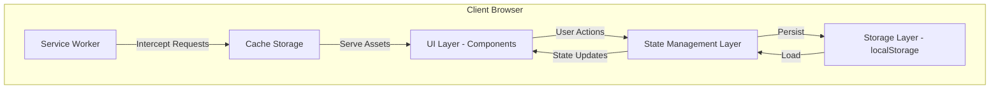
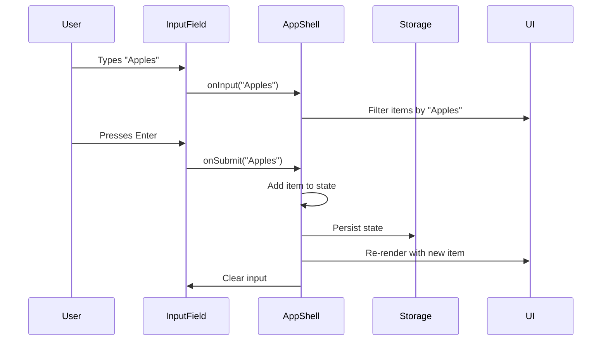

# Design Document: Grocery List PWA

## Overview

The Grocery List PWA is a Progressive Web App that provides a mobile-first grocery shopping list management experience. The application is built as a single-page application (SPA) with offline-first capabilities, allowing users to manage their shopping lists without requiring an internet connection.

### Key Design Principles

- **Offline-First Architecture**: All functionality works without network connectivity through service worker caching and local storage persistence
- **Mobile-First Design**: Touch-optimized interface with responsive layouts for mobile (< 768px) and tablet (768-1024px) devices
- **Instant Feedback**: Client-side rendering ensures UI updates within 100ms of user actions
- **Data Persistence**: Automatic saving to local storage on every state change
- **Progressive Enhancement**: Installable as a native-like app while remaining accessible as a web page

### Technology Stack

- **Frontend Framework**: Vanilla JavaScript with modern ES6+ features (or React/Vue if preferred)
- **PWA Technologies**: Service Worker API, Web App Manifest, Cache API
- **Storage**: localStorage for data persistence
- **Styling**: CSS3 with dark theme, CSS Grid/Flexbox for responsive layouts
- **Build Tools**: Webpack or Vite for bundling and service worker generation

## Architecture

### System Architecture

The application follows a client-side MVC/MVVM pattern with three primary layers:



### Layer Responsibilities

**UI Layer**
- Renders components (sections, items, input field, filters)
- Handles user interactions (tap, drag-and-drop, input)
- Provides visual feedback for state changes
- Implements responsive layouts based on viewport size

**State Management Layer**
- Maintains application state (sections, items, filter mode, collapsed states)
- Processes user actions and updates state
- Triggers persistence operations
- Notifies UI of state changes

**Storage Layer**
- Serializes/deserializes application state to/from JSON
- Reads from and writes to localStorage
- Handles data migration if schema changes

**Service Worker Layer**
- Intercepts network requests
- Serves cached assets when offline
- Implements cache-first strategy for app shell
- Handles PWA installation lifecycle

### Offline-First Strategy

The app uses a **cache-first** approach:

1. Service worker intercepts all requests
2. Checks cache for matching resource
3. Returns cached version if available
4. Falls back to network only if not cached
5. All data operations use localStorage (no network dependency)

## Components and Interfaces

### Core Components

#### 1. App Shell Component

The main container that orchestrates all other components.

```typescript
interface AppShell {
  state: AppState;
  render(): void;
  handleAction(action: Action): void;
  persistState(): void;
  loadState(): void;
}
```

#### 2. Input Field Component

Dual-purpose component for adding items and filtering.

```typescript
interface InputField {
  value: string;
  placeholder: string;
  onInput(text: string): void;  // Triggers filtering
  onSubmit(text: string): void; // Adds new item
  clear(): void;
}
```

#### 3. Section Component

Collapsible container for grocery items.

```typescript
interface Section {
  id: string;
  name: string;
  isCollapsed: boolean;
  items: Item[];
  onToggle(): void;
  onMoveUp(): void;
  onMoveDown(): void;
  onDelete(): void;
  onItemDrop(item: Item): void;
}
```

#### 4. Item Component

Individual grocery item with quantity and check-off functionality.

```typescript
interface Item {
  id: string;
  name: string;
  quantity: number;
  isChecked: boolean;
  sectionId: string;
  onToggleCheck(): void;
  onIncrement(): void;
  onDecrement(): void;
  onDelete(): void;
  onDragStart(): void;
  onDragEnd(): void;
}
```

#### 5. Filter Control Component

Toggle for viewing all/checked/unchecked items.

```typescript
interface FilterControl {
  currentFilter: FilterMode;
  onFilterChange(mode: FilterMode): void;
}

type FilterMode = 'all' | 'checked' | 'unchecked';
```

#### 6. Service Worker

Handles caching and offline functionality.

```typescript
interface ServiceWorkerConfig {
  cacheName: string;
  assetsToCache: string[];
  cacheStrategy: 'cache-first' | 'network-first';
}
```

### Component Interaction Flow



## Data Models

### Application State

The complete application state stored in localStorage:

```typescript
interface AppState {
  sections: Section[];
  filterMode: FilterMode;
  collapsedSections: Set<string>; // Section IDs that are collapsed
  selectedSectionId: string | null; // Section to add new items to
  version: number; // For data migration
}
```

### Section Model

```typescript
interface Section {
  id: string;           // UUID
  name: string;         // User-defined name (e.g., "Produce")
  order: number;        // Position in the list (0-indexed)
  createdAt: number;    // Timestamp
}
```

### Item Model

```typescript
interface Item {
  id: string;           // UUID
  name: string;         // Item name (e.g., "Apples")
  quantity: number;     // Default 1, minimum 1
  isChecked: boolean;   // Purchase status
  sectionId: string;    // Parent section ID
  createdAt: number;    // Timestamp
}
```

### Storage Schema

Data is stored in localStorage as JSON:

```json
{
  "grocery-list-state": {
    "version": 1,
    "sections": [
      {
        "id": "uuid-1",
        "name": "Produce",
        "order": 0,
        "createdAt": 1234567890
      }
    ],
    "items": [
      {
        "id": "uuid-2",
        "name": "Apples",
        "quantity": 2,
        "isChecked": false,
        "sectionId": "uuid-1",
        "createdAt": 1234567891
      }
    ],
    "filterMode": "all",
    "collapsedSections": ["uuid-3"],
    "selectedSectionId": "uuid-1"
  }
}
```

### PWA Manifest

```json
{
  "name": "Grocery List",
  "short_name": "Groceries",
  "description": "Manage your grocery shopping list offline",
  "start_url": "/",
  "display": "standalone",
  "background_color": "#1a1a1a",
  "theme_color": "#2d2d2d",
  "icons": [
    {
      "src": "/icons/icon-192x192.png",
      "sizes": "192x192",
      "type": "image/png"
    },
    {
      "src": "/icons/icon-512x512.png",
      "sizes": "512x512",
      "type": "image/png"
    }
  ]
}
```

### Drag and Drop Data Transfer

```typescript
interface DragData {
  itemId: string;
  sourceSectionId: string;
}
```


## Correctness Properties

*A property is a characteristic or behavior that should hold true across all valid executions of a system—essentially, a formal statement about what the system should do. Properties serve as the bridge between human-readable specifications and machine-verifiable correctness guarantees.*

### Property 1: Section creation adds to state

*For any* valid section name, creating a new section should add it to the application state with a unique ID and the next available order position.

**Validates: Requirements 3.1**

### Property 2: All sections are rendered

*For any* application state containing sections, all sections should be rendered in the UI in order.

**Validates: Requirements 3.2**

### Property 3: Section toggle is idempotent

*For any* section, toggling its collapsed state twice should return it to its original state.

**Validates: Requirements 3.3**

### Property 4: Collapsed sections hide items

*For any* section in collapsed state, none of its items should be visible in the rendered UI.

**Validates: Requirements 3.4, 3.5**

### Property 5: Move up decreases section order

*For any* section not at position 0, moving it up should decrease its order value by 1 and increase the order of the section previously above it by 1.

**Validates: Requirements 3.6**

### Property 6: Move down increases section order

*For any* section not at the last position, moving it down should increase its order value by 1 and decrease the order of the section previously below it by 1.

**Validates: Requirements 3.7**

### Property 7: Section deletion removes section and items

*For any* section, deleting it should remove both the section and all items with that sectionId from the application state.

**Validates: Requirements 3.8, 3.9**

### Property 8: Text filtering shows matching items only

*For any* non-empty search text, only items whose names contain that text (case-insensitive) should be visible in the UI.

**Validates: Requirements 4.2, 4.3**

### Property 9: Item submission creates new item

*For any* valid text submitted through the input field, a new item should be created in the selected section with quantity 1 and isChecked false.

**Validates: Requirements 4.5, 5.2**

### Property 10: Duplicate item names are allowed

*For any* existing item name, submitting that same name should create a second distinct item with a different ID.

**Validates: Requirements 4.6**

### Property 11: Drag and drop changes item section

*For any* item and any target section, dragging the item to that section should update the item's sectionId to the target section's ID.

**Validates: Requirements 4.7, 4.8**

### Property 12: Item deletion removes from state

*For any* item, deleting it should remove it from the application state.

**Validates: Requirements 4.9**

### Property 13: Items render in their parent section

*For any* item, it should be rendered within the UI container of its parent section (matching sectionId).

**Validates: Requirements 4.10**

### Property 14: Quantity increment increases by one

*For any* item, incrementing its quantity should increase the quantity value by exactly 1.

**Validates: Requirements 5.5**

### Property 15: Quantity decrement decreases by one when greater than one

*For any* item with quantity > 1, decrementing should decrease the quantity by exactly 1.

**Validates: Requirements 5.6**

### Property 16: Quantity has minimum of one

*For any* item with quantity 1, decrementing should not change the quantity (invariant: quantity >= 1 always holds).

**Validates: Requirements 5.7**

### Property 17: Quantity prefix display rule

*For any* item, if quantity is 1 then no prefix should appear in the rendered text, and if quantity >= 2 then the prefix should be "{quantity}x " before the item name.

**Validates: Requirements 5.3, 5.4**

### Property 18: Check toggle changes state

*For any* item, toggling its check state should flip isChecked from true to false or false to true.

**Validates: Requirements 6.1, 6.2**

### Property 19: Checked items show visual indicator

*For any* checked item (isChecked = true), the rendered UI should include a checkmark icon and distinct styling.

**Validates: Requirements 6.3, 6.4**

### Property 20: Filter mode controls visibility

*For any* filter mode ('all', 'checked', 'unchecked'), only items matching that filter criteria should be visible in the UI.

**Validates: Requirements 7.5**

### Property 21: State persistence round trip

*For any* application state (sections, items, filterMode, collapsedSections), serializing to localStorage and then deserializing should produce an equivalent state.

**Validates: Requirements 3.10, 5.8, 6.5, 7.6, 9.1, 9.2, 9.3, 9.4, 9.5**

### Property 22: Touch targets meet minimum size

*For all* interactive elements (buttons, checkboxes, drag handles), the computed dimensions should be at least 44x44 pixels.

**Validates: Requirements 2.4**

### Property 23: UI updates without page reload

*For any* user action that modifies state, the UI should update without triggering a page navigation or reload event.

**Validates: Requirements 10.1, 10.3**

### Property 24: UI update performance

*For any* user action, the time between the action and the corresponding UI update should be less than 100ms.

**Validates: Requirements 10.2**

### Property 25: Service worker serves cached resources offline

*For any* resource in the cache, when the network is unavailable, the service worker should serve the cached version.

**Validates: Requirements 11.1**

### Property 26: Offline functionality equivalence

*For any* user operation (add, modify, delete, check items/sections), the behavior should be identical whether the app is online or offline.

**Validates: Requirements 11.3, 11.4, 11.5**

### Property 27: All interactive elements have increment/decrement controls

*For any* item rendered in the UI, it should include both increment and decrement controls for quantity management.

**Validates: Requirements 5.1**

## Error Handling

### Input Validation

**Empty Input Submission**
- When user submits empty or whitespace-only text, the app should ignore the submission and not create an item
- Input field should remain focused for user to try again

**Invalid Section Names**
- Empty or whitespace-only section names should be rejected
- Section name length should be limited to 100 characters
- Special characters are allowed in section names

**Storage Quota Exceeded**
- If localStorage quota is exceeded, display error message to user
- Suggest clearing checked items or old sections
- Prevent further additions until space is available

### State Corruption

**Invalid State Detection**
- On app load, validate state structure matches expected schema
- If validation fails, attempt to migrate or repair state
- If repair fails, reset to empty state and notify user

**Orphaned Items**
- If items reference non-existent sectionIds, move them to a default "Uncategorized" section
- Log warning for debugging purposes

### Service Worker Errors

**Registration Failure**
- If service worker registration fails, log error but allow app to function
- Display subtle notification that offline mode may not work
- App should still function with localStorage persistence

**Cache Failure**
- If caching fails, log error but continue serving from network
- Gracefully degrade to online-only mode

### Browser Compatibility

**localStorage Unavailable**
- Detect if localStorage is unavailable (private browsing, disabled)
- Display warning message to user
- Fall back to in-memory state (data lost on page reload)

**Drag and Drop Unsupported**
- Detect if drag and drop API is unavailable
- Provide alternative UI (move buttons) for reordering items between sections

## Testing Strategy

### Dual Testing Approach

The testing strategy employs both unit tests and property-based tests to ensure comprehensive coverage:

- **Unit tests**: Verify specific examples, edge cases, error conditions, and integration points
- **Property-based tests**: Verify universal properties across randomized inputs with minimum 100 iterations per test

### Unit Testing Focus

Unit tests should cover:

1. **Specific Examples**
   - PWA manifest contains required fields (name, icons, theme_color, display)
   - Manifest includes 192x192 and 512x512 icon sizes
   - Service worker registration succeeds
   - Mobile layout applies at 767px width
   - Tablet layout applies at 768px width
   - Empty input field displays all items
   - Filter control exists with three modes
   - Dark theme CSS variables are defined
   - Single HTML page loads initially

2. **Edge Cases**
   - Decrementing quantity at minimum (1) keeps it at 1
   - Moving top section up has no effect
   - Moving bottom section down has no effect
   - Deleting last section in list
   - Filtering with no matches shows empty state
   - Empty localStorage on first load initializes default state

3. **Error Conditions**
   - Empty input submission is rejected
   - Whitespace-only input submission is rejected
   - localStorage quota exceeded handling
   - Invalid state structure recovery
   - Orphaned items (sectionId references non-existent section)
   - Service worker registration failure
   - localStorage unavailable (private browsing)

4. **Integration Points**
   - Service worker intercepts fetch requests
   - localStorage save triggered after state changes
   - localStorage load on app initialization
   - Drag and drop data transfer between sections

### Property-Based Testing Configuration

**Testing Library**: Use `fast-check` (JavaScript/TypeScript) for property-based testing

**Test Configuration**:
- Minimum 100 iterations per property test
- Each test tagged with: `Feature: grocery-list-pwa, Property {number}: {property_text}`

**Property Test Coverage**:

Each correctness property (1-27) should have a corresponding property-based test:

1. **Property 1-7**: Section management properties
   - Generate random section names, orders, and operations
   - Verify state transitions and invariants

2. **Property 8-13**: Item management properties
   - Generate random item names, sections, and operations
   - Test filtering, creation, deletion, and drag-drop

3. **Property 14-17**: Quantity management properties
   - Generate random quantities and increment/decrement sequences
   - Verify quantity bounds and display rules

4. **Property 18-20**: Check state and filtering properties
   - Generate random check states and filter modes
   - Verify visibility and state transitions

5. **Property 21**: Persistence round trip
   - Generate random complete application states
   - Verify serialize/deserialize produces equivalent state

6. **Property 22-24**: UI and performance properties
   - Generate random UI elements and actions
   - Measure dimensions and timing

7. **Property 25-27**: Offline and service worker properties
   - Generate random operations and network states
   - Verify offline equivalence

**Example Property Test Structure**:

```javascript
// Feature: grocery-list-pwa, Property 9: Item submission creates new item
test('property: item submission creates new item', () => {
  fc.assert(
    fc.property(
      fc.string({ minLength: 1, maxLength: 100 }), // Random item name
      fc.uuid(), // Random section ID
      (itemName, sectionId) => {
        const initialState = createStateWithSection(sectionId);
        const newState = submitItem(initialState, itemName, sectionId);
        
        const newItem = findItemByName(newState, itemName);
        expect(newItem).toBeDefined();
        expect(newItem.quantity).toBe(1);
        expect(newItem.isChecked).toBe(false);
        expect(newItem.sectionId).toBe(sectionId);
      }
    ),
    { numRuns: 100 }
  );
});
```

### Test Organization

```
tests/
├── unit/
│   ├── manifest.test.js
│   ├── service-worker.test.js
│   ├── responsive-layout.test.js
│   ├── sections.test.js
│   ├── items.test.js
│   ├── quantity.test.js
│   ├── filtering.test.js
│   ├── persistence.test.js
│   └── error-handling.test.js
├── properties/
│   ├── section-properties.test.js
│   ├── item-properties.test.js
│   ├── quantity-properties.test.js
│   ├── check-filter-properties.test.js
│   ├── persistence-properties.test.js
│   ├── ui-properties.test.js
│   └── offline-properties.test.js
└── integration/
    ├── pwa-installation.test.js
    ├── offline-mode.test.js
    └── full-workflow.test.js
```

### Testing Tools

- **Unit Testing**: Jest or Vitest
- **Property-Based Testing**: fast-check
- **DOM Testing**: @testing-library/dom or @testing-library/react
- **Service Worker Testing**: Mock Service Worker (MSW)
- **E2E Testing**: Playwright or Cypress (for PWA installation and offline scenarios)

### Continuous Integration

- Run all unit tests on every commit
- Run property-based tests (100 iterations) on every commit
- Run E2E tests on pull requests
- Measure and enforce code coverage (target: 80%+ for unit tests)
- Validate PWA manifest and service worker in CI pipeline
