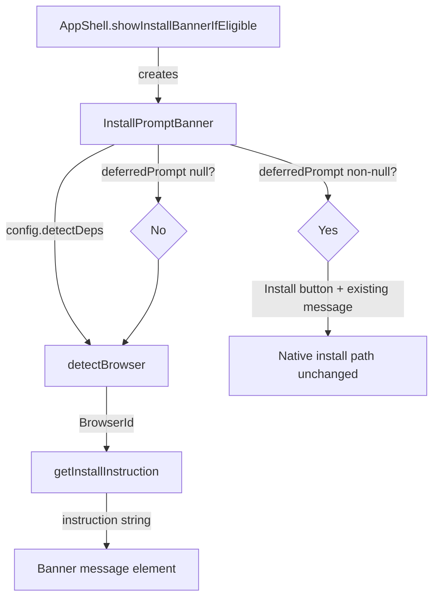

# Design Document: Install Prompt Instructions

## Overview

This feature enhances the PWA install prompt banner in `src/install-prompt.ts` by replacing generic fallback messages with browser-specific installation instructions. Currently, when the native `beforeinstallprompt` event is unavailable and the device is not iOS Safari, the banner shows a vague "Add this app to your home screen for quick access." message. After this change, the banner will detect the user's browser family and display step-by-step instructions tailored to that browser.

Two new pure functions are introduced:

- `detectBrowser(deps: DetectDeps): BrowserId` — inspects the user agent string to classify the browser.
- `getInstallInstruction(browserId: BrowserId): string` — maps a browser identifier to a human-readable instruction string.

The `InstallPromptBanner` is updated to accept `DetectDeps` via its config and use these functions for the non-`deferredPrompt` rendering paths. The native install flow (when `deferredPrompt` is available) remains untouched.

## Architecture

The change is contained entirely within `src/install-prompt.ts` and its consumer in `src/index.ts`. No new files or modules are needed.



Data flow:

1. `AppShell` constructs `InstallPromptBannerConfig` with the existing fields plus a new `detectDeps` property.
2. `InstallPromptBanner.createElement()` checks `deferredPrompt`:
   - Non-null → existing native install path (no change).
   - Null → calls `detectBrowser(config.detectDeps)` to get a `BrowserId`, then `getInstallInstruction(browserId)` to get the message string.
3. The resolved instruction string is set as the banner's message text.

## Components and Interfaces

### New type: `BrowserId`

```typescript
export type BrowserId =
  | 'chrome-android'
  | 'firefox-android'
  | 'samsung-internet'
  | 'ios-safari'
  | 'unknown';
```

A union of string literals representing the supported browser families. The `unknown` variant serves as the catch-all fallback.

### New function: `detectBrowser(deps: DetectDeps): BrowserId`

Pure function. Inspects `deps.userAgent` to classify the browser:

| Priority | Condition | Result |
|----------|-----------|--------|
| 1 | iOS device + WebKit + no CriOS/FxiOS | `'ios-safari'` |
| 2 | UA contains `SamsungBrowser` | `'samsung-internet'` |
| 3 | UA contains `Firefox` + `Android` | `'firefox-android'` |
| 4 | UA contains `Chrome` + `Android` (and not Samsung) | `'chrome-android'` |
| 5 | None of the above | `'unknown'` |

The iOS Safari check reuses the same logic as the existing `isIOSSafari()` function. Samsung Internet is checked before Chrome because Samsung Internet's UA also contains "Chrome".

### New function: `getInstallInstruction(browserId: BrowserId): string`

Pure function. A simple lookup that maps each `BrowserId` to an instruction string:

| BrowserId | Instruction |
|-----------|-------------|
| `'chrome-android'` | `'To install, tap the ⋮ menu and select "Add to Home Screen" or "Install App".'` |
| `'firefox-android'` | `'To install, tap the ⋮ menu and select "Install".'` |
| `'samsung-internet'` | `'To install, tap the menu button and select "Add page to" → "Home screen".'` |
| `'ios-safari'` | `'To install this app, tap the Share button and select "Add to Home Screen".'` |
| `'unknown'` | `'To install, open your browser menu and look for "Add to Home Screen" or "Install".'` |

### Updated interface: `InstallPromptBannerConfig`

```typescript
export interface InstallPromptBannerConfig {
  deferredPrompt: BeforeInstallPromptEvent | null;
  isIOS: boolean;
  detectDeps: DetectDeps;       // ← NEW
  onDismiss: () => void;
  onInstallAccepted: () => void;
}
```

The `isIOS` field is retained for backward compatibility but becomes redundant for message selection — the banner now uses `detectBrowser()` to determine the message. The `isIOS` field may still be useful for other conditional logic in the future.

### Updated class: `InstallPromptBanner`

The `createElement()` method changes its non-`deferredPrompt` branch:

**Before:**
```
if isIOS → hardcoded iOS message
else     → hardcoded generic message
```

**After:**
```
if deferredPrompt → existing native install path (unchanged)
else              → detectBrowser(config.detectDeps) → getInstallInstruction(browserId)
```

### Updated call site: `AppShell.showInstallBannerIfEligible()`

The `InstallPromptBannerConfig` object already has access to `detectDeps` (constructed a few lines above). The change is to pass it through:

```typescript
const banner = new InstallPromptBanner({
  deferredPrompt: this.deferredPrompt,
  isIOS: isIOSSafari(detectDeps),
  detectDeps,                          // ← NEW
  onDismiss: () => { ... },
  onInstallAccepted: () => { ... },
});
```

## Data Models

### `BrowserId` (new)

A TypeScript string literal union type — no runtime data structure. Values: `'chrome-android'`, `'firefox-android'`, `'samsung-internet'`, `'ios-safari'`, `'unknown'`.

### `InstallPromptBannerConfig` (updated)

One new required field: `detectDeps: DetectDeps`. All existing fields remain unchanged.

### No persistence changes

This feature does not introduce any new persisted state. The existing `pwa-install-dismissed` localStorage key continues to work as before.


## Correctness Properties

*A property is a characteristic or behavior that should hold true across all valid executions of a system — essentially, a formal statement about what the system should do. Properties serve as the bridge between human-readable specifications and machine-verifiable correctness guarantees.*

### Property 1: Detection-to-instruction round-trip completeness

*For any* arbitrary string used as a user agent, `detectBrowser` should return a value that is a member of the `BrowserId` union, and `getInstallInstruction` called with that value should return a non-empty string.

This combines the totality of `detectBrowser` (it must always return a valid `BrowserId`, never throw or return an unexpected value) with the completeness of `getInstallInstruction` (every `BrowserId` maps to a non-empty instruction). Together they guarantee the composition never fails regardless of input.

**Validates: Requirements 1.4, 2.6, 4.3**

### Property 2: Browser classification correctness

*For any* user agent string drawn from a pool of known UA patterns for each browser family (Chrome Android, Firefox Android, Samsung Internet, iOS Safari), `detectBrowser` should return the corresponding `BrowserId` for that family.

This verifies the regex-based classification logic correctly distinguishes between browser families. The generator produces UAs by combining known tokens (e.g., "SamsungBrowser/X.Y", "Firefox/X.Y" + "Android") with random version numbers and platform details.

**Validates: Requirements 1.2**

### Property 3: Banner displays resolved instruction when no deferredPrompt

*For any* `DetectDeps` object (with arbitrary user agent strings), when `InstallPromptBanner` is created with `deferredPrompt: null`, the banner's message text content should equal `getInstallInstruction(detectBrowser(deps))`.

This ensures the banner correctly wires the detection and instruction functions together — the rendered message always matches the resolved instruction for the detected browser.

**Validates: Requirements 3.2, 3.3**

### Property 4: Dismiss button always present

*For any* configuration of `InstallPromptBanner` (any combination of `deferredPrompt` presence and any `DetectDeps`), the banner element should always contain a dismiss button with `aria-label="Dismiss install prompt"`.

**Validates: Requirements 5.2**

## Error Handling

- **Unknown user agent**: `detectBrowser` returns `'unknown'` for any UA string that doesn't match a known pattern. `getInstallInstruction('unknown')` returns a generic but actionable fallback message. No errors are thrown.
- **Invalid BrowserId**: `getInstallInstruction` uses a `Record<BrowserId, string>` lookup. TypeScript's type system ensures only valid `BrowserId` values are accepted at compile time. At runtime, the function returns the fallback message for any unrecognized input as a defensive measure.
- **Missing DetectDeps**: The `detectDeps` field is required in `InstallPromptBannerConfig`. TypeScript enforces this at compile time. The call site in `AppShell` already constructs `DetectDeps` before creating the banner.
- **Existing error handling unchanged**: The `deferredPrompt.prompt()` try/catch, `isDismissed`/`setDismissed` try/catch blocks, and all other error paths remain as-is.

## Testing Strategy

### Unit Tests

Unit tests verify specific examples and edge cases:

- Each `BrowserId` maps to the correct instruction string (5 examples for 2.1–2.5)
- `detectBrowser` returns correct `BrowserId` for representative UAs of each browser family
- `detectBrowser` returns `'unknown'` for desktop UAs and unrecognized mobile UAs
- Samsung Internet UA (which also contains "Chrome") is classified as `'samsung-internet'`, not `'chrome-android'` (priority edge case)
- Banner with `deferredPrompt` non-null still renders Install button and original message (backward compatibility, 3.1/5.1)
- Banner with `deferredPrompt: null` and iOS Safari UA renders iOS-specific instruction (3.2)
- Banner with `deferredPrompt: null` and Chrome Android UA renders Chrome-specific instruction (3.3)

### Property-Based Tests

Property-based tests use `fast-check` (already in devDependencies) with a minimum of 100 iterations per property.

Each property test references its design document property:

- **Feature: install-prompt-instructions, Property 1: Detection-to-instruction round-trip completeness** — generates arbitrary strings via `fc.string()`, calls `detectBrowser` then `getInstallInstruction`, asserts the result is a non-empty string and the intermediate value is a valid `BrowserId`.
- **Feature: install-prompt-instructions, Property 2: Browser classification correctness** — generates UAs from a structured generator that combines browser-family tokens with random version numbers, asserts `detectBrowser` returns the expected `BrowserId`.
- **Feature: install-prompt-instructions, Property 3: Banner displays resolved instruction when no deferredPrompt** — generates arbitrary UA strings, creates a banner with `deferredPrompt: null`, asserts the message text equals `getInstallInstruction(detectBrowser(deps))`.
- **Feature: install-prompt-instructions, Property 4: Dismiss button always present** — generates arbitrary configurations (random deferredPrompt presence, random UA strings), creates a banner, asserts a dismiss button with the correct aria-label exists.

### Test Configuration

- Library: `fast-check` ^4.6.0 (already installed)
- Runner: `vitest` with `jsdom` environment
- Minimum iterations: 100 per property test
- Test files: `tests/install-prompt-instructions.properties.test.ts` and `tests/install-prompt-instructions.unit.test.ts`
