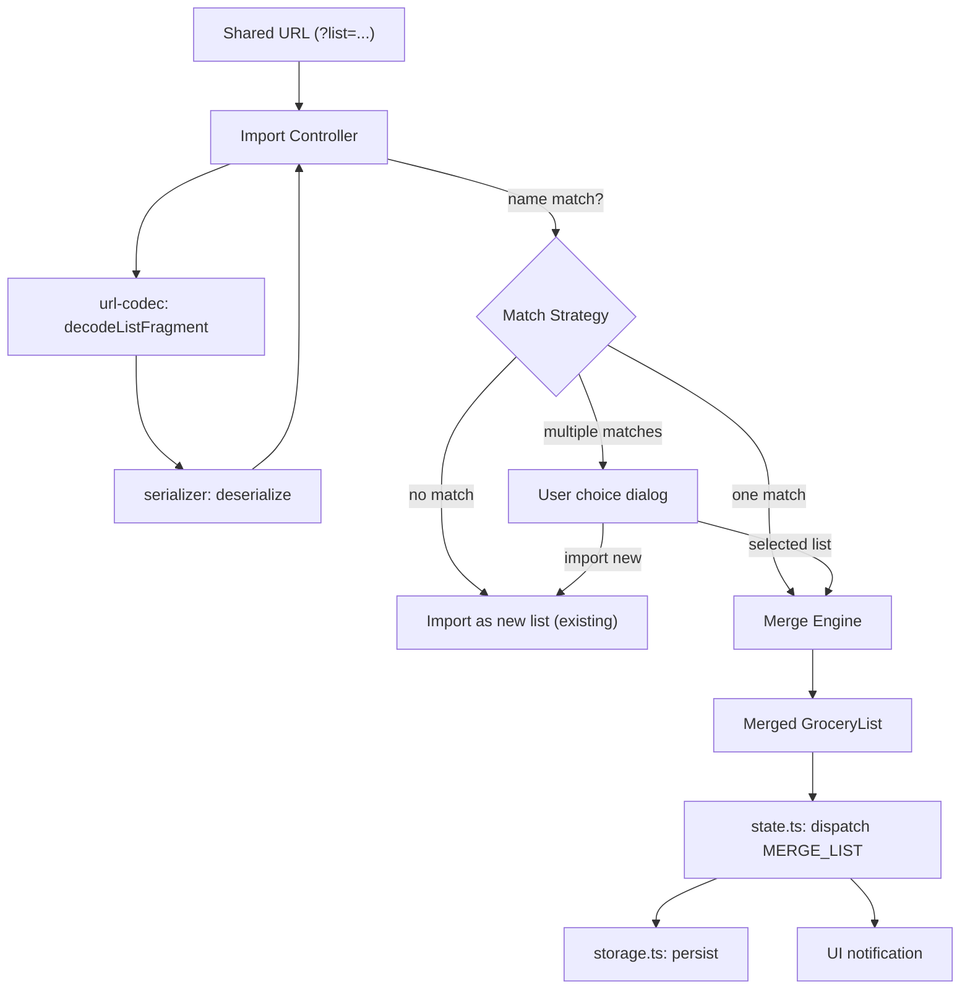

# Design Document: List Merge Collaboration

## Overview

This feature introduces a merge engine and updated import flow for the Grocery List PWA. When a user opens a shared URL whose list name matches an existing local list, the app merges the incoming list into the local copy instead of creating a duplicate. The merge follows **additive-only, unchecked-wins** semantics:

- New items and sections are added; nothing is ever removed.
- An item is marked checked only when **both** the local and incoming copies agree it's checked. If either says unchecked, unchecked wins ("I'd rather accidentally buy milk than miss it").
- Items are matched by `(itemName, sectionName)` using case-insensitive comparison, since the serializer strips IDs.
- Local quantities and section assignments are always preserved for matched items.

The merge engine is a **pure function** with no side effects, making it straightforward to test with property-based techniques. The import controller orchestrates detection, merge invocation, state persistence, and user feedback.

## Architecture



The merge engine sits as a new pure module (`src/merge-engine.ts`) with zero dependencies on browser APIs or app state. The import controller gains merge-awareness by checking list names before deciding whether to import or merge.

### Key Design Decisions

1. **Pure merge function**: The merge engine accepts two `GroceryList` objects and returns a new `GroceryList`. No mutations, no side effects. This makes it trivially testable and composable.

2. **Case-insensitive matching by name+section**: Since the serializer strips IDs, we match items by `(item.name.toLowerCase(), section.name.toLowerCase())`. This is the only stable identity across serialization round-trips.

3. **No timestamps in merge logic**: Timestamps are generated fresh on deserialization and carry no semantic meaning for merge decisions. The unchecked-wins rule replaces any need for "last-write-wins" logic.

4. **New action type `MERGE_LIST`**: The state reducer gets a new action that replaces an existing list in-place (preserving its `id` and `activeListId` status) rather than appending a new list.

## Components and Interfaces

### 1. Merge Engine (`src/merge-engine.ts`)

New module — the core pure function.

```typescript
/** Result of a merge operation, including the merged list and change statistics */
export interface MergeResult {
  mergedList: GroceryList;
  stats: MergeStats;
}

export interface MergeStats {
  itemsAdded: number;
  itemsUnchecked: number;  // items flipped from checked → unchecked
  sectionsAdded: number;
}

/**
 * Merge an incoming list into a local list using additive, unchecked-wins semantics.
 * Pure function — no side effects.
 */
export function mergeLists(local: GroceryList, incoming: GroceryList): MergeResult;
```

### 2. Import Controller Updates (`src/import-controller.ts`)

Extended to support merge flow. The `checkImportUrl` return type gains a new variant:

```typescript
export type ImportCheckResult =
  | { status: 'none' }
  | { status: 'decoded'; list: GroceryList }
  | { status: 'error'; message: string };

/** After decoding, determine the merge/import action */
export type ImportAction =
  | { action: 'import-new'; list: GroceryList }
  | { action: 'merge'; localList: GroceryList; incomingList: GroceryList }
  | { action: 'choose'; candidates: GroceryList[]; incomingList: GroceryList }
  | { action: 'error'; message: string }
  | { action: 'none' };

/**
 * Given a decoded incoming list and the current multi-list state,
 * determine what action to take.
 */
export function resolveImportAction(
  incoming: GroceryList,
  existingLists: GroceryList[]
): ImportAction;
```

### 3. State Reducer Updates (`src/state.ts`)

New action type:

```typescript
| { type: 'MERGE_LIST'; listId: string; mergedList: GroceryList }
```

The handler replaces the list with matching `listId` in `state.lists` with the `mergedList`, preserving the original list's `id` and `createdAt`.

### 4. Notification Interface

The import controller returns `MergeStats` so the UI layer can display:
- "Merged: 3 new items added, 2 items unchecked" (when changes occurred)
- "Lists are already in sync" (when stats are all zeros)

## Data Models

### Existing Types (unchanged)

```typescript
// src/types.ts — no changes needed
interface GroceryList {
  id: string;
  name: string;
  sections: Section[];
  items: Item[];
  createdAt: number;
}

interface Section {
  id: string;
  name: string;
  order: number;
  createdAt: number;
}

interface Item {
  id: string;
  name: string;
  quantity: number;
  isChecked: boolean;
  sectionId: string;
  createdAt: number;
}
```

### New Types

```typescript
// src/merge-engine.ts
interface MergeResult {
  mergedList: GroceryList;
  stats: MergeStats;
}

interface MergeStats {
  itemsAdded: number;
  itemsUnchecked: number;
  sectionsAdded: number;
}
```

### Item Matching Key

Items are matched using a composite key: `(item.name.toLowerCase(), section.name.toLowerCase())`. This is derived at merge time — not stored. The merge engine builds a lookup map from the local list's items keyed by this composite, then iterates the incoming list's items to find matches or detect new additions.

### Merge Algorithm (pseudocode)

```
function mergeLists(local, incoming):
  result = deep copy of local
  stats = { itemsAdded: 0, itemsUnchecked: 0, sectionsAdded: 0 }

  // Build section name → local section ID map (case-insensitive)
  localSectionMap = map(section.name.lower() → section) for each section in local

  // Build item lookup: (sectionName.lower(), itemName.lower()) → local item
  localItemMap = map((sectionName.lower(), itemName.lower()) → item)

  for each incomingSection in incoming.sections:
    sectionKey = incomingSection.name.lower()

    if sectionKey not in localSectionMap:
      // New section — create it with new ID, preserve order relative to other new sections
      newSection = createSection(incomingSection.name, nextOrder++)
      add newSection to result.sections
      localSectionMap[sectionKey] = newSection
      stats.sectionsAdded++

    targetSectionId = localSectionMap[sectionKey].id

    for each incomingItem in incomingSection.items:
      itemKey = (sectionKey, incomingItem.name.lower())

      if itemKey in localItemMap:
        // Matched item — apply unchecked-wins
        localItem = localItemMap[itemKey]
        newChecked = localItem.isChecked AND incomingItem.isChecked
        if localItem.isChecked and not newChecked:
          stats.itemsUnchecked++
        update localItem.isChecked = newChecked in result
      else:
        // New item — add with new ID
        newItem = createItem(incomingItem.name, incomingItem.quantity, incomingItem.isChecked, targetSectionId)
        append newItem to result.items
        stats.itemsAdded++
        // Add to map so duplicate incoming items don't double-add
        localItemMap[itemKey] = newItem

  return { mergedList: result, stats }
```


## Correctness Properties

*A property is a characteristic or behavior that should hold true across all valid executions of a system — essentially, a formal statement about what the system should do. Properties serve as the bridge between human-readable specifications and machine-verifiable correctness guarantees.*

### Property 1: Import Action Resolution

*For any* incoming `GroceryList` and *for any* array of existing local `GroceryList` objects, the `resolveImportAction` function SHALL return:
- `import-new` when zero local list names match the incoming list name (case-insensitive),
- `merge` when exactly one local list name matches,
- `choose` with all matching candidates when two or more local list names match.

**Validates: Requirements 1.1, 1.2, 1.3, 1.4**

### Property 2: Unchecked-Wins Check State

*For any* local `GroceryList` and *for any* incoming `GroceryList`, for every item that exists in both lists (matched by name+section, case-insensitive), the merged item's `isChecked` state SHALL equal the logical AND of the local item's `isChecked` and the incoming item's `isChecked`.

**Validates: Requirements 3.1, 3.2, 3.3, 3.4, 3.5**

### Property 3: No Item Removal (Superset)

*For any* local `GroceryList` and *for any* incoming `GroceryList`, the merged result SHALL contain every item (by name+section key) that was present in the local list AND every item (by name+section key) that was present in the incoming list. The merged item set is a superset of both inputs.

**Validates: Requirements 4.1, 4.2, 2.1**

### Property 4: Local Quantity Preservation

*For any* local `GroceryList` and *for any* incoming `GroceryList`, for every item that existed in the local list before the merge, the merged result SHALL preserve that item's `quantity` unchanged.

**Validates: Requirements 4.3**

### Property 5: Section Preservation and Creation

*For any* local `GroceryList` and *for any* incoming `GroceryList`, the merged result SHALL contain every section from the local list AND every section from the incoming list (matched by name, case-insensitive). New sections from the incoming list SHALL preserve their relative order among other new sections.

**Validates: Requirements 5.1, 5.3, 2.3**

### Property 6: Case-Insensitive Within-Section Matching Only

*For any* local `GroceryList` and *for any* incoming `GroceryList`, items SHALL be matched only when both the item name and section name match case-insensitively. Items with the same name in different sections SHALL be treated as distinct items (no cross-section matching), and the local item SHALL remain in its original section.

**Validates: Requirements 6.1, 6.3, 5.2**

### Property 7: Unique IDs in Merged Result

*For any* local `GroceryList` and *for any* incoming `GroceryList`, every item and every section in the merged result SHALL have a unique `id`. No two items share an ID, no two sections share an ID.

**Validates: Requirements 2.2**

### Property 8: New Items Appended After Existing

*For any* local `GroceryList` and *for any* incoming `GroceryList`, within each section of the merged result, all items that existed in the local list SHALL appear before any newly added items from the incoming list.

**Validates: Requirements 2.4**

### Property 9: Idempotent Merge

*For any* local `GroceryList` and *for any* incoming `GroceryList`, merging the result of `merge(local, incoming)` with `incoming` again SHALL produce a result with identical item names, quantities, checked states, and section structure as the first merge (content-equivalent ignoring IDs and timestamps).

**Validates: Requirements 7.1**

### Property 10: Commutative Merge

*For any* two `GroceryList` objects A and B, `merge(A, B)` and `merge(B, A)` SHALL produce results with the same set of items (by name+section), the same checked states, and the same sections (content-equivalent ignoring IDs, timestamps, and item ordering).

**Validates: Requirements 7.2**

### Property 11: Serialization Round-Trip

*For any* valid `GroceryList` produced by the merge engine, serializing then deserializing SHALL produce a `GroceryList` with equivalent `name`, section names, item names, item quantities, and item checked states.

**Validates: Requirements 8.1, 8.2**

### Property 12: Merge Stats Accuracy

*For any* local `GroceryList` and *for any* incoming `GroceryList`, the `MergeStats` returned by the merge engine SHALL report `itemsAdded` equal to the count of incoming items not matched in the local list, `itemsUnchecked` equal to the count of matched items flipped from checked to unchecked, and `sectionsAdded` equal to the count of incoming sections not present in the local list. When the incoming list is a subset of the local list, all stats SHALL be zero.

**Validates: Requirements 9.1, 9.3**

## Error Handling

| Scenario | Handler | Behavior |
|---|---|---|
| Invalid/corrupted incoming URL data | `import-controller.ts` | `decodeListFragment` or `deserialize` returns error → display error notification, local list unchanged |
| Incoming list fails deserialization validation | `serializer.ts` | Returns `{ error: string }` → import controller shows error message |
| Empty incoming list (no sections/items) | `merge-engine.ts` | Returns local list unchanged with zero stats |
| Merge engine receives valid inputs | `merge-engine.ts` | Pure function — cannot throw on valid `GroceryList` inputs. Invalid inputs are caught upstream by the deserializer. |
| Storage quota exceeded after merge | `state.ts` / `storage.ts` | Existing `StorageQuotaExceededError` handling applies — merge is applied in-memory, storage error surfaced to UI |
| Multiple list name matches | `import-controller.ts` | Returns `choose` action — UI presents selection dialog |

The merge engine itself has no error paths for valid inputs. All validation happens at the deserialization boundary. The import controller is the error boundary — if anything fails, the local list remains in its pre-merge state because the state reducer only receives the final merged list after successful computation.

## Testing Strategy

### Property-Based Testing

Use **fast-check** (already in devDependencies) for property-based tests. Each property from the Correctness Properties section maps to exactly one property-based test.

**Configuration:**
- Minimum 100 iterations per property test (fast-check default is 100, which satisfies this)
- Each test tagged with a comment: `// Feature: list-merge-collaboration, Property {N}: {title}`
- Test file: `tests/list-merge-collaboration.properties.test.ts`

**Generators needed:**
- `arbitraryItem(sectionId: string)`: generates an `Item` with random name, quantity (≥1), checked state
- `arbitrarySection()`: generates a `Section` with random name and order
- `arbitraryGroceryList()`: generates a `GroceryList` with 0-5 sections, each with 0-10 items
- `arbitraryOverlappingLists()`: generates two lists that share some section/item names (for testing merge matching)

**Properties to implement:**
1. Import action resolution (Property 1)
2. Unchecked-wins check state (Property 2)
3. No item removal / superset (Property 3)
4. Local quantity preservation (Property 4)
5. Section preservation and creation (Property 5)
6. Case-insensitive within-section matching (Property 6)
7. Unique IDs in merged result (Property 7)
8. New items appended after existing (Property 8)
9. Idempotent merge (Property 9)
10. Commutative merge (Property 10)
11. Serialization round-trip (Property 11)
12. Merge stats accuracy (Property 12)

### Unit Testing

Test file: `tests/list-merge-collaboration.unit.test.ts`

Unit tests complement property tests by covering specific examples, edge cases, and integration points:

- **Edge cases**: empty incoming list, single-item lists, all items checked, all items unchecked, duplicate item names in same section (Req 6.2), incoming list with only new sections
- **Integration**: `resolveImportAction` with real `MultiListState`, `MERGE_LIST` action dispatch through the reducer, notification message formatting
- **Error conditions**: corrupted incoming data, empty string input, malformed JSON
- **Specific examples**: two concrete lists with known items → verify exact merged output

Unit tests should be focused and few — property tests handle comprehensive input coverage. Unit tests catch concrete bugs and verify integration seams.
