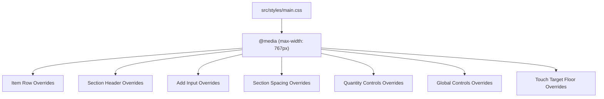

# Design Document: Mobile Layout Density

## Overview

This feature compacts the mobile layout (viewport < 768px) of the grocery list PWA to maximize visible content, inspired by the density of native list apps like iPhone Notes. The change is purely CSS — no HTML structure, component class names, or JavaScript logic is modified.

All overrides live inside the existing `@media (max-width: 767px)` block in `src/styles/main.css`. Touch targets are reduced from the current 44px minimum to 32–36px depending on the element, and padding/gaps/margins are tightened throughout.

## Architecture

The architecture is a single-file change. The existing mobile media query block is extended with additional CSS rules that override the base styles. No new files, selectors, or custom properties are introduced.

### Design Decisions

1. **Single media query block** — All compact overrides are appended to the existing `@media (max-width: 767px)` block rather than creating a separate block. This keeps specificity predictable and avoids cascade conflicts.

2. **No new CSS custom properties** — Requirement 8.2 explicitly forbids modifying `:root` variables. All overrides use direct property values.

3. **32px minimum touch target floor** — Requirement 7.1 sets the absolute minimum at 32px for all interactive elements. Checkboxes and section control buttons use 36px for slightly better ergonomics; quantity buttons use the 32px floor since they appear in a tight row.

4. **No `!important`** — All overrides rely on the natural cascade (media query specificity) rather than `!important`, keeping the CSS maintainable.

## Components and Interfaces

This feature modifies no components or interfaces. All changes are CSS-only within `src/styles/main.css`.

### Affected CSS Selectors (within mobile media query)

| Selector | Current State | Compact Override |
|---|---|---|
| `#app` | `padding: 0.5rem` | `padding: 6px` |
| `.item` | `gap: 0.375rem; padding: 0.375rem 0.5rem` | `gap: 6px; padding: 4px 0.5rem` |
| `.item-checkbox` | `min-width: 44px; min-height: 44px` | `min-width: 36px; min-height: 36px` |
| `.item-checkbox input[type="checkbox"]` | `width: 24px; height: 24px` | `width: 20px; height: 20px` |
| `.section-header` | `min-height: 44px; padding: 0.375rem 0.5rem` | `min-height: 36px; padding: 4px 0.5rem` |
| `.section-controls button` | `min-width: 44px; min-height: 44px` | `min-width: 36px; min-height: 36px` |
| `.section-title` | `font-size: 1rem` | `font-size: 0.9375rem` |
| `.section-add-input` | `min-height: 44px` | `min-height: 36px; padding: 6px 0.75rem` |
| `.section` | `margin-bottom: 0.5rem` | `margin-bottom: 6px` |
| `.item-quantity` | `gap: 0.5rem` | `gap: 2px` |
| `.item-quantity button` | `min-width: 44px; min-height: 44px` | `min-width: 32px; min-height: 32px` |
| `.item-quantity-value` | `font-size: 0.875rem` | `font-size: 0.8125rem` |
| `input[type="text"], input[type="search"]` | `padding: 0.5rem 0.75rem; margin-bottom: 0.625rem` | `padding: 6px 0.75rem; margin-bottom: 6px` |
| `.filter-control` | `margin-bottom: 0.625rem; padding: 0.375rem` | `margin-bottom: 6px; padding: 4px` |
| `.filter-control button` | `min-height: 44px` | `min-height: 36px` |
| `button` (general) | `min-width: 44px; min-height: 44px` | `min-width: 32px; min-height: 32px` |
| `button.icon-only` | `min-width: 44px; min-height: 44px` | `min-width: 32px; min-height: 32px; padding: 0.25rem` |

## Data Models

No data model changes. This feature is CSS-only and does not affect application state, storage, or type definitions.

## Correctness Properties

*A property is a characteristic or behavior that should hold true across all valid executions of a system — essentially, a formal statement about what the system should do. Properties serve as the bridge between human-readable specifications and machine-verifiable correctness guarantees.*

Since this feature is CSS-only, correctness properties are expressed as invariants over computed styles at a mobile viewport width. Tests will render the app in a browser-like environment (e.g., Playwright or a real browser test runner) at a viewport below 768px and assert computed style values.

### Property 1: Item row compactness

*For any* Item_Row rendered at a viewport width below 768px, the computed vertical padding (top and bottom) shall each be no greater than 4px, and the computed gap between child elements shall be no greater than 6px.

**Validates: Requirements 1.1, 1.4**

### Property 2: Checkbox compactness

*For any* Checkbox_Area rendered at a viewport width below 768px, the computed min-width and min-height shall be 36px, and the checkbox input within it shall have a computed width and height of 20px.

**Validates: Requirements 1.2, 1.3**

### Property 3: Section header compactness

*For any* Section_Header rendered at a viewport width below 768px, the computed vertical padding shall each be no greater than 4px, and the computed min-height shall be no greater than 36px.

**Validates: Requirements 2.1, 2.2**

### Property 4: Section control button dimensions

*For any* button inside Section_Controls rendered at a viewport width below 768px, the computed min-width and min-height shall each be 36px.

**Validates: Requirements 2.3**

### Property 5: Section title font size

*For any* section title rendered at a viewport width below 768px, the computed font-size shall be between 0.9rem and 1rem (inclusive) when converted to pixels.

**Validates: Requirements 2.4**

### Property 6: Add input compactness

*For any* Add_Input rendered at a viewport width below 768px, the computed min-height shall be no greater than 36px, and the computed vertical padding shall each be no greater than 6px.

**Validates: Requirements 3.1, 3.2**

### Property 7: Section spacing

*For any* section element rendered at a viewport width below 768px, the computed bottom margin shall be no greater than 6px.

**Validates: Requirements 4.1**

### Property 8: Quantity controls compactness

*For any* Quantity_Controls area rendered at a viewport width below 768px, the increment and decrement buttons shall have a computed min-width and min-height of 32px, the gap between elements shall be no greater than 2px, and the quantity value font-size shall be 0.8125rem in pixels.

**Validates: Requirements 5.1, 5.2, 5.3**

### Property 9: Filter button height

*For any* filter button rendered at a viewport width below 768px, the computed min-height shall be 36px.

**Validates: Requirements 6.3**

### Property 10: Universal touch target floor

*For any* interactive element (button, checkbox, or input) rendered at a viewport width below 768px, the computed min-width and min-height shall each be at least 32px.

**Validates: Requirements 7.1**

## Error Handling

This feature introduces no new error paths. CSS overrides are purely declarative and cannot throw exceptions or produce runtime errors. If a CSS rule is malformed, the browser silently ignores it and falls back to the base style — which is the existing 44px layout. This is a safe degradation path.

Potential issues and mitigations:
- **Malformed CSS rule**: Browser ignores it; base styles apply. No action needed.
- **Viewport detection failure**: The `@media` query is a well-supported CSS feature. No fallback needed.
- **Conflicting specificity**: All overrides are placed inside the same media query block, relying on source order. No `!important` is used.

## Testing Strategy

### Dual Testing Approach

This feature requires both unit tests (specific examples) and property-based tests (universal properties across generated inputs).

### Unit Tests

Unit tests verify specific computed style values at exact viewport widths:

- **Example: App container padding at 767px** — Render the app at 767px viewport, verify `#app` has padding-top and padding-bottom <= 6px. (Validates 4.2)
- **Example: Search input padding at 767px** — Render the search input at 767px, verify vertical padding <= 6px and margin-bottom <= 6px. (Validates 6.1)
- **Example: Filter control bar at 767px** — Render the filter control at 767px, verify padding <= 4px and margin-bottom <= 6px. (Validates 6.2)
- **Example: No compact overrides at 768px** — Render the app at 768px viewport, verify buttons retain 44px min-height/min-width. (Validates 7.3)
- **Example: All compact rules inside mobile media query** — Parse `main.css` and verify all new compact rules exist within the `@media (max-width: 767px)` block. (Validates 8.1)
- **Example: :root block unchanged** — Parse `main.css` and verify the `:root` block contains no new or modified custom properties. (Validates 8.2)

### Property-Based Tests

Property-based tests verify universal properties across randomly generated app states (varying numbers of sections and items). Each test renders the app at a mobile viewport width (randomly chosen below 768px) and checks computed styles.

- **Library**: `fast-check` for generating random app states; Playwright or similar for real browser rendering and computed style access.
- **Minimum iterations**: 100 per property test.
- **Tag format**: `Feature: mobile-layout-density, Property {N}: {title}`

Each correctness property (1–10) maps to exactly one property-based test:

1. `Feature: mobile-layout-density, Property 1: Item row compactness`
2. `Feature: mobile-layout-density, Property 2: Checkbox compactness`
3. `Feature: mobile-layout-density, Property 3: Section header compactness`
4. `Feature: mobile-layout-density, Property 4: Section control button dimensions`
5. `Feature: mobile-layout-density, Property 5: Section title font size`
6. `Feature: mobile-layout-density, Property 6: Add input compactness`
7. `Feature: mobile-layout-density, Property 7: Section spacing`
8. `Feature: mobile-layout-density, Property 8: Quantity controls compactness`
9. `Feature: mobile-layout-density, Property 9: Filter button height`
10. `Feature: mobile-layout-density, Property 10: Universal touch target floor`

### Practical Consideration

Since this is a CSS-only change and the project uses Vitest with JSDOM (which does not compute real CSS), the property-based tests for computed styles would need either:
- A Playwright-based test setup for real browser rendering, or
- A CSS parsing approach that validates the CSS rules themselves (e.g., using `postcss` to parse `main.css` and assert rule values)

The CSS parsing approach is more practical for this project since it avoids adding a full browser test dependency. Property tests would generate random selectors from the affected set and verify the parsed CSS values match the requirements.
