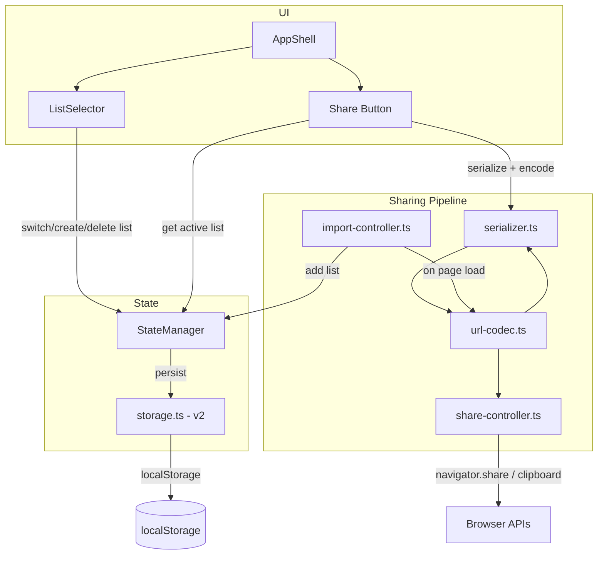

# Design Document: Multi-List Sharing

## Overview

This design extends the Grocery List PWA from a single-list model to a multi-list model with zero-backend sharing. The core changes are:

1. A new `GroceryList` wrapper type that groups a name with sections and items, and a `MultiListState` that holds an array of lists plus the active list ID.
2. A storage migration path from the current v1 `AppState` (single flat list) to a v2 multi-list schema.
3. A serialization pipeline: `List → JSON → lz-string compress → base64url` for encoding a list into a URL fragment, and the reverse for decoding.
4. A `ShareController` that uses the Web Share API with clipboard fallback.
5. An `ImportController` that detects `#list=<data>` on page load, decodes it, and prompts the user to import.
6. A `ListSelector` UI component for switching between lists.

No server infrastructure is required. All data stays in localStorage and URL fragments.

## Architecture

The feature introduces four new pure-logic modules and one UI component, all wired through the existing `AppShell` orchestrator.



### Data Flow: Sharing a List

1. User taps "Share" → `AppShell` reads the active list from `StateManager`
2. `serialize(list)` → JSON string (excluding transient UI state)
3. `encodeListUrl(json)` → lz-string compress → base64url → `origin/#list=<data>`
4. `ShareController.share(url, title)` → `navigator.share()` or clipboard fallback

### Data Flow: Importing a List

1. Page loads → `ImportController.checkUrl()` reads `location.hash`
2. `decodeListFragment(hash)` → base64url decode → lz-string decompress → JSON string
3. `deserialize(json)` → `GroceryList` with fresh UUIDs
4. User confirms → `StateManager.dispatch({ type: 'IMPORT_LIST', list })` → persisted
5. `history.replaceState` removes the fragment

### Module Placement

| Module | Path | Pure Logic? |
|---|---|---|
| Serializer / Deserializer | `src/serializer.ts` | Yes |
| URL Codec | `src/url-codec.ts` | Yes |
| Share Controller | `src/share-controller.ts` | Yes (deps injected) |
| Import Controller | `src/import-controller.ts` | Yes (deps injected) |
| List Selector | `src/components/ListSelector.ts` | No (UI) |
| Storage v2 | `src/storage.ts` (extended) | Yes |

All pure-logic modules accept dependencies via parameters (no global access), making them fully testable without mocks.

## Components and Interfaces

### 1. Types (`src/types.ts` — extended)

```typescript
/** A named grocery list containing sections and items */
export interface GroceryList {
  id: string;
  name: string;
  sections: Section[];
  items: Item[];
  createdAt: number;
}

/** Top-level multi-list application state */
export interface MultiListState {
  lists: GroceryList[];
  activeListId: string;
  filterMode: FilterMode;
  collapsedSections: Set<string>;
  version: number; // 2
}
```

The existing `Section` and `Item` interfaces remain unchanged. `AppState` is replaced by `MultiListState` as the root state shape. The `selectedSectionId` field is dropped (it was only used for the old single-section add flow, now replaced by inline section inputs).

### 2. Serializer (`src/serializer.ts`)

```typescript
/** Portable list representation — no IDs, no timestamps, no UI state */
export interface SerializedList {
  name: string;
  sections: {
    name: string;
    order: number;
    items: {
      name: string;
      quantity: number;
      isChecked: boolean;
    }[];
  }[];
}

export function serialize(list: GroceryList): string;
export function deserialize(json: string): GroceryList | { error: string };
```

`serialize` converts a `GroceryList` into a JSON string of `SerializedList` shape. Items are nested under their parent section (denormalized) to avoid needing section IDs in the portable format.

`deserialize` parses the JSON, validates the shape, generates fresh UUIDs and timestamps for all entities, and returns a `GroceryList`. On invalid input it returns `{ error: string }`.

### 3. URL Codec (`src/url-codec.ts`)

```typescript
export function encodeListUrl(serializedJson: string, origin: string): string;
export function decodeListFragment(hash: string): string | null | { error: string };
```

`encodeListUrl` compresses with `lz-string`'s `compressToEncodedURIComponent` (which produces URL-safe base64) and returns `${origin}/#list=${encoded}`.

`decodeListFragment` extracts the `list=` parameter from the hash, decompresses, and returns the JSON string. Returns `null` if no `list=` parameter is present, or `{ error }` on decode/decompress failure.

### 4. Share Controller (`src/share-controller.ts`)

```typescript
export interface ShareDeps {
  navigatorShare?: (data: ShareData) => Promise<void>;
  clipboardWriteText?: (text: string) => Promise<void>;
}

export type ShareResult =
  | { status: 'shared' }
  | { status: 'copied' }
  | { status: 'unsupported' };

export function shareList(url: string, title: string, deps: ShareDeps): Promise<ShareResult>;
```

Dependency-injected for testability. Tries `navigator.share` first; on `AbortError` it does nothing (user cancelled, returns `{ status: 'shared' }`); on other errors it falls back to clipboard. If neither API is available, returns `{ status: 'unsupported' }`.

### 5. Import Controller (`src/import-controller.ts`)

```typescript
export interface ImportDeps {
  getHash: () => string;
  replaceState: (url: string) => void;
}

export type ImportCheckResult =
  | { status: 'none' }
  | { status: 'decoded'; list: GroceryList }
  | { status: 'error'; message: string };

export function checkImportUrl(deps: ImportDeps): ImportCheckResult;
```

Pure function that reads the hash, decodes, deserializes, and returns the result. The `AppShell` handles the confirmation prompt and dispatching.

### 6. ListSelector Component (`src/components/ListSelector.ts`)

```typescript
export interface ListSelectorConfig {
  lists: { id: string; name: string }[];
  activeListId: string;
  onSelect: (listId: string) => void;
  onNew: () => void;
  onRename: (listId: string, name: string) => void;
  onDelete: (listId: string) => void;
}

export class ListSelector {
  constructor(config: ListSelectorConfig);
  getElement(): HTMLElement;
  update(config: ListSelectorConfig): void;
}
```

Renders a horizontal scrollable bar of list tabs with a "+" button. The active list tab is visually highlighted. Long-press or double-tap on a tab enters rename mode. Each tab has a delete affordance (except when it's the only list).

### 7. StateManager Extensions

New action types added to the `Action` union:

```typescript
| { type: 'CREATE_LIST'; name: string }
| { type: 'DELETE_LIST'; listId: string }
| { type: 'RENAME_LIST'; listId: string; name: string }
| { type: 'SWITCH_LIST'; listId: string }
| { type: 'IMPORT_LIST'; list: GroceryList }
```

The reducer operates on `MultiListState`. Actions like `ADD_ITEM`, `DELETE_SECTION`, etc. are scoped to the active list. `SWITCH_LIST` saves the current collapsed sections state and loads the target list's sections.

### 8. Storage v2 (`src/storage.ts` — extended)

```typescript
export function loadMultiListState(): MultiListState;
export function saveMultiListState(state: MultiListState): void;
export function migrateV1ToV2(v1: AppState): MultiListState;
```

`loadMultiListState` checks the `version` field:
- Missing or `1` → calls `migrateV1ToV2` to wrap the single list in a `GroceryList` and return a `MultiListState`.
- `2` → validates and returns directly.
- Invalid → logs warning, returns fresh default state.

## Data Models

### Storage Schema v2

```json
{
  "version": 2,
  "activeListId": "uuid-1",
  "filterMode": "all",
  "collapsedSections": ["section-uuid-a"],
  "lists": [
    {
      "id": "uuid-1",
      "name": "Weekly Groceries",
      "createdAt": 1700000000000,
      "sections": [
        { "id": "s1", "name": "Produce", "order": 0, "createdAt": 1700000000000 }
      ],
      "items": [
        { "id": "i1", "name": "Apples", "quantity": 3, "isChecked": false, "sectionId": "s1", "createdAt": 1700000000000 }
      ]
    }
  ]
}
```

### Migration v1 → v2

The v1 schema stores sections and items at the top level with a `version: 1` field. Migration wraps them into a single `GroceryList`:

```typescript
function migrateV1ToV2(v1Data: any): MultiListState {
  const listId = generateId();
  return {
    lists: [{
      id: listId,
      name: 'My Grocery List',
      sections: v1Data.sections,
      items: v1Data.items,
      createdAt: Date.now(),
    }],
    activeListId: listId,
    filterMode: v1Data.filterMode ?? 'all',
    collapsedSections: new Set(v1Data.collapsedSections ?? []),
    version: 2,
  };
}
```

### Serialized List Format (for sharing)

The portable format is intentionally minimal — no IDs, no timestamps, no UI state. Items are nested under sections to avoid needing foreign keys:

```json
{
  "name": "Weekly Groceries",
  "sections": [
    {
      "name": "Produce",
      "order": 0,
      "items": [
        { "name": "Apples", "quantity": 3, "isChecked": false }
      ]
    }
  ]
}
```

### lz-string Dependency

The `lz-string` library (MIT, ~4KB gzipped) provides `compressToEncodedURIComponent` / `decompressFromEncodedURIComponent` which produce URL-safe strings without needing separate base64url encoding. This is a well-established library with no dependencies. It will be added as a runtime dependency.


## Correctness Properties

*A property is a characteristic or behavior that should hold true across all valid executions of a system — essentially, a formal statement about what the system should do. Properties serve as the bridge between human-readable specifications and machine-verifiable correctness guarantees.*

### Property 1: Creating a list adds it and sets it active

*For any* valid `MultiListState`, dispatching `CREATE_LIST` should increase the list count by one, and the newly created list should become the active list with an empty sections and items array.

**Validates: Requirements 1.2**

### Property 2: Switching lists updates the active list ID

*For any* valid `MultiListState` with two or more lists and any list ID present in the state, dispatching `SWITCH_LIST` with that ID should set `activeListId` to the given ID without modifying any list contents.

**Validates: Requirements 1.3**

### Property 3: Renaming a list updates only the target list's name

*For any* valid `MultiListState` and any list ID present in the state and any non-empty string, dispatching `RENAME_LIST` should update only that list's name, leaving all other lists and all items unchanged.

**Validates: Requirements 1.4**

### Property 4: Deleting a list removes it and falls back to the first remaining list

*For any* valid `MultiListState` with two or more lists, dispatching `DELETE_LIST` for any list should remove that list and all its sections and items. If the deleted list was the active list, `activeListId` should equal the first remaining list's ID.

**Validates: Requirements 1.5, 1.6**

### Property 5: Active list ID persists across save and load

*For any* valid `MultiListState`, saving to localStorage and then loading should produce a state with the same `activeListId`.

**Validates: Requirements 1.8**

### Property 6: V1 to V2 migration preserves all sections and items

*For any* valid v1 `AppState` with arbitrary sections and items, `migrateV1ToV2` should produce a `MultiListState` with `version: 2`, exactly one list, and that list should contain all original sections (same names, same order) and all original items (same names, quantities, checked states, and section assignments).

**Validates: Requirements 2.1, 2.2**

### Property 7: Loading a valid V2 state is idempotent

*For any* valid `MultiListState` (version 2), saving then loading should produce an equivalent state (same lists, same active list, same filter mode).

**Validates: Requirements 2.3**

### Property 8: Invalid stored data falls back to a default state

*For any* object that fails schema validation (missing required fields, wrong types, corrupt JSON), `loadMultiListState` should return a default state with version 2 and one empty list.

**Validates: Requirements 2.4**

### Property 9: Serialized output contains exactly the portable fields

*For any* valid `GroceryList`, the JSON output of `serialize` should parse to an object containing only: `name` (string), and `sections` (array of objects each containing only `name`, `order`, and `items` — where each item contains only `name`, `quantity`, and `isChecked`). No `id`, `createdAt`, `filterMode`, `collapsedSections`, or `sectionId` fields should appear at any level.

**Validates: Requirements 3.2, 3.3**

### Property 10: Serialization round-trip preserves list content

*For any* valid `GroceryList`, serializing then deserializing should produce a list with the same name, the same number of sections with the same names and order, and the same items per section with the same names, quantities, and checked states.

**Validates: Requirements 3.6**

### Property 11: Deserialization generates fresh unique IDs

*For any* valid serialized JSON string, deserializing should produce a `GroceryList` where every section ID and every item ID is a valid UUID, all IDs are unique across the entire list, and no ID matches any ID from the original list that was serialized.

**Validates: Requirements 3.4, 6.6**

### Property 12: Deserialization rejects invalid input

*For any* string that is not valid JSON or does not conform to the `SerializedList` schema (missing `name`, non-array `sections`, items with non-numeric `quantity`, etc.), `deserialize` should return an object with an `error` string property.

**Validates: Requirements 3.5**

### Property 13: URL codec round-trip preserves the serialized string

*For any* non-empty string, `encodeListUrl(str, origin)` followed by extracting the hash and calling `decodeListFragment(hash)` should return the original string.

**Validates: Requirements 4.7**

### Property 14: Encoded URL matches the expected format

*For any* non-empty serialized JSON string and any origin string, `encodeListUrl` should return a string matching the pattern `<origin>/#list=<non-empty-string>`.

**Validates: Requirements 4.2**

### Property 15: Missing list parameter returns null

*For any* URL hash string that does not contain `list=` (including empty string, `#other=value`, `#`, etc.), `decodeListFragment` should return `null`.

**Validates: Requirements 4.5**

### Property 16: Corrupted encoded data returns an error

*For any* hash string of the form `#list=<data>` where `<data>` is random bytes that are not a valid lz-string compressed payload, `decodeListFragment` should return an object with an `error` string property.

**Validates: Requirements 4.6**

### Property 17: Share invokes navigator.share with correct parameters

*For any* URL string and any title string, when `navigator.share` is available, `shareList` should call it with `{ url, title }` and return `{ status: 'shared' }`.

**Validates: Requirements 5.2**

### Property 18: Share falls back to clipboard when share is unavailable or fails

*For any* URL string, when `navigator.share` is either unavailable or rejects with a non-AbortError, `shareList` should call `clipboardWriteText` with the URL and return `{ status: 'copied' }`.

**Validates: Requirements 5.3, 5.5**

### Property 19: Importing a list adds it and sets it as active

*For any* valid `MultiListState` and any valid `GroceryList`, dispatching `IMPORT_LIST` should add the list to the state and set it as the active list, without modifying any existing lists.

**Validates: Requirements 6.2**

## Error Handling

### Storage Errors

| Scenario | Behavior |
|---|---|
| localStorage unavailable | Throw `StorageUnavailableError`; app runs in memory-only mode |
| Quota exceeded on save | Throw `StorageQuotaExceededError`; `AppShell` shows warning notification |
| Corrupted v1 data during migration | Log warning, return fresh default v2 state |
| Corrupted v2 data on load | Log warning, return fresh default v2 state |

### Serialization Errors

| Scenario | Behavior |
|---|---|
| `deserialize` receives invalid JSON | Return `{ error: 'Invalid JSON: <parse error message>' }` |
| `deserialize` receives JSON missing required fields | Return `{ error: 'Missing required field: <field>' }` |
| `deserialize` receives items with invalid types | Return `{ error: 'Invalid <field> at section <index>, item <index>' }` |

### URL Codec Errors

| Scenario | Behavior |
|---|---|
| Hash has no `list=` parameter | `decodeListFragment` returns `null` |
| `list=` value is not valid lz-string | `decodeListFragment` returns `{ error: 'Decompression failed' }` |
| Decompressed string is not valid serialized list | Caught by `deserialize` error handling above |

### Share Errors

| Scenario | Behavior |
|---|---|
| `navigator.share` throws `AbortError` | Silently ignore (user cancelled); return `{ status: 'shared' }` |
| `navigator.share` throws other error | Fall back to clipboard |
| Both share and clipboard unavailable | Return `{ status: 'unsupported' }`; `AppShell` shows notification |

### Import Errors

| Scenario | Behavior |
|---|---|
| URL has no `#list=` fragment | `checkImportUrl` returns `{ status: 'none' }`; app loads normally |
| Fragment contains corrupted data | `checkImportUrl` returns `{ status: 'error', message }` ; `AppShell` shows "Could not load shared list: invalid link" |
| User cancels import prompt | App loads normally, fragment is still removed from URL |

## Testing Strategy

### Property-Based Testing

Use `fast-check` 4.x with minimum 100 iterations per property. Each property test must reference its design document property with a tag comment.

Tag format: `// Feature: multi-list-sharing, Property N: <title>`

Each correctness property (1–19) maps to exactly one `fc.assert(fc.property(...))` call.

#### Generators Needed

- `arbSection()`: generates a `Section` with random name, order, UUID, timestamp
- `arbItem(sectionId)`: generates an `Item` with random name, quantity ≥ 1, random isChecked, given sectionId
- `arbGroceryList()`: generates a `GroceryList` with 0–5 sections, 0–10 items per section
- `arbMultiListState()`: generates a `MultiListState` with 1–5 lists, valid activeListId
- `arbV1AppState()`: generates a valid v1 `AppState` (sections + items at top level, version 1)
- `arbSerializedListJson()`: generates a valid `SerializedList` JSON string
- `arbInvalidJson()`: generates strings that are not valid JSON or don't match the schema
- `arbHashWithoutList()`: generates hash strings without `list=`
- `arbCorruptedHash()`: generates `#list=<random-non-lzstring-data>`

#### Test Files

| File | Contents |
|---|---|
| `tests/serializer.properties.test.ts` | Properties 9, 10, 11, 12 |
| `tests/url-codec.properties.test.ts` | Properties 13, 14, 15, 16 |
| `tests/share-controller.properties.test.ts` | Properties 17, 18 |
| `tests/multi-list-state.properties.test.ts` | Properties 1, 2, 3, 4, 5, 19 |
| `tests/storage-migration.properties.test.ts` | Properties 6, 7, 8 |

### Unit Tests

Unit tests complement property tests by covering specific examples, edge cases, and integration points.

| File | Covers |
|---|---|
| `tests/serializer.unit.test.ts` | Specific serialization examples, empty list, list with special characters |
| `tests/url-codec.unit.test.ts` | Specific encode/decode examples, empty hash, hash with other params |
| `tests/share-controller.unit.test.ts` | AbortError handling, unsupported browser scenario (5.6) |
| `tests/import-controller.unit.test.ts` | Full import flow, cancel flow (6.3), URL cleanup (6.4), error notification (6.5) |
| `tests/storage-migration.unit.test.ts` | Specific v1 data shapes, edge cases in migration |
| `tests/ListSelector.test.ts` | Component rendering (1.1), interaction callbacks |
| `tests/multi-list-state.unit.test.ts` | Delete-only-list creates default (1.7), specific state transitions |

### Library Choice

- Property-based testing: `fast-check` 4.x (already in devDependencies)
- Test runner: `vitest` 4.x with jsdom environment (already configured)
- No additional testing libraries needed

### Configuration

```typescript
// All property tests use numRuns: 100
fc.assert(
  fc.property(arbGroceryList(), (list) => {
    // ...
  }),
  { numRuns: 100 }
);
```
