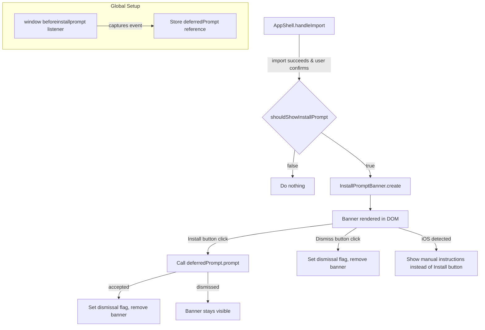

# Design Document: PWA Install Prompt

## Overview

This feature adds a dismissible install-prompt banner that appears after a user opens a shared grocery list link on a mobile device. The banner encourages the user to add the PWA to their home screen. On Chromium/Firefox Android browsers that fire the `beforeinstallprompt` event, the banner includes a one-tap "Install" button. On iOS Safari, which lacks that event, the banner shows manual instructions ("Tap Share → Add to Home Screen"). The banner is suppressed when the app is already running in standalone mode, on desktop devices, or when the user has previously dismissed it (tracked via a localStorage flag).

The feature is implemented as a standalone `InstallPromptBanner` component plus a set of pure utility functions for device/context detection. Integration with the existing app happens in `AppShell`, triggered after the shared-list import flow completes.

## Architecture



### Key Design Decisions

1. **Pure utility functions for detection**: `isMobileDevice()`, `isStandaloneMode()`, and `isDismissed()` / `setDismissed()` are exported as pure functions with injectable dependencies. This keeps them testable without requiring a browser environment.

2. **Component follows existing patterns**: `InstallPromptBanner` mirrors the class-based component pattern used by `Section`, `Item`, etc. — a class with `getElement()` that returns a DOM element, constructed with a config object.

3. **Integration point is post-import**: The banner is shown only after a successful shared-list import, not on every page load. This keeps the prompt contextual and non-intrusive.

4. **`beforeinstallprompt` captured globally**: The event listener is registered once in `init()` (or `AppShell` constructor) because the event fires early and only once per page load. The captured event reference is passed to the banner when it's created.

## Components and Interfaces

### `src/install-prompt.ts` — Detection Utilities & Banner Component

```typescript
/** Dependencies for device/context detection (injectable for testing) */
export interface DetectDeps {
  userAgent: string;
  maxTouchPoints: number;
  matchMedia: (query: string) => { matches: boolean };
  standalone?: boolean; // navigator.standalone (iOS)
}

/** Dependencies for dismissal persistence */
export interface DismissalDeps {
  getItem: (key: string) => string | null;
  setItem: (key: string, value: string) => void;
}

/** Returns true if the device appears to be mobile */
export function isMobileDevice(deps: DetectDeps): boolean;

/** Returns true if the app is running in standalone (installed) mode */
export function isStandaloneMode(deps: DetectDeps): boolean;

/** Returns true if the user agent indicates iOS Safari */
export function isIOSSafari(deps: DetectDeps): boolean;

/** Returns true if the dismissal flag exists in storage */
export function isDismissed(deps: DismissalDeps): boolean;

/** Sets the dismissal flag in storage */
export function setDismissed(deps: DismissalDeps): void;

/** Top-level check: should the banner be shown? */
export function shouldShowInstallPrompt(
  detectDeps: DetectDeps,
  dismissalDeps: DismissalDeps,
): boolean;

/** Config for the InstallPromptBanner component */
export interface InstallPromptBannerConfig {
  deferredPrompt: BeforeInstallPromptEvent | null;
  isIOS: boolean;
  onDismiss: () => void;
  onInstallAccepted: () => void;
}

/** The banner component */
export class InstallPromptBanner {
  constructor(config: InstallPromptBannerConfig);
  getElement(): HTMLElement;
  remove(): void;
}
```

### `BeforeInstallPromptEvent` type (ambient)

```typescript
interface BeforeInstallPromptEvent extends Event {
  prompt(): Promise<void>;
  userChoice: Promise<{ outcome: 'accepted' | 'dismissed' }>;
}
```

### Integration in `AppShell` (changes to `src/index.ts`)

- In `init()`: register a `window.addEventListener('beforeinstallprompt', ...)` handler that stores the event and prevents default.
- In `handleImport()`: after a successful import + user confirmation, call `shouldShowInstallPrompt()`. If true, create an `InstallPromptBanner` and append it to the app shell.
- The `onDismiss` callback calls `setDismissed()` and `banner.remove()`.
- The `onInstallAccepted` callback calls `setDismissed()` and `banner.remove()`.

### CSS additions to `src/styles/main.css`

New styles for `.install-prompt-banner` — a fixed-bottom bar with the app's dark theme, containing message text, an optional Install button, and a dismiss (×) button.

## Data Models

No new persistent data models are introduced. The feature uses a single localStorage key for the dismissal flag:

| Key | Value | Purpose |
|-----|-------|---------|
| `pwa-install-dismissed` | `"1"` | Indicates the user has dismissed or completed the install prompt |

The `BeforeInstallPromptEvent` is held in memory only (not persisted). It is captured once per page load and discarded after use or when the page unloads.


## Correctness Properties

*A property is a characteristic or behavior that should hold true across all valid executions of a system — essentially, a formal statement about what the system should do. Properties serve as the bridge between human-readable specifications and machine-verifiable correctness guarantees.*

### Property 1: shouldShowInstallPrompt gate

*For any* combination of (isMobile: boolean, isStandalone: boolean, isDismissed: boolean), `shouldShowInstallPrompt` shall return `true` if and only if `isMobile === true` AND `isStandalone === false` AND `isDismissed === false`. In all other combinations it shall return `false`.

**Validates: Requirements 1.1, 1.2, 1.3, 1.4, 5.3**

### Property 2: Install button presence matches deferredPrompt availability

*For any* `InstallPromptBanner` created with a config where `deferredPrompt` is either a mock event or `null`, the banner's DOM shall contain an element with `aria-label="Install"` if and only if `deferredPrompt` is non-null.

**Validates: Requirements 3.1, 4.2**

### Property 3: Standalone mode detection

*For any* combination of (mediaQueryMatches: boolean, navigatorStandalone: boolean | undefined), `isStandaloneMode` shall return `true` if and only if `mediaQueryMatches === true` OR `navigatorStandalone === true`.

**Validates: Requirements 6.1**

### Property 4: Mobile device detection

*For any* user agent string and maxTouchPoints value, `isMobileDevice` shall return `true` if and only if the user agent contains at least one of the mobile platform identifiers ("Android", "iPhone", "iPad") AND `maxTouchPoints > 0`.

**Validates: Requirements 6.2**

## Error Handling

| Scenario | Handling |
|----------|----------|
| `localStorage` unavailable (private browsing) | `isDismissed()` returns `false` (show banner); `setDismissed()` silently fails. The banner may reappear on next visit, which is acceptable. |
| `beforeinstallprompt` never fires | `deferredPrompt` stays `null`. Banner shows iOS-style instructions on iOS, or a generic "Add to Home Screen" message on other mobile browsers. No Install button is rendered. |
| `prompt()` throws | Catch the error, log it, and leave the banner visible so the user can dismiss manually. |
| `userChoice` promise rejects | Treat as a dismissal — leave the banner visible. |
| Banner DOM container missing | `shouldShowInstallPrompt` returns false or banner creation is skipped if the app shell element is not found. |

## Testing Strategy

### Unit Tests

Unit tests cover specific examples, edge cases, and integration behavior:

- Banner renders iOS instructions when `isIOS=true` and `deferredPrompt=null`
- Banner renders Install button when `deferredPrompt` is provided
- Clicking Install calls `prompt()` on the deferred event
- Accepting the native dialog sets the dismissal flag and removes the banner
- Dismissing the native dialog leaves the banner visible
- Clicking the dismiss (×) button sets the dismissal flag and removes the banner
- Banner has `role="banner"` and dismiss button has `aria-label="Dismiss install prompt"`
- `isIOSSafari` returns true for iOS Safari user agents and false for others
- Edge case: `isMobileDevice` returns false when UA contains "Android" but `maxTouchPoints === 0` (e.g., Chrome DevTools emulation without touch)
- Edge case: `isDismissed` returns false when localStorage throws

### Property-Based Tests

Property-based tests use `fast-check` (already in devDependencies) with a minimum of 100 iterations per property. Each test is tagged with a comment referencing the design property.

- **Feature: pwa-install-prompt, Property 1: shouldShowInstallPrompt gate** — Generate arbitrary booleans for (isMobile, isStandalone, isDismissed) and verify the function returns true only when all three conditions align.
- **Feature: pwa-install-prompt, Property 2: Install button presence matches deferredPrompt availability** — Generate arbitrary boolean for deferredPrompt presence, create the banner, and assert Install button existence matches.
- **Feature: pwa-install-prompt, Property 3: Standalone mode detection** — Generate arbitrary booleans for (mediaQueryMatches, navigatorStandalone) and verify the OR logic.
- **Feature: pwa-install-prompt, Property 4: Mobile device detection** — Generate arbitrary user agent strings (from a pool of mobile and non-mobile UAs) and arbitrary non-negative integers for maxTouchPoints, and verify the AND logic.

Each correctness property is implemented by a single property-based test. Property tests and unit tests are complementary — property tests verify universal invariants across randomized inputs while unit tests pin down specific examples and edge cases.
