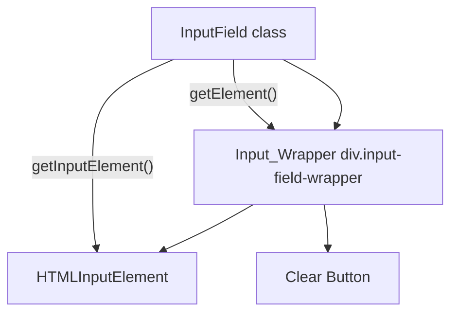

# Design Document: Search Clear Button

## Overview

This feature adds an inline clear ("✕") button to the `InputField` component of the grocery list app. The button appears inside the input when text is present and clears the search text on click, resetting item filtering. The implementation wraps the existing `HTMLInputElement` and the new clear button in a container `<div>`, changing the return type of `getElement()` from `HTMLInputElement` to `HTMLDivElement`. A new `getInputElement()` method provides direct access to the underlying input for backward compatibility with existing tests.

The change is scoped entirely to `InputField.ts` and `main.css`. No new components or modules are introduced.

## Architecture

The current `InputField` component creates a single `HTMLInputElement` and returns it from `getElement()`. The new design introduces a thin wrapper layer:



### Key Design Decisions

1. **Wrapper approach over shadow DOM**: A simple container `<div>` with `position: relative` is sufficient. Shadow DOM would add unnecessary complexity for a vanilla TS app.

2. **`getElement()` returns the wrapper**: The app shell (`index.ts`) calls `inputField.getElement()` and appends it to `#input-container`. Returning the wrapper means the app shell code doesn't change — it still gets a single element to append.

3. **New `getInputElement()` method**: Existing tests directly set `.value` and dispatch events on the element returned by `getElement()`. Rather than rewriting all tests, a `getInputElement()` method exposes the raw `HTMLInputElement`. Tests update their `getElement()` calls to `getInputElement()`.

4. **Visibility via `display` + `tabindex`**: The clear button uses `display: none` / `display: flex` to toggle visibility. When hidden, `tabindex="-1"` ensures it's removed from the tab order (Requirement 5.3).

5. **Debounce cancellation on clear click**: Clicking the clear button cancels any pending debounce timer before invoking `onInput('')`, matching the same pattern used by `clear()` and `handleSubmit()`.

## Components and Interfaces

### Modified: `InputField` class (`src/components/InputField.ts`)

```typescript
// Existing interface — unchanged
export interface InputFieldConfig {
  placeholder: string;
  onInput: (text: string) => void;
  onSubmit: (text: string) => void;
}

export class InputField {
  // New private members
  private wrapper: HTMLDivElement;
  private clearButton: HTMLButtonElement;

  // Existing members (unchanged)
  private element: HTMLInputElement;
  private config: InputFieldConfig;
  private debounceTimer: ReturnType<typeof setTimeout> | null;
  private readonly DEBOUNCE_DELAY = 300;

  // Modified methods
  getElement(): HTMLDivElement;          // now returns wrapper
  getInputElement(): HTMLInputElement;   // NEW — returns raw input

  // New private methods
  private createWrapper(): HTMLDivElement;
  private createClearButton(): HTMLButtonElement;
  private updateClearButtonVisibility(): void;
  private handleClearClick(): void;
}
```

### New CSS classes (`src/styles/main.css`)

| Class | Purpose |
|---|---|
| `.input-field-wrapper` | Container with `position: relative`, inherits `.input-field` border/bg styles |
| `.input-field-wrapper .input-field` | Input inside wrapper — removes its own border/margin, goes full width |
| `.input-field-clear-btn` | Absolutely positioned clear button on the right — small circular gray background (`border-radius: 50%`, `background: #475569`) with centered "✕" text, matching the app's dark theme. Hover state lightens the background. |

## Data Models

No new data models are introduced. The feature is purely a UI component change. The `InputFieldConfig` interface remains unchanged — the clear button reuses the existing `onInput` callback to signal filter resets.


## Correctness Properties

*A property is a characteristic or behavior that should hold true across all valid executions of a system — essentially, a formal statement about what the system should do. Properties serve as the bridge between human-readable specifications and machine-verifiable correctness guarantees.*

### Property 1: Clear button visibility tracks input content

*For any* string value set on the InputField, the clear button should be visible and focusable (tabindex not -1) if and only if the string is non-empty. When the string is empty, the clear button should be hidden and not focusable (tabindex = -1).

**Validates: Requirements 1.1, 1.2, 1.3, 1.4, 5.3**

### Property 2: Clear click resets input and invokes filter callback

*For any* non-empty string in the InputField, clicking the clear button should set the input value to an empty string and invoke the `onInput` callback exactly once with an empty string.

**Validates: Requirements 2.1, 2.2**

### Property 3: Clear click cancels pending debounce

*For any* non-empty string typed into the InputField (starting a debounce timer), clicking the clear button before the debounce fires should prevent the debounced `onInput` call from ever executing with the old value. The only `onInput` call should be with an empty string.

**Validates: Requirements 2.3**

### Property 4: Clear click moves focus to input

*For any* non-empty string in the InputField, clicking the clear button should move `document.activeElement` to the underlying `HTMLInputElement`.

**Validates: Requirements 2.4**

### Property 5: Programmatic clear() hides button and resets state

*For any* non-empty string in the InputField, calling the `clear()` method should set the input value to an empty string, invoke `onInput` with an empty string, and hide the clear button.

**Validates: Requirements 3.4**

## Error Handling

This feature has a minimal error surface since it's a self-contained UI component with no network or storage interactions.

| Scenario | Handling |
|---|---|
| Clear button clicked when input is already empty | No-op — button is hidden when input is empty, so this state shouldn't occur. If it does (e.g., programmatic call), `clear()` is idempotent. |
| `onInput` callback throws | Not caught by InputField — same as existing behavior. The caller is responsible for error handling in their callback. |
| DOM not available (SSR) | Not applicable — this is a client-side PWA. |

## Testing Strategy

### Property-Based Tests

Use `fast-check` (already in devDependencies) with `vitest`. Each property test runs a minimum of 100 iterations with randomly generated strings.

Each test must be tagged with a comment referencing the design property:
- **Feature: search-clear-button, Property 1: Clear button visibility tracks input content**
- **Feature: search-clear-button, Property 2: Clear click resets input and invokes filter callback**
- **Feature: search-clear-button, Property 3: Clear click cancels pending debounce**
- **Feature: search-clear-button, Property 4: Clear click moves focus to input**
- **Feature: search-clear-button, Property 5: Programmatic clear() hides button and resets state**

Each correctness property must be implemented by a single property-based test. The `fc.string()` and `fc.stringOf()` arbitraries generate random input values. For non-empty strings, use `fc.string({ minLength: 1 })`.

### Unit Tests

Unit tests cover specific examples, structural checks, and accessibility attributes:

- **Structure**: `getElement()` returns a `<div>`, `getInputElement()` returns an `<input>`, wrapper contains both input and button (Requirements 3.1, 3.2, 3.3)
- **Accessibility**: Clear button has `aria-label="Clear search"`, is a `<button type="button">`, keyboard operable via Enter/Space (Requirements 5.1, 5.2, 5.4)
- **Rendering**: Clear button contains "✕" text (Requirement 4.1)
- **Edge cases**: Clear on already-empty input is idempotent, rapid clear clicks don't cause double callbacks

### Test File Organization

- `tests/search-clear-button.properties.test.ts` — property-based tests for Properties 1–5
- `tests/search-clear-button.unit.test.ts` — unit tests for structure, accessibility, and edge cases

### Backward Compatibility Testing

Existing tests in `InputField.test.ts`, `InputField.integration.test.ts`, and `InputField.debounce.test.ts` call `inputField.getElement()` expecting an `HTMLInputElement`. These must be updated to use `inputField.getInputElement()` to continue working after the wrapper change.
