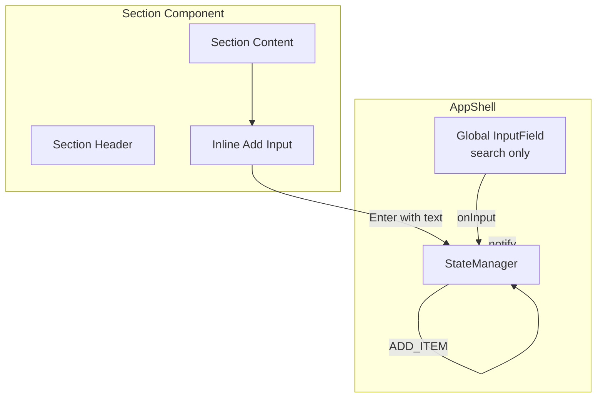

# Design Document: Section Item Add

## Overview

This feature replaces the dual-purpose global input field with per-section inline add inputs and converts the global input into a search-only field. Each expanded section renders a small text input at the bottom of its content area, allowing users to add items directly to the section they're looking at. The global `InputField` component drops its `onSubmit` behavior and becomes a pure filter/search field.

The changes touch three layers:
1. **Section component** — gains an inline `<input>` in its content area
2. **AppShell** — stops wiring `onSubmit` on the global input, stops managing `selectedSectionId` for adds
3. **CSS** — new `.section-add-input` class for the subdued inline input style

No new components are created. The `Section` class grows an internal input element, and the `SectionConfig` interface gains an `onAddItem` callback.

## Architecture



### Design Decisions

1. **Input lives inside Section, not as a separate component**: The inline input is simple enough (a single `<input>` element with a keydown listener) that extracting it into its own class would add indirection without benefit. It's created in `Section.createElement()` and appended after the items.

2. **`onAddItem` callback on SectionConfig**: Follows the established callback pattern used by `onRename`, `onDelete`, etc. The Section component doesn't know about state — it just calls the callback with the trimmed text.

3. **Global input becomes search-only**: Rather than removing `InputField`, we keep it but stop passing an `onSubmit` that dispatches `ADD_ITEM`. The `handleSubmit` method inside `InputField` still fires (clearing the field), but the callback becomes a no-op or is repurposed. The simplest approach: pass an `onSubmit` that does nothing, since `InputField` already validates and clears on Enter.

4. **`selectedSectionId` left in AppState**: The property remains in the type for backward compatibility with persisted state, but is no longer read for item addition. Removing it would require a storage migration. It can be cleaned up in a future version bump.

5. **CSS class `.section-add-input`**: A dedicated class keeps the subdued styling isolated from the global `.input-field` styles. The input gets `border: none` by default, a visible border on `:focus`, and inherits the section's background.

## Components and Interfaces

### Modified: `SectionConfig` interface (`src/components/Section.ts`)

```typescript
export interface SectionConfig {
  // ... existing properties unchanged ...
  onAddItem: (name: string) => void;  // NEW
}
```

### Modified: `Section` class (`src/components/Section.ts`)

**`createElement()` changes:**

After creating the `.section-content` div, create an inline input:

```typescript
const addInput = document.createElement('input');
addInput.type = 'text';
addInput.className = 'section-add-input';
addInput.placeholder = `Add to ${this.config.name}...`;
addInput.setAttribute('aria-label', `Add item to ${this.config.name}`);
```

The input is appended as the last child of the section element, after `.section-content`. This keeps it visually at the bottom of the section but outside the content div so it doesn't interfere with item rendering (AppShell clears `contentElement.innerHTML` on re-render).

**Event listeners on the inline input:**

```typescript
addInput.addEventListener('keydown', (event) => {
  if (event.key === 'Enter') {
    event.preventDefault();
    const value = addInput.value.trim();
    if (value !== '') {
      this.config.onAddItem(value);
      addInput.value = '';
    }
  }
  if (event.key === 'Escape') {
    addInput.value = '';
    addInput.blur();
  }
});
```

**Collapse behavior:**

The inline input is placed inside a wrapper or directly managed by `updateCollapsedState()`. When collapsed, the input is hidden along with the content. The simplest approach: place the input inside the `.section-content` div but after items are rendered. However, since AppShell clears `contentElement.innerHTML`, the input would be destroyed on re-render. 

Better approach: AppShell appends the inline input to the content element after rendering items, during each render cycle. This means the Section component exposes a method to create/return the input element, or AppShell creates it directly.

**Chosen approach**: Section creates the input in `createElement()` and stores a reference. A new public method `getAddInputElement()` returns it. AppShell appends it to the content element after rendering items. The CSS rule `.section.collapsed .section-content` already hides the content div, so the input is automatically hidden when collapsed.

### Modified: `AppShell` class (`src/index.ts`)

**`render()` changes:**

After rendering items into a section's content element, append the section's add input:

```typescript
contentElement.appendChild(sectionComponent.getAddInputElement());
```

**`handleItemSubmit()` changes:**

This method is replaced with a no-op or removed. The `InputField` `onSubmit` callback becomes `() => {}`.

**Global input placeholder:**

Changed from `'Add item or search...'` to `'Search items...'`.

**New handler:**

```typescript
private handleSectionAddItem(sectionId: string, name: string): void {
  this.stateManager.dispatch({ type: 'ADD_ITEM', name, sectionId });
}
```

Passed to each Section's `onAddItem` in the render loop.

### Modified: CSS (`src/styles/main.css`)

New styles for `.section-add-input`:

```css
.section-add-input {
  width: 100%;
  padding: 0.5rem 0.75rem;
  background-color: transparent;
  color: var(--text-primary);
  border: 1px solid transparent;
  border-radius: 4px;
  font-size: 0.8125rem;
  outline: none;
  transition: border-color 0.2s ease, background-color 0.2s ease;
  min-height: 44px;
  box-sizing: border-box;
}

.section-add-input:focus {
  border-color: var(--accent);
  background-color: var(--bg-tertiary);
}

.section-add-input::placeholder {
  color: var(--text-disabled);
  font-style: italic;
}
```

### Unchanged

- `InputField` class — no code changes needed; behavior is controlled by the callbacks passed to it
- `Item` class — unaffected
- `FilterControl` class — unaffected
- `StateManager` — the `ADD_ITEM` action handler already accepts `name` and `sectionId`, no changes needed
- `types.ts` — `AppState.selectedSectionId` remains but is no longer used for adds
- `storage.ts` — no changes

## Data Models

No data model changes. The `Section`, `Item`, and `AppState` interfaces remain identical. The `ADD_ITEM` action already requires `sectionId`, so the state reducer needs no modification. The `selectedSectionId` field stays in `AppState` for backward compatibility but is no longer functionally relevant for item addition.


## Correctness Properties

*A property is a characteristic or behavior that should hold true across all valid executions of a system — essentially, a formal statement about what the system should do. Properties serve as the bridge between human-readable specifications and machine-verifiable correctness guarantees.*

### Property 1: Inline input visibility matches collapsed state

*For any* section configuration, the inline add input SHALL be visible (present in a displayed content area) when the section is not collapsed, and hidden (inside a hidden content area) when the section is collapsed.

**Validates: Requirements 1.1, 1.2**

### Property 2: Inline input attributes contain section name

*For any* section name string, the inline add input's `placeholder` attribute SHALL contain that section name, and the `aria-label` attribute SHALL contain that section name.

**Validates: Requirements 1.3, 2.4, 5.3**

### Property 3: Valid submission dispatches callback, clears input, and retains focus

*For any* non-empty trimmed string entered into the inline add input, pressing Enter SHALL invoke the `onAddItem` callback with the trimmed text, clear the input's value to an empty string, and leave the input as the focused element.

**Validates: Requirements 1.4, 1.6, 4.2**

### Property 4: Whitespace-only input is rejected

*For any* string composed entirely of whitespace characters (including the empty string), pressing Enter in the inline add input SHALL NOT invoke the `onAddItem` callback, and the section's item list SHALL remain unchanged.

**Validates: Requirements 1.7**

### Property 5: Escape clears and blurs

*For any* string value in the inline add input, pressing Escape SHALL clear the input's value to an empty string and remove focus from the input (blur).

**Validates: Requirements 5.2**

## Error Handling

No new error handling is required beyond what already exists:

- **Empty/whitespace input**: The inline input's keydown handler trims the value and silently ignores empty results. No error is surfaced to the user — this is intentional since typing Enter on an empty field is a common accidental action.
- **Missing section on dispatch**: The `StateManager.handleAddItem()` does not validate that `sectionId` exists in `state.sections`. This is acceptable because the inline input is always rendered inside a section that exists in state. If a race condition somehow causes a stale section ID, the item is created with an orphaned `sectionId` and will not appear in any section — the same behavior as today.
- **Re-render destroys input focus**: Since AppShell does a full re-render on state change, the inline input is recreated after each item add. The input loses focus. To preserve the "add multiple items" flow (Requirement 4.2), AppShell should re-focus the inline input of the section that just received an item after re-render. This is handled by tracking the last-added section ID and calling `focus()` on its input after render completes.

## Testing Strategy

### Dual Testing Approach

This feature uses both unit tests and property-based tests.

**Unit tests** (`tests/Section.add-input.test.ts`):
- Verify the global input placeholder is "Search items..." (Requirement 3.2)
- Verify the global input Enter key does not dispatch ADD_ITEM (Requirement 3.1)
- Verify the inline input has no negative tabindex (Requirement 5.1)
- Verify the inline input has `min-height: 44px` via CSS class presence (Requirement 2.3)
- Verify existing filter/debounce behavior is preserved (Requirement 3.3)

**Property-based tests** (`tests/Section.add-input.properties.test.ts`):
- Use fast-check with `{ numRuns: 100 }` per property
- Each test is tagged with: **Feature: section-item-add, Property {number}: {title}**

| Property | Test Description |
|----------|-----------------|
| 1 | Generate random section configs with random collapsed state; verify input visibility matches |
| 2 | Generate random section name strings; verify placeholder and aria-label contain the name |
| 3 | Generate random non-whitespace strings; simulate Enter; verify callback, input cleared, focus retained |
| 4 | Generate random whitespace-only strings; simulate Enter; verify callback NOT called |
| 5 | Generate random strings; set as input value; simulate Escape; verify value cleared and blur |

**Property-based testing library**: fast-check 4.x (already in the project)

**What does NOT need new tests**:
- `ADD_ITEM` state reducer — already covered by `tests/state.properties.test.ts`
- Persistence round-trip — already covered by `tests/storage.test.ts`
- Filter/debounce behavior — already covered by `tests/InputField.debounce.properties.test.ts`
