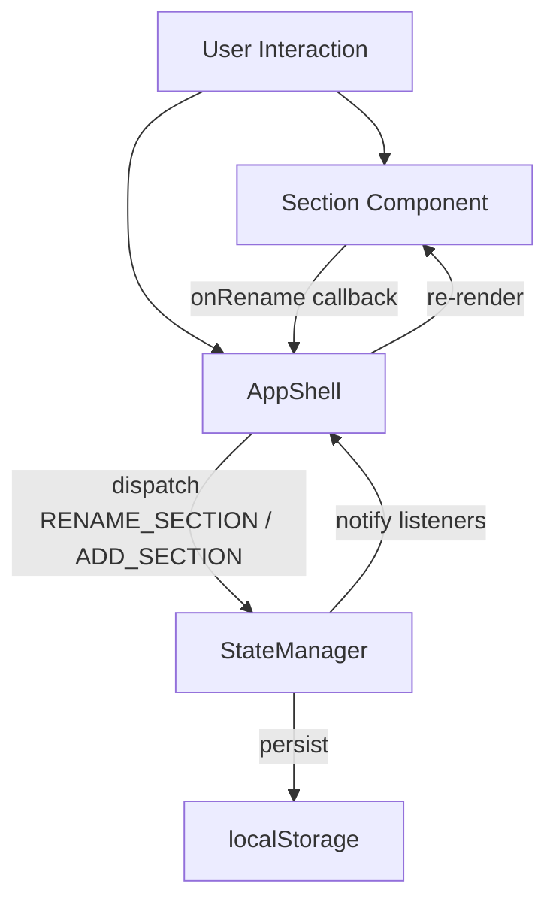

# Design Document: Section Management

## Overview

This feature adds user-facing section management to the Grocery List PWA: an "Add Section" button for creating new sections and inline rename capability on section headers. The existing `StateManager` already handles `ADD_SECTION` and `DELETE_SECTION` actions; this design introduces a `RENAME_SECTION` action and wires new UI affordances through the existing component architecture.

The changes touch three layers:
1. **State** — Add `RENAME_SECTION` action to the reducer
2. **AppShell** — Render an "Add Section" button and pass `onRename` to Section components
3. **Section component** — Add inline rename UI triggered by double-click on the section name

## Architecture

The feature follows the existing unidirectional data flow:



Key architectural decisions:
- **No new components**: The "Add Section" button is rendered directly by `AppShell` inside the sections container. It doesn't warrant a separate component class.
- **Inline rename lives in Section**: The rename input replaces the title `<span>` inside the existing `.section-title` container. This keeps rename state local to the component.
- **Rename mode flag**: The `Section` component tracks an `isRenaming` boolean internally. When true, it swaps the title span for an `<input>`. This avoids polluting global state with transient UI state.
- **Auto-rename on create**: When `AppShell` creates a new section via the Add button, it calls `enterRenameMode()` on the newly created `Section` component instance after mounting.

## Components and Interfaces

### StateManager — New Action

Add `RENAME_SECTION` to the `Action` union type:

```typescript
| { type: 'RENAME_SECTION'; id: string; name: string }
```

The reducer handler:
- Finds the section by `id`
- Updates its `name` to the provided value
- Returns state unchanged if no section matches the `id`

### SectionConfig — Extended Interface

```typescript
export interface SectionConfig {
  id: string;
  name: string;
  isCollapsed: boolean;
  initialRenameMode?: boolean;  // NEW: auto-enter rename on mount
  onToggle: () => void;
  onMoveUp: () => void;
  onMoveDown: () => void;
  onDelete: () => void;
  onRename: (id: string, newName: string) => void;  // NEW
  onItemDrop: (itemId: string, sourceSectionId: string) => void;
}
```

### Section Component — Rename Behavior

Internal state:
- `isRenaming: boolean` — whether the inline input is shown
- `originalName: string` — cached name for cancel/revert

Methods:
- `enterRenameMode()` — swaps title span for input, focuses and selects all text
- `commitRename()` — trims input value; if empty/whitespace, reverts to `originalName`; otherwise calls `onRename(id, trimmedName)` and exits rename mode
- `cancelRename()` — restores `originalName` and exits rename mode

Event bindings:
- Double-click on `.section-title span` → `enterRenameMode()`
- `keydown` Enter on input → `commitRename()`
- `keydown` Escape on input → `cancelRename()`
- `blur` on input → `commitRename()`
- Click on input → `stopPropagation()` (prevents header collapse toggle)

The input element:
- `type="text"`, `maxlength="50"`, `aria-label="Rename section"`
- Pre-filled with current name, all text selected on focus
- Minimum touch target 44×44 CSS pixels (inherits from existing button styles)

### AppShell — Add Section Button & Wiring

The `render()` method appends an "Add Section" button after all section elements:

```html
<button class="add-section-btn" aria-label="Add new section">
  <span aria-hidden="true">+</span> Add Section
</button>
```

Click handler:
1. Dispatches `ADD_SECTION` with name `"New Section"`
2. After re-render, finds the newly created `Section` component and calls `enterRenameMode()`

The `onRename` callback passed to each `Section`:
```typescript
onRename: (id, newName) => {
  this.stateManager.dispatch({ type: 'RENAME_SECTION', id, name: newName });
}
```

When creating sections in `render()`, pass `initialRenameMode: true` for newly added sections so they auto-enter rename mode.

## Data Models

No new types are introduced. The existing `Section` interface already has a `name: string` field. The `Action` union in `state.ts` gains one new variant:

```typescript
{ type: 'RENAME_SECTION'; id: string; name: string }
```

The `SectionConfig` interface gains two optional/required fields:
- `onRename: (id: string, newName: string) => void` — required callback
- `initialRenameMode?: boolean` — optional flag for auto-rename on mount

State shape is unchanged. The `RENAME_SECTION` reducer produces a new `sections` array with the target section's `name` updated. All other fields remain untouched.


## Correctness Properties

*A property is a characteristic or behavior that should hold true across all valid executions of a system — essentially, a formal statement about what the system should do. Properties serve as the bridge between human-readable specifications and machine-verifiable correctness guarantees.*

### Property 1: Rename updates section name

*For any* section in state and *for any* non-empty, non-whitespace-only string as the new name, dispatching `RENAME_SECTION` with that section's ID and the new name should result in the section's name being updated to the new name, with all other sections and items unchanged.

**Validates: Requirements 2.1, 2.2**

### Property 2: Rename with non-matching ID is a no-op

*For any* application state and *for any* ID that does not match any existing section, dispatching `RENAME_SECTION` should return a state where the sections array is identical to the original.

**Validates: Requirements 2.3**

### Property 3: Rename round-trip persistence

*For any* section and *for any* new name, dispatching `RENAME_SECTION` and then loading state from localStorage should yield a state where the renamed section has the new name.

**Validates: Requirements 2.4**

### Property 4: Double-click enters rename mode with current name

*For any* section name, when the user double-clicks the section title, the Section component should display an input element whose value equals the current section name.

**Validates: Requirements 3.1**

### Property 5: Commit rename invokes callback with trimmed name

*For any* non-whitespace-only string entered in the rename input, committing the rename (via Enter key or blur) should invoke the `onRename` callback with the section ID and the trimmed version of the input value.

**Validates: Requirements 3.3, 3.5, 4.1, 4.2**

### Property 6: Escape cancels rename and restores original name

*For any* section name and *for any* text entered in the rename input, pressing Escape should restore the displayed section name to the original value and exit rename mode without invoking the `onRename` callback.

**Validates: Requirements 3.4**

### Property 7: Whitespace-only name reverts to original

*For any* string composed entirely of whitespace characters (including the empty string), submitting it as a rename should cancel the rename and restore the original section name, without invoking the `onRename` callback.

**Validates: Requirements 3.6**

### Property 8: Rename input does not trigger collapse

*For any* section in rename mode, clicking or interacting with the rename input should not trigger the section's collapse/expand toggle callback.

**Validates: Requirements 3.8**

## Error Handling

| Scenario | Behavior |
|---|---|
| `RENAME_SECTION` with non-existent ID | State returned unchanged, no error thrown |
| Empty/whitespace-only rename submission | Rename cancelled, original name restored |
| `localStorage` write failure on rename | Existing `saveState` try/catch logs error; UI state still updates (consistent with current behavior) |
| Rename input exceeds 50 chars | `maxlength="50"` on the input element prevents entry beyond 50 characters |
| Double-click while already in rename mode | No-op — input is already shown |
| Blur fires after Escape (browser behavior) | `commitRename` checks `isRenaming` flag; if already false (set by Escape handler), it's a no-op |

## Testing Strategy

### Property-Based Tests (fast-check)

All property tests use `fast-check` (already a dev dependency) with a minimum of 100 iterations per property. Each test is tagged with a comment referencing the design property.

Tag format: `Feature: section-management, Property {N}: {title}`

Properties 1–3 test the `StateManager` reducer directly — no DOM needed. Properties 4–8 test the `Section` component in jsdom.

**Generators needed:**
- Section name generator: `fc.string({ minLength: 1, maxLength: 50 })`
- Whitespace-only generator: `fc.stringOf(fc.constantFrom(' ', '\t', '\n', '\r'))` with `minLength: 0, maxLength: 50`
- Non-matching ID generator: `fc.uuid()` filtered to exclude existing section IDs
- Padded string generator: `fc.tuple(fc.stringOf(fc.constantFrom(' ', '\t')), fc.string({ minLength: 1, maxLength: 40 }), fc.stringOf(fc.constantFrom(' ', '\t'))).map(([pre, mid, post]) => pre + mid + post)`

### Unit Tests (Vitest)

Unit tests cover specific examples, edge cases, and integration points:

- Add Section button renders below sections with correct text and aria-label (1.1, 1.5, 5.1)
- Add Section button visible when no sections exist (1.6)
- Clicking Add Section creates section named "New Section" and enters rename mode (1.2, 1.3, 1.4)
- Rename input has `aria-label="Rename section"` and `maxlength="50"` (5.2, 3.7)
- Rename input is focused with all text selected on enter (3.2)
- Add Section button activatable via Enter and Space keys (5.3)
- AppShell dispatches RENAME_SECTION when onRename fires (4.3)

### Test File Organization

- `tests/state.rename.properties.test.ts` — Properties 1–3 (StateManager)
- `tests/Section.rename.properties.test.ts` — Properties 4–8 (Section component)
- `tests/Section.rename.test.ts` — Unit tests for rename UI
- `tests/AppShell.section-management.test.ts` — Unit tests for Add Section button and wiring

Each correctness property is implemented by a single property-based test. Unit tests and property tests are complementary: unit tests catch concrete bugs in specific scenarios, property tests verify general correctness across randomized inputs.
