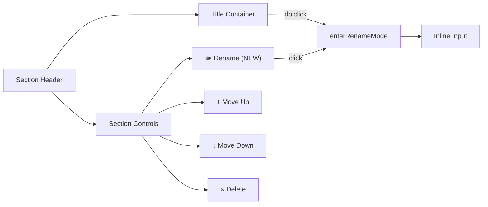

# Design Document: Section Rename Button

## Overview

This feature adds a visible ✏️ rename button to the section controls in the Grocery List PWA's `Section` component. The button provides an explicit, accessible alternative to the existing double-click rename gesture, which does not work reliably on touch devices. The implementation is entirely contained within `src/components/Section.ts` — no new files, no CSS changes, and no architectural modifications.

## Architecture

The change is localized to the `Section` component's `createElement()` method and the existing controls click handler. No architectural changes are needed.



The rename button is inserted as the first child of the `.section-controls` container, before the existing move-up, move-down, and delete buttons. It reuses the same `icon-only` CSS class and follows the same `data-action` pattern used by all other control buttons.

### Design Decisions

1. **Button position (first in controls)**: The rename action is the most common section management operation on mobile. Placing it first makes it the easiest to reach.
2. **Reuse existing `enterRenameMode()`**: Both the button and double-click call the same method, ensuring identical behavior regardless of entry point.
3. **No CSS changes**: The existing `icon-only` class provides consistent styling. The ✏️ emoji renders natively across all platforms.
4. **`data-action` pattern**: Follows the established convention where the controls container has a single delegated click handler that switches on `data-action`.

## Components and Interfaces

### Modified: `Section` class (`src/components/Section.ts`)

**`createElement()` changes:**

A new `<button>` element is created with these attributes:
- `className`: `'icon-only'`
- `textContent`: `'✏️'`
- `aria-label`: `'Rename section'`
- `data-action`: `'rename'`

The button is appended to the controls container before the move-up button:

```typescript
const renameBtn = document.createElement('button');
renameBtn.className = 'icon-only';
renameBtn.textContent = '✏️';
renameBtn.setAttribute('aria-label', 'Rename section');
renameBtn.setAttribute('data-action', 'rename');

controls.appendChild(renameBtn);   // first
controls.appendChild(moveUpBtn);
controls.appendChild(moveDownBtn);
controls.appendChild(deleteBtn);
```

**Click handler changes:**

A `'rename'` case is added to the existing `switch` statement in the controls click listener:

```typescript
case 'rename':
  this.enterRenameMode();
  break;
```

The `event.stopPropagation()` call at the top of the controls click handler prevents the rename button click from triggering the header's collapse/expand toggle.

### Unchanged

- `SectionConfig` interface — no new config properties needed
- `enterRenameMode()`, `commitRename()`, `cancelRename()` — existing rename logic is reused as-is
- Double-click handler on title span — preserved unchanged
- All other components, state management, and persistence — unaffected

## Data Models

No data model changes. The `Section`, `Item`, and `AppState` interfaces remain identical. The rename button triggers the same `onRename` callback that the double-click path already uses.

## Correctness Properties

*A property is a characteristic or behavior that should hold true across all valid executions of a system — essentially, a formal statement about what the system should do. Properties serve as the bridge between human-readable specifications and machine-verifiable correctness guarantees.*

### Property 1: Rename button structural correctness

*For any* section configuration, the rendered Section component SHALL contain a rename button as the first button in the controls container, with `textContent` of `'✏️'`, `data-action` of `'rename'`, `aria-label` of `'Rename section'`, and CSS class `'icon-only'`.

**Validates: Requirements 1.1, 1.2, 1.3, 1.4, 4.1**

### Property 2: Rename entry point confluence

*For any* section configuration with a non-empty name, entering rename mode via the rename button click and entering rename mode via double-clicking the title span SHALL produce identical rename mode state: an input element pre-filled with the current section name, with the text selected.

**Validates: Requirements 2.1, 2.3, 3.1, 3.2**

### Property 3: Rename button click does not trigger collapse

*For any* section configuration, clicking the rename button SHALL NOT invoke the `onToggle` callback.

**Validates: Requirements 2.2**

## Error Handling

No new error handling is needed. The rename button delegates to `enterRenameMode()`, which already handles:

- **Re-entrant calls**: If already in rename mode, `enterRenameMode()` returns immediately (guard: `if (this.isRenaming) return`)
- **Empty/whitespace input**: `commitRename()` trims the input and reverts to the original name if the result is empty
- **Escape cancellation**: `cancelRename()` restores the original name without invoking `onRename`
- **Blur after Escape**: The `commitRename()` guard (`if (!this.isRenaming) return`) prevents double-commit when blur fires after Escape

## Testing Strategy

### Dual Testing Approach

This feature uses both unit tests and property-based tests, following the project's established pattern.

**Unit tests** (`tests/Section.rename.test.ts`):
- Verify specific examples: aria-label and maxlength on rename input, focus and selection on enter, no-op on double-enter, no double-commit on blur-after-Escape
- These are concrete scenarios that demonstrate correct behavior for specific inputs

**Property-based tests** (`tests/Section.rename.properties.test.ts`):
- Use fast-check with `{ numRuns: 100 }` per property
- Each test is tagged with: **Feature: section-rename-button, Property {number}: {title}**
- Existing property tests already cover Properties 4–8 from the broader section-management feature (double-click rename mode, commit with trimmed name, Escape cancellation, whitespace revert, input click isolation)
- The three new properties (1–3) from this design validate the rename button's structural correctness, entry point confluence, and collapse isolation

**Property-based testing library**: fast-check 4.x (already in the project)

**What does NOT need new tests**:
- The rename flow itself (enter → edit → commit/cancel) is already thoroughly tested by existing unit and property tests
- State management (`RENAME_SECTION` action) is covered by `tests/state.rename.properties.test.ts`
- Persistence round-trip is covered by Property 3 in `tests/state.rename.properties.test.ts`
