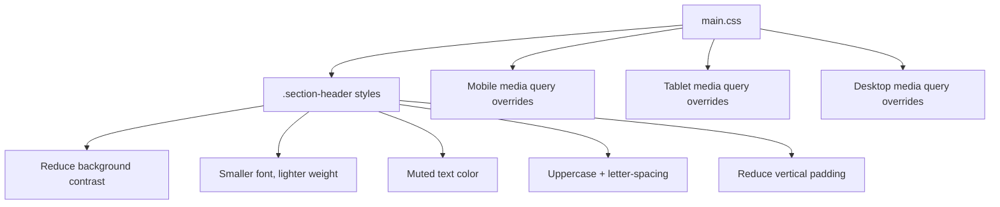

# Design Document: Section Visual Hierarchy

## Overview

This feature adjusts the CSS styling of the grocery list PWA so that section headers visually recede into quiet, muted category labels while item rows become the dominant visual elements. The change is purely cosmetic — CSS-only modifications to `src/styles/main.css` with no structural HTML or component changes.

The core idea: reduce section header visual weight (lighter background, smaller/lighter font, muted color, uppercase letter-spacing) and reduce header padding for compactness. Item rows remain completely unchanged. The result is a scannable list where items naturally stand out and sections fade into the background as organizational dividers.

## Architecture

This is a CSS-only change. No new components, modules, or data flows are introduced.

All changes live in a single file: `src/styles/main.css`. The existing CSS custom properties (`:root` variables) are reused — no new variables are needed.

## Components and Interfaces

No new components or interfaces. The existing `Section.ts` and `Item.ts` components remain unchanged. Only the CSS rules that style their DOM output are modified.

### CSS Rules Modified

| Selector | Current State | New State | Rationale |
|---|---|---|---|
| `.section-header` | `background: var(--bg-tertiary)` (#3a3a3a), `padding: 0.5rem 0.75rem`, `min-height: 44px` | `background: var(--bg-secondary)` (#2d2d2d), `padding: 0.25rem 0.75rem`, `min-height: auto` | Closer to page bg, reduces prominence; tighter padding for compactness |
| `.section-header:hover` | `background: var(--bg-hover)` (#404040) | `background: var(--bg-tertiary)` (#3a3a3a) | Subtle hover, still below item default |
| `.section-title` | `font-size: 1rem; font-weight: 500; color: var(--text-primary)` | `font-size: 0.8125rem; font-weight: 400; color: var(--text-secondary); text-transform: uppercase; letter-spacing: 0.05em` | Muted category label treatment |
| `.item-name` | `font-size: 0.9375rem` (no explicit weight) | No change | Items remain as-is per user feedback |
| Mobile `.section-header` | `padding: 4px 0.5rem; min-height: 36px` | `padding: 0.25rem 0.5rem; min-height: auto` | Compact mobile headers |
| Mobile `.section-title` | `font-size: 0.9375rem` | `font-size: 0.75rem` | Proportional scaling, still smaller than item |

### Color Contrast Verification

All color pairings must meet WCAG 2.1 AA (4.5:1 minimum):

| Element | Text Color | Background | Contrast Ratio | Pass? |
|---|---|---|---|---|
| Section header text | `--text-secondary` (#b0b0b0) | `--bg-secondary` (#2d2d2d) | ~6.4:1 | ✅ |
| Item name (unchecked) | `--text-primary` (#ffffff) | `--bg-secondary` (#2d2d2d) | ~12.6:1 | ✅ |
| Checked item text | `--checked-text` (#90a090) | `--checked-bg` (#2a3a2a) | ~4.8:1 | ✅ |

## Data Models

No data model changes. This feature is purely presentational. The existing `SectionConfig` and `ItemConfig` interfaces remain unchanged. No new state, storage, or serialization is involved.

## Correctness Properties

*A property is a characteristic or behavior that should hold true across all valid executions of a system — essentially, a formal statement about what the system should do. Properties serve as the bridge between human-readable specifications and machine-verifiable correctness guarantees.*

Since this feature is CSS-only, all properties are verified by parsing `main.css` with PostCSS and checking declared values across breakpoints (default, mobile, tablet, desktop).

### Property 1: Section title is subordinate to item name across all breakpoints

*For any* breakpoint context (default, mobile, tablet, desktop), the `.section-title` font-size SHALL be strictly less than the `.item-name` font-size, and the `.section-title` font-weight SHALL be no greater than 400.

This combines the font-size comparison (1.2), font-weight cap (1.3), cross-breakpoint consistency (6.1), and mobile proportional scaling (6.3) into a single property: section text is always subordinate to item text.

**Validates: Requirements 1.2, 1.3, 6.1, 6.3**

### Property 2: Item styling remains unchanged

*For any* breakpoint context (default, mobile, tablet, desktop), the `.item-name` font-size and font-weight declarations SHALL remain at their original values (0.9375rem font-size, no explicit font-weight) — no new declarations added.

This ensures item text is not modified by this feature.

**Validates: Requirements 2.1, 2.2, 2.3**

### Property 3: Section header hover remains less prominent than item default

*For any* CSS state, the `.section-header:hover` background color SHALL resolve to a value that is darker (closer to `--bg-primary`) than the `.item` default background color.

This ensures the hover state doesn't visually compete with item rows.

**Validates: Requirements 3.3**

### Property 4: WCAG contrast compliance for text/background pairings

*For any* text/background color pairing used in the feature (section header text on section header bg, item name on item bg, checked item text on checked bg), the computed WCAG 2.1 contrast ratio SHALL be at least 4.5:1.

We parse the `:root` custom property hex values and compute relative luminance to verify.

**Validates: Requirements 7.1, 7.2**

### Property 5: Section header padding is reduced

*For any* breakpoint context, the `.section-header` vertical padding SHALL be 0.25rem or less, and the min-height SHALL be `auto` (no fixed minimum), allowing the header to shrink naturally.

This ensures the visual hierarchy changes also improve list density.

**Validates: Requirements 9.1, 9.2**

### Property 6: Touch target minimums preserved

*For any* interactive element within `.section-controls` (buttons), the min-width and min-height SHALL be at least 44px on tablet/desktop breakpoints and at least 36px on mobile.

**Validates: Requirements 4.1**

## Error Handling

This feature introduces no runtime logic, so there are no new error conditions. The only risk is CSS syntax errors in `main.css`, which would be caught by the PostCSS parser during testing (and by the Vite build process).

If a future change to `:root` custom properties alters color values, the WCAG contrast property tests (Property 4) will fail, alerting developers to re-verify accessibility.

## Testing Strategy

### Dual Testing Approach

This feature uses both unit tests and property-based tests, following the project's established pattern (vitest + fast-check + postcss).

### Property-Based Tests

Library: **fast-check** (already in devDependencies)
Runner: **vitest** (already configured)
CSS parsing: **postcss** (already in devDependencies)

Each property test parses `src/styles/main.css` with PostCSS and validates CSS declarations. The approach mirrors the existing `mobile-layout-density.properties.test.ts` pattern.

Configuration:
- Minimum 100 iterations per property test (`{ numRuns: 100 }`)
- Each test tagged with a comment: `Feature: section-visual-hierarchy, Property {N}: {title}`
- Each correctness property is implemented by a single property-based test

Property tests to implement:
1. **Feature: section-visual-hierarchy, Property 1: Section title is subordinate to item name across all breakpoints** — generate breakpoint contexts, compare font-size and font-weight of `.section-title` vs `.item-name`
2. **Feature: section-visual-hierarchy, Property 2: Item styling remains unchanged** — generate breakpoint contexts, verify `.item-name` font-size is 0.9375rem and no font-weight is added
3. **Feature: section-visual-hierarchy, Property 3: Section header hover remains less prominent than item default** — resolve CSS variable references to hex values, compare luminance
4. **Feature: section-visual-hierarchy, Property 4: WCAG contrast compliance** — parse `:root` hex values, compute WCAG contrast ratios for all text/bg pairings
5. **Feature: section-visual-hierarchy, Property 5: Section header padding is reduced** — parse padding and min-height across breakpoints, verify reduced values
6. **Feature: section-visual-hierarchy, Property 6: Touch target minimums preserved** — parse button min-width/min-height across breakpoints

### Unit Tests

Unit tests cover specific examples and edge cases not suited to property-based testing:

- Section header uses `--text-secondary` color (Req 1.4)
- Section title has `text-transform: uppercase` and `letter-spacing > 0` (Req 1.5)
- Item row background uses `--bg-secondary` unchanged (Req 2.3)
- Item name color is `--text-primary` unchanged (Req 2.4)
- Item name font-size is 0.9375rem unchanged (Req 2.1)
- No font-weight added to item-name (Req 2.2)
- Section header has `border-bottom` declaration (Req 3.1)
- Section container has `margin-bottom > 0` (Req 3.2)
- Button hover state exists with background-color change (Req 4.2)
- Checked item retains `--checked-bg`, `--checked-text`, and `line-through` (Req 5.1)
- Section header padding reduced to 0.25rem vertical (Req 9.1)
- Section header min-height is auto (Req 9.2)
- Item row padding not increased (Req 10.1)
- Section margin-bottom not increased beyond current values (Req 10.2)
