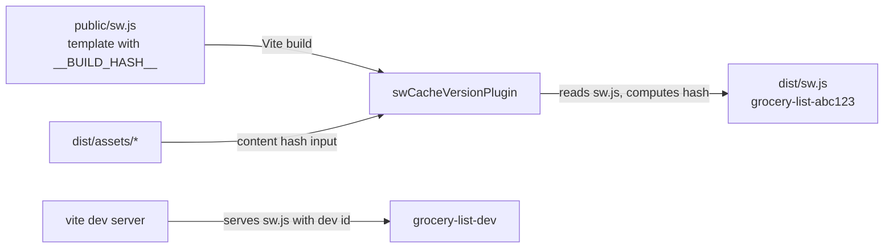
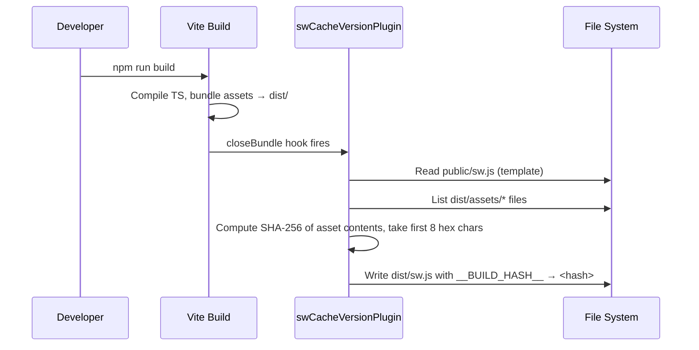

# Design Document: SW Cache Versioning

## Overview

This design introduces automatic cache versioning for the Grocery List PWA's service worker. Currently, `public/sw.js` uses a hardcoded `CACHE_NAME = 'grocery-list-v1'` that never changes between builds, so the browser cannot detect new deployments and old caches are never invalidated.

The solution is a custom Vite plugin that:
1. Replaces a `__BUILD_HASH__` placeholder in the service worker template with a content hash of the built assets
2. Writes the processed service worker to `dist/sw.js` during production builds
3. Substitutes a static dev identifier during development

This ensures every production build produces a service worker with a unique `CACHE_NAME`, triggering the browser's byte-diff detection and the existing activate-handler cache cleanup logic.

## Architecture

The feature adds a single build-time component (the Vite plugin) and modifies the service worker source file. No runtime dependencies are added. The existing service worker lifecycle (install → activate → fetch) is unchanged — only the cache name value changes.



### Build Flow



### Dev Flow

During `vite dev`, the plugin uses the `configureServer` hook to intercept requests for `/sw.js` and serve the template with `__BUILD_HASH__` replaced by `dev`. This keeps the service worker functional in development without requiring a full build.

## Components and Interfaces

### 1. SW Template (`public/sw.js`)

The existing service worker file is modified to use a placeholder:

```javascript
// Before
const CACHE_NAME = 'grocery-list-v1';

// After
const CACHE_NAME = 'grocery-list-__BUILD_HASH__';
```

All other service worker logic (install, activate, fetch handlers) remains unchanged. The activate handler already deletes caches whose name doesn't match `CACHE_NAME`, so cache cleanup works automatically once the name changes between builds.

### 2. Vite Plugin (`vite-plugin-sw-cache-version.ts`)

A new file at the project root (alongside `vite.config.ts`) containing the plugin:

```typescript
// vite-plugin-sw-cache-version.ts
import type { Plugin } from 'vite';

export function swCacheVersionPlugin(): Plugin {
  return {
    name: 'sw-cache-version',

    // Production: process sw.js after bundle is written
    closeBundle() { /* ... */ },

    // Development: serve sw.js with dev hash
    configureServer(server) { /* ... */ },
  };
}
```

**Plugin interface:**

| Hook | Phase | Purpose |
|------|-------|---------|
| `closeBundle` | Build (post-write) | Read `public/sw.js`, hash `dist/assets/*`, write `dist/sw.js` |
| `configureServer` | Dev | Intercept `/sw.js` requests, replace `__BUILD_HASH__` with `dev` |

**Hash generation algorithm:**
1. List all files in `dist/assets/` (Vite's hashed output directory)
2. Read each file's contents
3. Concatenate all contents and compute SHA-256
4. Take the first 8 hex characters as the Build_Hash

This approach ensures the hash changes when any built asset changes, which is exactly when the service worker cache should be invalidated.

### 3. Vite Config (`vite.config.ts`)

Register the plugin:

```typescript
import { defineConfig } from 'vite';
import { swCacheVersionPlugin } from './vite-plugin-sw-cache-version';

export default defineConfig({
  plugins: [swCacheVersionPlugin()],
  // ... rest unchanged
});
```

### 4. Force Update (`src/forceUpdate.ts`)

No changes needed. The `forceUpdate` function already calls `registration.update()`, which triggers the browser to fetch the new `sw.js`. Since the file content differs (different hash), the browser detects a new service worker and the existing update flow works.

## Data Models

### Cache Name Format

```
grocery-list-<Build_Hash>
```

- **Prefix**: `grocery-list-` (constant)
- **Build_Hash**: 8-character lowercase hex string (production) or `dev` (development)
- **Examples**: `grocery-list-a1b2c3d4`, `grocery-list-dev`

### Build Hash

| Property | Value |
|----------|-------|
| Algorithm | SHA-256 |
| Input | Concatenated contents of all files in `dist/assets/` |
| Output | First 8 hex characters of the digest |
| Character set | `[0-9a-f]` |
| Length | 8 (production), 3 (dev = `dev`) |

### Cache Name Construction and Parsing

```typescript
// Construction
const cacheName = `grocery-list-${buildHash}`;

// Parsing (extraction)
const PREFIX = 'grocery-list-';
const buildHash = cacheName.startsWith(PREFIX)
  ? cacheName.slice(PREFIX.length)
  : null;
```

This round-trip property (construct → extract → original hash) is a key correctness guarantee.


## Correctness Properties

*A property is a characteristic or behavior that should hold true across all valid executions of a system — essentially, a formal statement about what the system should do. Properties serve as the bridge between human-readable specifications and machine-verifiable correctness guarantees.*

### Property 1: Distinct asset contents produce distinct hashes

*For any* two distinct byte sequences representing concatenated asset contents, computing the build hash on each should produce two different hash strings.

This follows from the collision resistance of SHA-256 truncated to 8 hex chars. While truncation increases collision probability, for the scale of this project (hundreds of builds, not billions) it is effectively unique. We test this by generating random distinct byte buffers and verifying the hash function returns different values.

**Validates: Requirements 2.1, 2.2, 3.1**

### Property 2: Placeholder replacement produces valid service worker

*For any* valid build hash string (non-empty, lowercase hex, 8 characters), replacing `__BUILD_HASH__` in the service worker template should produce output that:
1. Contains the build hash
2. Does not contain the literal string `__BUILD_HASH__`
3. Contains a valid `CACHE_NAME` assignment

**Validates: Requirements 2.3**

### Property 3: Cache cleanup retains only the current cache

*For any* set of cache names and any current cache name, the activate-handler cleanup logic should delete every cache whose name does not equal the current cache name, and retain the cache that matches.

After cleanup, `caches.keys()` should return exactly one entry: the current cache name (assuming it was present). If the current cache name was not in the original set, the result should be empty.

**Validates: Requirements 4.2, 4.3**

### Property 4: Cache name round-trip

*For any* non-empty alphanumeric string used as a Build_Hash, constructing a Cache_Name (`grocery-list-<hash>`) and then extracting the hash by removing the `grocery-list-` prefix should yield the original Build_Hash value.

This is a classic round-trip property ensuring the cache name format is consistent and parseable.

**Validates: Requirements 8.1, 8.2**

## Error Handling

### Build Plugin Errors

| Scenario | Handling |
|----------|----------|
| `public/sw.js` not found | Plugin throws with a clear error message, failing the build |
| `dist/assets/` directory empty or missing | Plugin generates a hash from an empty input (deterministic fallback), logs a warning |
| File read error during hash computation | Plugin throws, failing the build — this indicates a broken build environment |
| `__BUILD_HASH__` placeholder not found in template | Plugin logs a warning but writes the file unchanged — allows graceful degradation |

### Service Worker Runtime Errors

| Scenario | Handling |
|----------|----------|
| Cache deletion fails during activate | Log the error and continue deleting remaining caches (existing behavior, Req 4.4) |
| `caches.open()` fails during install | The install event's `waitUntil` promise rejects, preventing the SW from activating |
| Network fetch fails | Existing cache-first strategy returns cached response; if no cache, the error propagates |

### Development Mode

| Scenario | Handling |
|----------|----------|
| Dev server can't read `public/sw.js` | Middleware passes the request through to Vite's default static file serving |
| `__BUILD_HASH__` not found in dev template | Serve the file as-is with a console warning |

## Testing Strategy

### Unit Tests

Unit tests verify specific examples and edge cases:

- **Template format**: Verify `public/sw.js` contains `__BUILD_HASH__` placeholder
- **Plugin output**: Verify the plugin writes `dist/sw.js` with the hash injected
- **Dev mode**: Verify the dev middleware replaces `__BUILD_HASH__` with `dev`
- **Edge cases**: Empty asset directory, missing template file, placeholder not found
- **Integration**: Verify `vite.config.ts` registers the plugin

Avoid writing too many unit tests — the property-based tests handle comprehensive input coverage.

### Property-Based Tests

Each correctness property is implemented as a single property-based test using fast-check with minimum 100 iterations:

| Property | Test Description | Generator Strategy |
|----------|-----------------|-------------------|
| Property 1: Hash uniqueness | Generate pairs of distinct random byte arrays, compute hashes, assert inequality | `fc.tuple(fc.uint8Array(), fc.uint8Array()).filter(([a, b]) => !arraysEqual(a, b))` |
| Property 2: Placeholder replacement | Generate random 8-char hex strings, run replacement, verify output constraints | `fc.hexaString({ minLength: 8, maxLength: 8 })` |
| Property 3: Cache cleanup | Generate random cache name sets + current name, run cleanup logic, verify only current remains | `fc.record({ cacheNames: fc.array(fc.string()), currentCache: fc.string() })` |
| Property 4: Cache name round-trip | Generate random alphanumeric strings, construct cache name, extract hash, assert equality | `fc.stringMatching(/^[a-z0-9]+$/)` |

### Test Tagging

Each property-based test must include a comment referencing its design property:

```typescript
// Feature: sw-cache-versioning, Property 1: Distinct asset contents produce distinct hashes
```

### Test File Organization

- `tests/sw-cache-version-plugin.test.ts` — Unit tests for the Vite plugin
- `tests/sw-cache-version-plugin.properties.test.ts` — Property-based tests for all 4 properties

### Existing Tests

The existing test files require no modifications:
- `tests/service-worker.test.ts` — Tests SW behavior with hardcoded cache names; still valid
- `tests/forceUpdate.test.ts` and `tests/forceUpdate.properties.test.ts` — Test the force update flow; still valid since `forceUpdate` is unchanged
