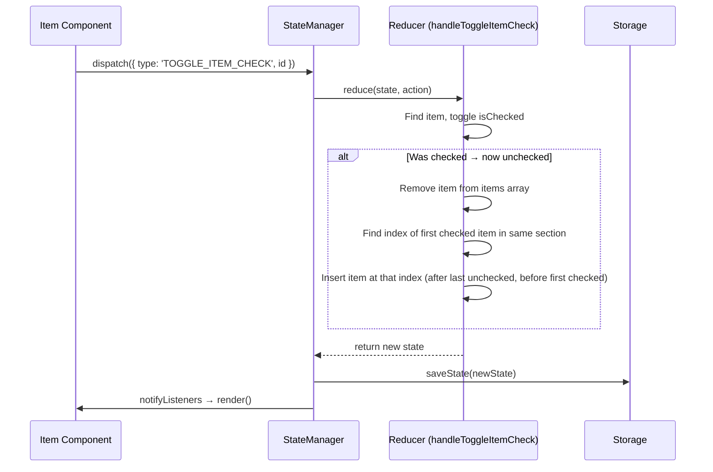

# Design Document: Uncheck Move to Top

## Overview

When a user unchecks a grocery item (transitions `isChecked` from `true` to `false`), the item should automatically move to the position immediately after the last unchecked item (and before the first checked item) in the same section. This groups unchecked items together at the top and checked items at the bottom. This is a state-management change localized to the `TOGGLE_ITEM_CHECK` action handler in `StateManager`. The existing `handleToggleItemCheck` method currently toggles the boolean in-place without reordering; the new behavior splices the item out and re-inserts it at the boundary between unchecked and checked items within the flat `items` array. Checking an item (unchecked → checked) does not reorder.

The UI already re-renders the full item list on every state change, so no component changes are needed — the Section component will naturally display items in their new array order.

## Architecture



### Design Decisions

1. **Modify only `handleToggleItemCheck`** — The reorder logic is entirely within the existing reducer handler. No new action types, no new methods, no component changes.

2. **Reorder within the flat `items` array** — Items from all sections live in a single `AppState.items` array. The unchecked item is moved to the position of the first checked item sharing the same `sectionId` (i.e., after the last unchecked item in that section). If no checked items exist in the section, the item is appended at the end of the section's items. This preserves the rendering order since `index.ts` filters items by `sectionId` and renders them in array order.

3. **No reorder on check** — Requirement 1.4 explicitly states that checking an item keeps it in place. Only the unchecked transition triggers reordering.

4. **Persistence is automatic** — `StateManager.dispatch` already calls `saveState` after every action, so the reordered array is persisted without additional work.

## Components and Interfaces

### Modified: `StateManager.handleToggleItemCheck` (src/state.ts)

The private method signature stays the same:

```typescript
private handleToggleItemCheck(state: AppState, id: string): AppState
```

Current behavior: maps over `items`, flipping `isChecked` for the matching item.

New behavior:
1. Find the target item. If not found, return state unchanged.
2. Toggle `isChecked`.
3. If the item was previously checked (i.e., now unchecked):
   - Build a new items array with the target removed.
   - Find the index of the first checked item (`isChecked === true`) in the same section.
   - If found, splice the toggled item at that index (placing it after the last unchecked item and before the first checked item).
   - If no checked items exist in the section, find the index after the last item in the same section and insert there.
   - If no other items exist in the section, push the item.
4. If the item was previously unchecked (i.e., now checked):
   - Return items with only the `isChecked` flag toggled (no reorder).

### Unchanged Components

- **Item component** (`src/components/Item.ts`) — No changes. It fires `onToggleCheck` as before.
- **Section component** (`src/components/Section.ts`) — No changes. It renders items in the order provided.
- **AppShell** (`src/index.ts`) — No changes. It already re-renders all items on state change.
- **Types** (`src/types.ts`) — No changes to data models.
- **Storage** (`src/storage.ts`) — No changes. `saveState` serializes the items array as-is.

## Data Models

No changes to data models. The existing `Item` interface and `AppState` interface remain unchanged. The feature only affects the ordering of elements within the `AppState.items` array.

```typescript
// Unchanged — included for reference
interface Item {
  id: string;
  name: string;
  quantity: number;
  isChecked: boolean;
  sectionId: string;
  createdAt: number;
}

interface AppState {
  sections: Section[];
  items: Item[];        // Order within this array determines render order
  filterMode: FilterMode;
  collapsedSections: Set<string>;
  selectedSectionId: string | null;
  version: number;
}
```


## Correctness Properties

*A property is a characteristic or behavior that should hold true across all valid executions of a system — essentially, a formal statement about what the system should do. Properties serve as the bridge between human-readable specifications and machine-verifiable correctness guarantees.*

### Property 1: Unchecked item is placed after last unchecked item in its section

*For any* `AppState` containing at least one checked item, when that item is toggled via `TOGGLE_ITEM_CHECK`, the item should appear immediately after the last unchecked item (and before the first checked item) among all items with the same `sectionId` in the resulting `items` array. If there are no other unchecked items in the section, it should be the first item in that section. If there are no checked items remaining in the section, it should be the last item in that section.

**Validates: Requirements 1.1**

### Property 2: All other items preserve relative order

*For any* `AppState` and any checked item that is toggled to unchecked, the relative order of all other items in the `items` array (both same-section and different-section items) should remain unchanged.

**Validates: Requirements 1.2, 1.3**

### Property 3: Checking an item does not reorder

*For any* `AppState` and any unchecked item that is toggled to checked, the `items` array order should be identical before and after the toggle (differing only in the `isChecked` field of the toggled item).

**Validates: Requirements 1.4**

## Error Handling

This feature introduces no new error paths. The change is confined to the `handleToggleItemCheck` reducer method, which operates on pure data (array manipulation). Existing error handling covers all relevant scenarios:

- **Item not found**: If the dispatched `id` doesn't match any item, the reducer returns state unchanged (existing behavior, preserved).
- **Storage failure**: `saveState` is already wrapped in a try/catch in `dispatch`. No additional handling needed.
- **Empty section**: If the unchecked item is the only item in its section, it stays in place (it's the only item). No special case needed.

## Testing Strategy

### Dual Testing Approach

Both unit tests and property-based tests are required.

### Unit Tests

Unit tests cover specific examples and edge cases:

- **Example: Single checked item unchecked moves after last unchecked** — Create a section with 3 items (A unchecked, B unchecked, C checked). Toggle C. Verify order is A, B, C with C unchecked.
- **Example: Unchecking item in one section doesn't affect another** — Create two sections with items. Toggle a checked item in section 1. Verify section 2 items are unchanged.
- **Example: Checking an item keeps position** — Create a section with items. Toggle an unchecked item to checked. Verify the array order is unchanged.
- **Edge case: Only item in section** — Create a section with one checked item. Toggle it. Verify it remains the only item and is now unchecked.
- **Edge case: All items checked** — Create a section where all items are checked. Toggle one. Verify it becomes the first item in the section (no unchecked items to go after).
- **Edge case: All items unchecked** — Create a section where all items are unchecked plus one checked. Toggle the checked one. Verify it appears after all the unchecked items.
- **Example: Persistence after reorder** — Toggle a checked item, verify `saveState` is called with the reordered items array. (Validates 2.1)

### Property-Based Tests

Property-based tests use `fast-check` to generate random `AppState` instances and verify universal properties.

- **Library**: `fast-check` (already in devDependencies)
- **Minimum iterations**: 100 per property test
- **Tag format**: `Feature: uncheck-move-to-top, Property {N}: {title}`

Each correctness property maps to exactly one property-based test:

1. `Feature: uncheck-move-to-top, Property 1: Unchecked item is placed after last unchecked item in its section`
2. `Feature: uncheck-move-to-top, Property 2: All other items preserve relative order`
3. `Feature: uncheck-move-to-top, Property 3: Checking an item does not reorder`
